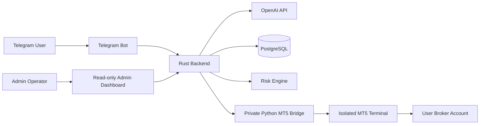

# AI Forex Trading Assistant

AI Forex Trading Assistant is a demo-first, multi-user platform that combines Telegram, AI-assisted forex market analysis, server-side risk controls, and user-confirmed MetaTrader 5 execution.

It is designed as a hosted SaaS application. Users interact through Telegram and connect their own MT5 broker accounts. The application does not pool accounts, receive trading deposits, control withdrawals, or execute an AI recommendation automatically.

> AI analyzes. The user decides. Rust controls the workflow. MT5 executes. The broker holds the user's funds.

Forex trading involves substantial risk and may result in loss of capital. AI-generated analysis may be incorrect. This project does not guarantee profit or claim that trading is risk-free.

## Why This Project Exists

Market analysis, risk review, and order execution are often spread across unrelated tools. AI output can also be mistaken for a trustworthy trading instruction even though models can be wrong or use incomplete information.

This project creates a controlled boundary between analysis and execution:

1. Retrieve fresh market data from the selected user's broker account through MT5.
2. Send only approved market fields to OpenAI.
3. Validate and display structured `BUY`, `SELL`, or `WAIT` analysis.
4. Let the user configure a trade intent.
5. Require a separate final confirmation.
6. Retrieve the current price again.
7. Enforce ownership, permissions, risk limits, live-mode gates, idempotency, and slippage rules in Rust.
8. Send the validated instruction through the private MT5 Bridge.
9. Store the result and show the MT5 ticket for independent verification.

Selecting `BUY` or `SELL` never places an order immediately.

## Architecture



### Rust backend

Rust is the primary application and security authority. It owns user isolation, API validation, OpenAI response validation, trade intents, human confirmation, risk checks, live-mode gates, idempotency, database transactions, audit logging, and admin dashboard data.

### Python MT5 Bridge

Python is a narrow compatibility adapter for the MetaTrader 5 Python package. It retrieves account and market information and translates validated internal requests into MT5 operations. It is not the primary backend and cannot independently authorize a trade.

Production MT5 deployment requires isolated account workers or terminal processes rather than uncontrolled asynchronous account switching in one global session.

### PostgreSQL

PostgreSQL stores users, settings, encrypted MT5 credentials, AI analyses, trade intents, orders, position snapshots, risk profiles, idempotency keys, audit logs, pricing plans, subscriptions, and invoices.

Every user-owned resource is scoped by `user_id`; account resources are also scoped by `account_id`.

## Technology Stack

| Area | Technology |
|---|---|
| Primary backend | Rust, Axum, Tokio |
| Database | PostgreSQL, SQLx |
| Telegram interface | Teloxide long-polling MVP for mock/demo workflows |
| AI analysis | OpenAI Responses API with structured JSON output |
| MT5 adapter | Python, FastAPI, Pydantic, MetaTrader5 |
| HTTP client | Reqwest |
| Credential encryption | AES-256-GCM |
| Password hashing | Argon2 |
| Observability | Tracing and structured JSON logs |
| Local deployment | Docker Compose |
| Admin console | Server-hosted responsive HTML, CSS, and JavaScript |

## Current Implementation Status

This repository is a compiled backend foundation and mock/demo vertical slice. It is not yet a complete public trading product.

### Implemented

- Axum application and health endpoint
- PostgreSQL trading and billing migrations
- Multi-user account ownership validation
- Structured OpenAI analysis integration
- Controlled mock `WAIT` analysis when no OpenAI key is configured
- Market-data freshness validation
- Non-executing trade-intent creation
- Explicit trade confirmation endpoint
- Transactional idempotency protection
- Current-price and slippage recheck
- Core lot, SL/TP, account, and trading-limit validation
- Global and user-level live-trading gates
- Trading kill switch
- AES-256-GCM credential encryption utility
- Private-key authenticated MT5 Bridge
- Per-account bridge locking
- Mock quote and order execution
- Order and audit persistence
- Proposed plan, subscription, and invoice schema
- Protected read-only admin dashboard
- Telegram long-polling mock/demo MVP with user-bound confirmation callbacks
- Rust unit tests and Python syntax validation

### Planned or incomplete

- Full Telegram account onboarding and conversational state persistence beyond the mock-demo MVP
- MT5 account-addition and credential-management API
- Full OHLC, indicator, and market-data service
- Positions, history, close, and SL/TP modification APIs
- Broker-derived margin, volume-step, daily-loss, and symbol-session checks
- Payment-gateway checkout and verified webhook ingestion
- Subscription mutation, refunds, and usage metering
- Production administrator accounts, MFA, and role-based access control
- Per-account Windows MT5 worker orchestration
- End-to-end PostgreSQL, OpenAI, Telegram, and MT5 integration tests
- Production legal and compliance review

The Telegram command reference distinguishes the implemented mock/demo MVP from
the broader target interface. Commands for real account connection, positions,
interactive risk settings, and billing are not yet available.

## Safety Model

### Human confirmation

AI analysis is never executable authority. Opening, closing, or materially modifying a position requires a separate user confirmation tied to an expiring server-side intent.

### Demo-first operation

The intended rollout order is:

```text
Mock trading -> MT5 demo -> optional MT5 live
```

Live trading is disabled by default. It requires runtime, global, user, account, permission, risk, freshness, and per-order confirmation gates to pass simultaneously.

### Credential protection

MT5 passwords are designed to be stored using AES-256-GCM with a unique nonce. The encryption key remains outside PostgreSQL. Passwords, Telegram tokens, OpenAI keys, database credentials, and internal bridge keys must never appear in OpenAI payloads, Telegram messages, API responses, or logs.

### Emergency stop

The kill switch blocks new `BUY` and `SELL` orders while retaining access to analysis, positions, history, and confirmed position closing.

## Repository Structure

```text
.
|-- backend-rust/
|   |-- admin/index.html             Admin dashboard UI
|   |-- migrations/
|   |   |-- 0001_initial.sql         Trading and security schema
|   |   `-- 0002_billing.sql         Plans, subscriptions, invoices
|   |-- src/
|   |   |-- admin.rs                 Dashboard API and authentication
|   |   |-- ai.rs                    OpenAI integration
|   |   |-- bin/hash_admin_password.rs
|   |   |-- config.rs                Environment configuration
|   |   |-- crypto.rs                Credential encryption
|   |   |-- error.rs                 Safe HTTP errors
|   |   |-- main.rs                  Axum entry point
|   |   |-- models.rs                API and domain models
|   |   |-- mt5.rs                   MT5 Bridge client
|   |   |-- risk.rs                  Risk rules
|   |   |-- routes.rs                Application routes
|   |   |-- state.rs                 Dependency container
|   |   `-- trading.rs               Confirmation and execution
|   |-- Cargo.toml
|   `-- Dockerfile
|-- mt5-bridge/
|   |-- app/
|   |   |-- main.py                  Internal FastAPI endpoints
|   |   |-- models.py                Typed payloads
|   |   |-- mt5_client.py            Mock and native MT5 calls
|   |   |-- security.py              Internal authentication
|   |   `-- sessions.py              Per-account locking
|   |-- Dockerfile
|   `-- requirements.txt
|-- docs/                             Product and engineering docs
|-- .env.example
|-- Cargo.toml                        Rust workspace
`-- docker-compose.yml
```

## Local Setup

### Prerequisites

- Docker Desktop with Docker Compose, or Rust stable plus PostgreSQL
- OpenSSL or another secure random-key generator
- An OpenAI API key is optional for mock analysis
- Real MT5 is not required for mock mode

### 1. Configure the environment

```powershell
Copy-Item .env.example .env
```

Generate a base64-encoded 32-byte encryption key:

```text
openssl rand -base64 32
```

Place it in `.env` as `ENCRYPTION_KEY`, replace the database and bridge secrets, and retain these safe development defaults:

```dotenv
TRADING_MODE=DEMO
LIVE_TRADING_ENABLED=false
MT5_MODE=MOCK
```

Do not put a real MT5 password into the local mock stack.

### 2. Configure the admin dashboard

```powershell
cargo run -p ai-forex-backend --bin hash-admin-password
```

Copy the generated value into `.env`:

```dotenv
ADMIN_USERNAME=admin
ADMIN_PASSWORD_HASH_B64=<generated-value>
```

If the hash is omitted, the dashboard remains unavailable.

### 3. Start the stack

```text
docker compose up --build
```

The backend applies SQLx migrations during startup.

### 4. Verify services

```text
GET http://localhost:8080/health
Admin dashboard: http://localhost:8080/admin/
```

The MVP admin console uses HTTP Basic authentication with an Argon2 password hash. Production must use HTTPS, restricted network access, named admin identities, MFA, session controls, and role-based authorization.

## Environment Variables

| Variable | Required | Default | Purpose |
|---|---:|---|---|
| `DATABASE_URL` | Yes | None | PostgreSQL connection string |
| `TELEGRAM_BOT_TOKEN` | For Telegram bot | None | BotFather token; empty disables the bot |
| `OPENAI_API_KEY` | No | Mock analysis | Operator-owned OpenAI credential |
| `OPENAI_MODEL` | No | `gpt-5-mini` | Structured-analysis model |
| `MT5_BRIDGE_URL` | No | `http://mt5-bridge:8000` | Private bridge URL |
| `MT5_BRIDGE_API_KEY` | Yes | None | Internal service authentication |
| `ENCRYPTION_KEY` | Yes | None | Base64 32-byte credential key |
| `TRADING_MODE` | No | `DEMO` | `MOCK`, `DEMO`, or gated `LIVE` |
| `LIVE_TRADING_ENABLED` | No | `false` | Global live feature flag |
| `MARKET_DATA_MAX_AGE_SECONDS` | No | `30` | Maximum accepted quote age |
| `MT5_MODE` | No | `MOCK` | Bridge mock or native mode |
| `ADMIN_USERNAME` | No | `admin` | MVP dashboard username |
| `ADMIN_PASSWORD_HASH_B64` | For dashboard | None | Base64 Argon2 password hash |
| `RUST_LOG` | No | Environment-dependent | Structured log filter |

Never commit `.env`.

## HTTP API

| Method | Path | Current purpose |
|---|---|---|
| `GET` | `/health` | Database and MT5 Bridge health |
| `POST` | `/api/v1/analyses` | Retrieve and store structured analysis |
| `POST` | `/api/v1/trade-intents` | Create a non-executing trade intent |
| `POST` | `/api/v1/trade-intents/{id}/confirm` | Revalidate and execute an intent |
| `POST` | `/api/v1/trading/stop` | Block new opening trades |
| `GET` | `/admin/` | Protected read-only dashboard |
| `GET` | `/admin/api/overview` | Platform and billing metrics |
| `GET` | `/admin/api/users` | User and subscription search |

Current application endpoints accept internal user UUIDs as a foundation. Before public exposure, trusted Telegram middleware must derive identity server-side rather than accepting an arbitrary user identity from the client.

See the [API documentation](docs/api.md) for payloads.

## Telegram Command Design

```text
/start          Register and begin secure onboarding
/menu           Open the main menu
/analyze        Request AI-assisted market analysis
/buy            Create a proposed BUY trade
/sell           Create a proposed SELL trade
/positions      View open MT5 positions
/history        View trading history
/accounts       Manage MT5 account connections
/security       Review security and trust controls
/risk           Review or configure risk limits
/stoptrading    Block new BUY and SELL orders
/resumetrading  Confirm resuming new trades
/settings       Manage preferences and billing
/help           Show guidance and support
```

These handlers remain planned. Their functional behavior is defined in the [Telegram command reference](docs/telegram-command-reference.md).

## Admin Dashboard

The responsive read-only console provides service health, user and account metrics, analysis and trading activity, subscription health, invoice revenue, billing filters, and recent audit events. It contains no trade-execution controls and exposes no secret credential fields.

See the [admin dashboard guide](docs/admin-dashboard.md).

## Pricing and Billing Status

| Plan | Proposed monthly price | AI analyses | MT5 accounts | Live eligibility |
|---|---:|---:|---:|---:|
| Free Trial | IDR 0 | 20 during trial | 1 demo | No |
| Demo | IDR 99,000 | 150 | 1 demo | No |
| Pro | IDR 249,000 | 1,000 | Up to 3 | Separate approval |
| Business | From IDR 799,000 | Custom | Custom | Separate approval |

Prices are proposals, not final public prices. Payment checkout, verified webhooks, provisioning, refunds, and usage metering are not implemented.

Subscription fees pay for platform access and included AI usage. They are not MT5 fees, broker deposits, margin, spreads, commissions, swaps, or investments.

## Development and Testing

```powershell
cargo fmt --all
cargo check --workspace
cargo test --workspace
python -m compileall -q mt5-bridge/app
```

Current tests cover credential encryption, safe demo risk input, live-account rejection under safe defaults, and invalid BUY stop-loss rejection. The master specification requires broader database, cross-user, Telegram, payment, broker-failure, and production MT5 integration coverage.

## Documentation

### Product and user

- [Product overview](docs/product-overview.md)
- [Application user guide and safety FAQ](docs/how-to-use-the-application.md)
- [MetaTrader 5, the broker, and this application: how they relate](docs/mt5-and-broker-relationship.md)
- [Infographic prompt: explaining AI Forex Trading Assistant](docs/infographic-prompt.md)
- [Telegram command reference](docs/telegram-command-reference.md)
- [Telegram user guide](docs/telegram-user-guide.md)
- [Can Telegram users tell if they're on a demo or live account?](docs/telegram-demo-vs-live.md)
- [User journey, application flow, database flow, and ERD](docs/user-journey-and-data-flow.md)
- [Business requirements document](docs/brd.md)
- [Product requirements document](docs/prd.md)
- [Project status report: what's done, what isn't](docs/project-status-report.md)

### Architecture and engineering

- [Architecture and trade sequence](docs/architecture.md)
- [MT5 and the Rust-Python architecture](docs/mt5-and-dual-tech-stack.md)
- [Deployment guide: VPS setup with Docker or native](docs/deployment-guide.md)
- [Deploying with Dokploy](docs/dokploy-deployment.md)
- [MT5 deployment](docs/mt5-deployment.md)
- [Can this run on a Linux VPS instead of Windows?](docs/linux-vps-deployment.md)
- [Deploying the MT5 Bridge to a Windows VPS](docs/windows-vps-deployment.md)
- [API documentation](docs/api.md)
- [Risk controls](docs/risk-controls.md)

### Security and operations

- [Security and threat model](docs/security.md)
- [Admin dashboard](docs/admin-dashboard.md)
- [SaaS, administration, AI, market data, and API ownership](docs/saas-administration-ai-and-market-data.md)

### Pricing and billing

- [Pricing, billing, payments, and administrative tracking](docs/pricing-billing-and-payment-administration.md)
- [Platform subscription fees vs. MT5 and broker costs](docs/subscription-fees-vs-mt5-and-broker-costs.md)

## Production Readiness

Before live trading, complete the Telegram identity layer, account credential lifecycle, broker-derived validation, integration tests, payment webhooks, isolated Windows MT5 workers, monitoring, recovery procedures, administrator MFA/RBAC, security review, and applicable privacy, financial, legal, tax, and regulatory review.

Keep live trading disabled until every required control has been independently verified.

## License

Licensed under the [PolyForm Noncommercial License 1.0.0](LICENSE). The source is publicly viewable for transparency, learning, and security review, and is free to use, modify, and share for noncommercial purposes. Commercial use — including operating a paid or hosted AI-forex service built on this code — requires a separate written license from the copyright holder; contact [kukuhtw@gmail.com](mailto:kukuhtw@gmail.com).

## Author

**Kukuh TW** - Ideator

- LinkedIn: [linkedin.com/in/kukuhtw](https://www.linkedin.com/in/kukuhtw)
- Email: [kukuhtw@gmail.com](mailto:kukuhtw@gmail.com)

Additional information is available in [AUTHORS.md](AUTHORS.md).
