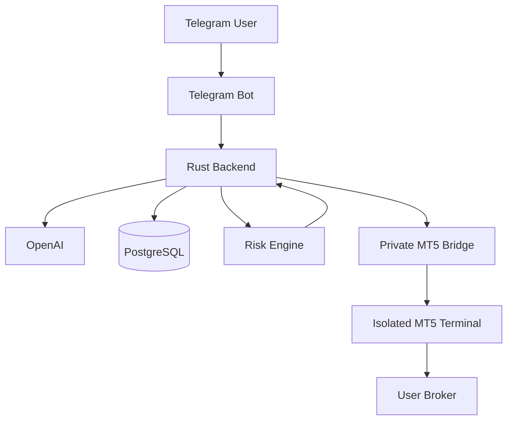
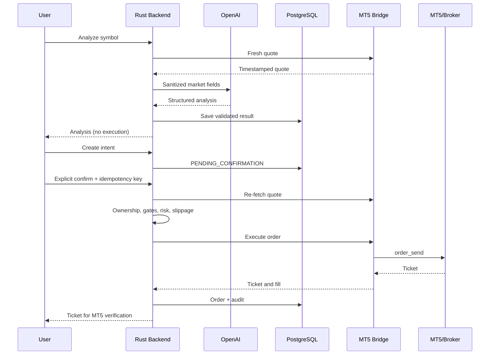

# Architecture

```mermaid
flowchart TD
 A[Telegram User] --> B[Telegram Bot]
 B --> C[Rust Backend]
 C --> D[OpenAI]
 C --> E[(PostgreSQL)]
 C --> F[Risk Engine]
 F --> C
 C --> G[Private MT5 Bridge]
 G --> H[Isolated MT5 Terminal]
 H --> I[User Broker]
```

```mermaid
sequenceDiagram
 participant U as User
 participant R as Rust Backend
 participant AI as OpenAI
 participant DB as PostgreSQL
 participant M as MT5 Bridge
 participant MT as MT5/Broker
 U->>R: Analyze symbol
 R->>M: Fresh quote
 M-->>R: Timestamped quote
 R->>AI: Sanitized market fields
 AI-->>R: Structured analysis
 R->>DB: Save validated result
 R-->>U: Analysis (no execution)
 U->>R: Create intent
 R->>DB: PENDING_CONFIRMATION
 U->>R: Explicit confirm + idempotency key
 R->>M: Re-fetch quote
 R->>R: Ownership, gates, risk, slippage
 R->>M: Execute order
 M->>MT: order_send
 MT-->>M: Ticket
 M-->>R: Ticket and fill
 R->>DB: Order + audit
 R-->>U: Ticket for MT5 verification
```

