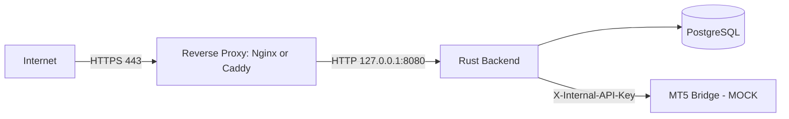

# Deployment Guide: Setting Up on a VPS (Docker or Native)

## 1. Purpose and Scope

This guide covers installing and running the application's core stack — the Rust backend, PostgreSQL, the MT5 Bridge (in mock mode), and the embedded admin dashboard — on a Linux VPS, end to end: OS prerequisites, secrets, building/running the services, putting them behind HTTPS, firewalling, backups, and updates. It gives **two complete paths** — Docker Compose and native (no Docker) — so you can pick whichever fits your VPS and comfort level.

**What this guide does not cover:**

- Connecting a **real** MT5 account. That needs a Windows host for the MT5 terminal and Python package; this guide only gets you to `MT5_MODE=MOCK`. See [Can this run on a Linux VPS instead of Windows?](linux-vps-deployment.md) and [Deploying the MT5 Bridge to a Windows VPS](windows-vps-deployment.md) for that half of the architecture.
- The Telegram bot interface, payment/billing integration, and production multi-account MT5 worker isolation — none of these are implemented in the current repository (see [product-overview.md §11](product-overview.md#11-current-product-status) and the [PRD](prd.md) release phases). This guide deploys exactly what exists today: the HTTP API foundation, admin dashboard, and mock trading workflow.

## 2. What You're Deploying

| Component | Technology | Notes |
|---|---|---|
| Rust backend | Axum, single compiled binary | Owns identity, risk, AI integration, persistence, and serves the admin dashboard |
| PostgreSQL | v17 | All application and billing-schema tables |
| MT5 Bridge | Python/FastAPI | Runs in `MOCK` mode on Linux by default (see [linux-vps-deployment.md](linux-vps-deployment.md)) |
| Admin dashboard | Served by the Rust binary at `/admin/` | HTML is compiled directly into the binary — no separate files to deploy |

A detail worth knowing before you start: the Rust binary embeds both its **database migrations** (`sqlx::migrate!` bakes `backend-rust/migrations/*.sql` into the compiled binary at build time) and the **admin dashboard HTML** (`include_str!("../admin/index.html")`, also baked in at build time). This means the *only* runtime artifact that matters for the backend is the single compiled binary — there is no migrations folder or HTML file to remember to copy alongside it, in either deployment path below.



## 3. Choosing Docker vs Native

| | Docker Compose | Native (no Docker) |
|---|---|---|
| Setup effort | Lower — one command starts everything | Higher — install Postgres, Rust, Python separately |
| Isolation | Each service in its own container | Shared OS; you manage users/permissions yourself |
| Resource overhead | Slightly higher (container runtime) | Slightly lower |
| Updating | `git pull && docker compose up --build -d` | Rebuild binary, restart systemd services |
| Good fit when | You want the fastest path to a working stack, or you're already comfortable with Docker | Docker isn't available/allowed on the VPS, or you want the smallest possible footprint and full manual control |

Both paths end up with the same three services and the same admin dashboard — pick based on your own operational preference, not because one is "more correct."

## 4. Shared Prerequisites

- A VPS running a recent Debian or Ubuntu LTS (examples below use `apt`; adapt for other distros). 2 vCPU / 4 GB RAM / 40 GB disk is a reasonable starting point for this foundational stack.
- A non-root user with `sudo` access — do not run either path as `root`.
- (Recommended) A domain name with an A record pointed at the VPS's IP, so you can serve the admin dashboard over a real HTTPS certificate rather than a self-signed one.
- SSH key-based login already working before you lock down the firewall.

```bash
sudo apt update && sudo apt upgrade -y
sudo apt install -y curl git ufw
```

Set a baseline firewall now (refined further in [§8](#8-firewall)):

```bash
sudo ufw allow OpenSSH
sudo ufw enable
```

## 5. Path A — Docker Compose Deployment

### 5.1 Install Docker

```bash
curl -fsSL https://get.docker.com | sudo sh
sudo usermod -aG docker "$USER"
```

Log out and back in so your user picks up the `docker` group, then confirm:

```bash
docker compose version
```

### 5.2 Get the code

```bash
git clone https://github.com/kukuhtw/aifrx.git
cd aifrx
```

### 5.3 Configure secrets

```bash
cp .env.example .env
```

Edit `.env` and set each of the following. Generate random secrets rather than typing your own:

```bash
openssl rand -base64 32   # -> ENCRYPTION_KEY
openssl rand -hex 32      # -> MT5_BRIDGE_API_KEY
openssl rand -base64 24   # -> a strong POSTGRES_PASSWORD
```

| Variable | Value |
|---|---|
| `ENCRYPTION_KEY` | The base64 output above — must decode to exactly 32 bytes |
| `MT5_BRIDGE_API_KEY` | The hex output above |
| `TRADING_MODE` | Keep `DEMO` |
| `LIVE_TRADING_ENABLED` | Keep `false` |
| `MT5_MODE` | Keep `MOCK` (this is what makes the app runnable on Linux at all — see [linux-vps-deployment.md](linux-vps-deployment.md)) |
| `OPENAI_API_KEY` | Optional — leave blank to get mock `WAIT` analyses, or set a real key |

**Two secrets that must match each other but aren't in `.env.example` by default — a real footgun if missed:** `docker-compose.yml` reads `POSTGRES_PASSWORD` directly (via `${POSTGRES_PASSWORD:-change-me}`) to set the database container's actual password, while `DATABASE_URL` separately embeds a password in its connection string. Add both to `.env` and make sure they match:

```dotenv
POSTGRES_PASSWORD=<the-password-you-generated>
DATABASE_URL=postgres://aiforex:<the-same-password>@postgres:5432/aiforex
```

**Generating `ADMIN_PASSWORD_HASH_B64`:** the shipped runtime image does **not** include the `hash-admin-password` utility — only the intermediate Docker build stage does (`cargo build` compiles it, but the final `COPY --from=build` step only copies the main server binary). `docker compose run rust-backend hash-admin-password` will fail with `exec: "hash-admin-password": not found`. Use one of these instead:

- **Simplest:** generate it on any machine with Rust installed (your laptop, a CI runner — it doesn't have to be the VPS) and paste the resulting hash into the VPS's `.env`:
  ```bash
  cargo run -p ai-forex-backend --bin hash-admin-password
  ```
- **No local Rust, Docker only:** build just the intermediate stage and run the tool from it:
  ```bash
  docker build --target build -f backend-rust/Dockerfile -t aifrx-buildstage .
  docker run --rm -it aifrx-buildstage /app/target/release/hash-admin-password
  ```

Either way, copy the printed base64 value into `.env`:

```dotenv
ADMIN_USERNAME=admin
ADMIN_PASSWORD_HASH_B64=<generated-value>
```

### 5.4 Recommended `docker-compose.yml` production tweaks

The committed `docker-compose.yml` is tuned for local development. Before running it on a VPS, make two edits:

1. **Bind the backend to loopback only**, so it's reachable solely through the reverse proxy you'll set up in [§7](#7-reverse-proxy-and-https) — change:
   ```yaml
   ports: ["8080:8080"]
   ```
   to:
   ```yaml
   ports: ["127.0.0.1:8080:8080"]
   ```
2. **Add a restart policy** to all three services (none is set by default, so a crash or VPS reboot won't bring them back on its own):
   ```yaml
   restart: unless-stopped
   ```

### 5.5 Build and start

```bash
docker compose up --build -d
```

Migrations run automatically as part of the backend's startup (`sqlx::migrate!` against `DATABASE_URL`) — there is no separate migration command to run.

### 5.6 Verify

```bash
docker compose ps
curl -s http://127.0.0.1:8080/health
```

A healthy response looks like:

```json
{"status":"ok","database":"ok","mt5_bridge":"ok"}
```

### 5.7 Logs

```bash
docker compose logs -f rust-backend
docker compose logs -f mt5-bridge
```

### 5.8 Updating

```bash
git pull
docker compose up --build -d
```

The new binary re-runs (and no-ops on already-applied) migrations automatically on startup.

## 6. Path B — Native Deployment (No Docker)

### 6.1 Install PostgreSQL 17

```bash
sudo apt install -y postgresql-common
sudo /usr/share/postgresql-common/pgdg/apt.postgresql.org.sh -y
sudo apt install -y postgresql-17
```

Create the database and role:

```bash
sudo -u postgres psql -c "CREATE ROLE aiforex WITH LOGIN PASSWORD '<a-strong-password>';"
sudo -u postgres psql -c "CREATE DATABASE aiforex OWNER aiforex;"
```

### 6.2 Install Rust and build the backend

```bash
curl --proto '=https' --tlsv1.2 -sSf https://sh.rustup.rs | sh
source "$HOME/.cargo/env"

sudo mkdir -p /opt/aifrx
sudo chown "$USER":"$USER" /opt/aifrx
git clone https://github.com/kukuhtw/aifrx.git /opt/aifrx
cd /opt/aifrx
cargo build --release -p ai-forex-backend
```

This produces `/opt/aifrx/target/release/ai-forex-backend`. As noted in [§2](#2-what-youre-deploying), migrations and the admin dashboard HTML are compiled into this binary — nothing else needs to be copied alongside it.

### 6.3 Install Python and the MT5 Bridge (mock mode)

```bash
sudo apt install -y python3.12 python3.12-venv
cd /opt/aifrx/mt5-bridge
python3.12 -m venv venv
./venv/bin/pip install -r requirements.txt
```

On Linux, `pip` silently skips the `MetaTrader5` package (its `requirements.txt` entry is marked `platform_system == "Windows"` only) — this is expected and is exactly what keeps the bridge in mock mode here. See [linux-vps-deployment.md §3](linux-vps-deployment.md#3-evidence-from-this-codebase) if you want the full explanation.

### 6.4 Create a dedicated service user and secrets files

```bash
sudo useradd --system --no-create-home --shell /usr/sbin/nologin aifrx
sudo mkdir -p /etc/aifrx
sudo chown root:aifrx /etc/aifrx
sudo chmod 750 /etc/aifrx
```

Generate secrets the same way as the Docker path:

```bash
openssl rand -base64 32   # -> ENCRYPTION_KEY
openssl rand -hex 32      # -> MT5_BRIDGE_API_KEY
```

Create `/etc/aifrx/backend.env` (root:aifrx, mode 640):

```dotenv
DATABASE_URL=postgres://aiforex:<the-password-from-6.1>@127.0.0.1:5432/aiforex
OPENAI_API_KEY=
OPENAI_MODEL=gpt-5-mini
MT5_BRIDGE_URL=http://127.0.0.1:8000
MT5_BRIDGE_API_KEY=<the-generated-hex-value>
ENCRYPTION_KEY=<the-generated-base64-value>
TRADING_MODE=DEMO
LIVE_TRADING_ENABLED=false
MARKET_DATA_MAX_AGE_SECONDS=30
RUST_LOG=info
BIND_ADDR=127.0.0.1:8080
ADMIN_USERNAME=admin
ADMIN_PASSWORD_HASH_B64=
```

`BIND_ADDR` (default `0.0.0.0:8080`, overridable, per `backend-rust/src/config.rs`) is set to loopback-only here for the same reason as the Docker path's port tweak in §5.4 — the reverse proxy in §7 is what the public actually reaches.

Create `/etc/aifrx/bridge.env` (root:aifrx, mode 640):

```dotenv
MT5_BRIDGE_API_KEY=<the-same-generated-hex-value>
MT5_MODE=MOCK
```

```bash
sudo chown root:aifrx /etc/aifrx/*.env
sudo chmod 640 /etc/aifrx/*.env
sudo chown -R aifrx:aifrx /opt/aifrx
```

### 6.5 Generate the admin password hash

Since Rust is already installed, this is direct here — no Docker workaround needed:

```bash
cd /opt/aifrx
cargo run -p ai-forex-backend --bin hash-admin-password
```

Paste the printed value into `/etc/aifrx/backend.env` as `ADMIN_PASSWORD_HASH_B64`.

### 6.6 Create systemd units

`/etc/systemd/system/aifrx-backend.service`:

```ini
[Unit]
Description=AI Forex Trading Assistant - Rust backend
After=network.target postgresql.service
Wants=postgresql.service

[Service]
Type=simple
User=aifrx
Group=aifrx
WorkingDirectory=/opt/aifrx
EnvironmentFile=/etc/aifrx/backend.env
ExecStart=/opt/aifrx/target/release/ai-forex-backend
Restart=on-failure
RestartSec=3
NoNewPrivileges=true
ProtectSystem=strict
ProtectHome=true
LimitNOFILE=65536

[Install]
WantedBy=multi-user.target
```

`/etc/systemd/system/aifrx-mt5-bridge.service`:

```ini
[Unit]
Description=AI Forex Trading Assistant - MT5 Bridge (mock mode)
After=network.target

[Service]
Type=simple
User=aifrx
Group=aifrx
WorkingDirectory=/opt/aifrx/mt5-bridge
EnvironmentFile=/etc/aifrx/bridge.env
ExecStart=/opt/aifrx/mt5-bridge/venv/bin/uvicorn app.main:app --host 127.0.0.1 --port 8000
Restart=on-failure
RestartSec=3
NoNewPrivileges=true
ProtectSystem=strict

[Install]
WantedBy=multi-user.target
```

`WorkingDirectory=/opt/aifrx/mt5-bridge` matters here: `uvicorn app.main:app` needs to run from inside `mt5-bridge/` so `app` resolves as a Python package, mirroring exactly how `mt5-bridge/Dockerfile` runs the same command from its own `WORKDIR /app`.

### 6.7 Enable and start

```bash
sudo systemctl daemon-reload
sudo systemctl enable --now aifrx-mt5-bridge aifrx-backend
```

### 6.8 Verify

```bash
systemctl status aifrx-backend aifrx-mt5-bridge
curl -s http://127.0.0.1:8080/health
journalctl -u aifrx-backend -f
```

### 6.9 Updating

```bash
cd /opt/aifrx
git pull
cargo build --release -p ai-forex-backend
sudo systemctl restart aifrx-backend
# if mt5-bridge/requirements.txt changed:
./mt5-bridge/venv/bin/pip install -r mt5-bridge/requirements.txt
sudo systemctl restart aifrx-mt5-bridge
```

## 7. Reverse Proxy and HTTPS

This section applies identically to both paths — in each case the backend now listens only on `127.0.0.1:8080`. The [admin dashboard guide](admin-dashboard.md) is explicit that HTTP Basic Auth "must be served only over HTTPS in production," so treat this step as required, not optional.

### Option 1 — Caddy (simplest; automatic certificates)

```bash
sudo apt install -y debian-keyring debian-archive-keyring apt-transport-https
curl -1sLf 'https://dl.cloudsmith.io/public/caddy/stable/gpg.key' | sudo gpg --dearmor -o /usr/share/keyrings/caddy-stable-archive-keyring.gpg
curl -1sLf 'https://dl.cloudsmith.io/public/caddy/stable/debian.deb.txt' | sudo tee /etc/apt/sources.list.d/caddy-stable.list
sudo apt update && sudo apt install -y caddy
```

`/etc/caddy/Caddyfile`:

```text
your-domain.example {
    reverse_proxy 127.0.0.1:8080
}
```

```bash
sudo systemctl reload caddy
```

Caddy obtains and renews a Let's Encrypt certificate automatically the first time it starts with a real domain pointed at the server.

### Option 2 — Nginx + Certbot

```bash
sudo apt install -y nginx certbot python3-certbot-nginx
```

`/etc/nginx/sites-available/aifrx`:

```nginx
server {
    listen 80;
    server_name your-domain.example;

    location / {
        proxy_pass http://127.0.0.1:8080;
        proxy_set_header Host $host;
        proxy_set_header X-Real-IP $remote_addr;
        proxy_set_header X-Forwarded-For $proxy_add_x_forwarded_for;
        proxy_set_header X-Forwarded-Proto $scheme;
    }
}
```

```bash
sudo ln -s /etc/nginx/sites-available/aifrx /etc/nginx/sites-enabled/
sudo nginx -t && sudo systemctl reload nginx
sudo certbot --nginx -d your-domain.example
```

## 8. Firewall

Once the reverse proxy is confirmed working over HTTPS, lock the firewall down to only what the public actually needs:

```bash
sudo ufw allow OpenSSH
sudo ufw allow 80/tcp
sudo ufw allow 443/tcp
sudo ufw enable
sudo ufw status verbose
```

Deliberately **not** opened to the public: `8080` (backend — reached only via the proxy on loopback), `8000` (MT5 Bridge — internal only, never exposed), and `5432` (PostgreSQL — internal only; if using Docker Compose, it isn't published to the host at all by default, and the native path's Postgres should stay bound to `localhost`).

## 9. Verifying a Production Deployment

- [ ] `curl -s https://your-domain.example/health` returns `{"status":"ok",...}` over HTTPS
- [ ] `https://your-domain.example/admin/` prompts for Basic Auth and rejects wrong credentials
- [ ] `ufw status` shows only SSH/80/443 open
- [ ] `docker compose ps` (or `systemctl status aifrx-backend aifrx-mt5-bridge`) shows everything running/healthy
- [ ] `TRADING_MODE=DEMO`, `LIVE_TRADING_ENABLED=false`, `MT5_MODE=MOCK` — confirm you haven't accidentally deployed with live gates open
- [ ] `.env` (Docker path) or `/etc/aifrx/*.env` (native path) is not world-readable and is excluded from version control

## 10. Backups

**Docker path:**

```bash
docker compose exec postgres pg_dump -U aiforex aiforex | gzip > "aifrx-$(date +%F).sql.gz"
```

**Native path:**

```bash
pg_dump -U aiforex -h 127.0.0.1 aiforex | gzip > "aifrx-$(date +%F).sql.gz"
```

Store dumps off the VPS (object storage, another host) and encrypt them at rest — they contain encrypted MT5 credential ciphertext plus every other business table, but remember the **encryption key itself lives only in your `.env`/`backend.env`, never in the database** (see [security.md](security.md)); back that up separately and just as carefully, since losing it makes every stored credential unrecoverable.

## 11. Monitoring and Logs

| Path | Command |
|---|---|
| Docker | `docker compose logs -f rust-backend` / `docker compose logs -f mt5-bridge` |
| Native | `journalctl -u aifrx-backend -f` / `journalctl -u aifrx-mt5-bridge -f` |

Both services log structured JSON (`RUST_LOG`-controlled on the Rust side); pipe into whatever log aggregation you already run. At minimum, alert on `/health` returning anything other than `{"status":"ok"}`.

## 12. Security Hardening Checklist

- [ ] SSH: key-only login, root login disabled (`PermitRootLogin no` in `sshd_config`)
- [ ] `ufw` active with only SSH/80/443 open (§8)
- [ ] `unattended-upgrades` installed for OS security patches
- [ ] Reverse proxy terminates TLS; backend/bridge never directly internet-reachable
- [ ] Admin dashboard: real Argon2 hash set, default `admin` username changed if this is a multi-admin deployment, MFA and RBAC added before commercial use (still MVP-only per [admin-dashboard.md](admin-dashboard.md))
- [ ] Secrets files (`.env` / `/etc/aifrx/*.env`) are not world-readable and are never committed to git
- [ ] `POSTGRES_PASSWORD` / `DATABASE_URL` password segment match and are strong, generated values — not the `change-me` default
- [ ] Regular, encrypted, off-host database backups, with the `ENCRYPTION_KEY` backed up separately from the database itself

## 13. Troubleshooting

| Symptom | Likely cause |
|---|---|
| `ENCRYPTION_KEY must decode to 32 bytes` on startup | Value isn't valid base64, or doesn't decode to exactly 32 bytes — regenerate with `openssl rand -base64 32` |
| `MT5_BRIDGE_API_KEY is required` | Missing from `.env` / `backend.env` |
| `docker compose run rust-backend hash-admin-password` → `not found` | Expected — the runtime image doesn't ship that binary; use one of the two workarounds in [§5.3](#53-configure-secrets) |
| Admin dashboard returns `503 Service Unavailable` | `ADMIN_PASSWORD_HASH_B64` is missing or invalid — see [admin-dashboard.md](admin-dashboard.md) |
| `/health` returns `"database":"error"` | Postgres unreachable, wrong `DATABASE_URL`, or password mismatch between `DATABASE_URL` and `POSTGRES_PASSWORD` |
| `/health` returns `"mt5_bridge":"error"` | Bridge not running, wrong `MT5_BRIDGE_URL`, or `MT5_BRIDGE_API_KEY` mismatch between the two services |
| Backend fails on first start with a migration error | Check `journalctl`/`docker compose logs` for the specific SQL error — migrations are embedded in the binary and run automatically, so a failure here usually means an incompatible Postgres version or a partially-applied prior migration |
| `502 Bad Gateway` from Nginx/Caddy | Backend isn't listening on `127.0.0.1:8080` — check `BIND_ADDR` (native) or the port mapping (Docker) |

## 14. Related Documentation

- [Can this run on a Linux VPS instead of Windows?](linux-vps-deployment.md) — why real MT5 needs a separate Windows host, and how this deployment relates to that
- [Deploying the MT5 Bridge to a Windows VPS](windows-vps-deployment.md) — the other half of the architecture, once real MT5 connectivity is needed
- [Admin dashboard](admin-dashboard.md) — configuring and using the operations console this guide exposes over HTTPS
- [Security](security.md) — the threat model behind the hardening steps above
- [API documentation](api.md) — endpoints available once the backend is running
