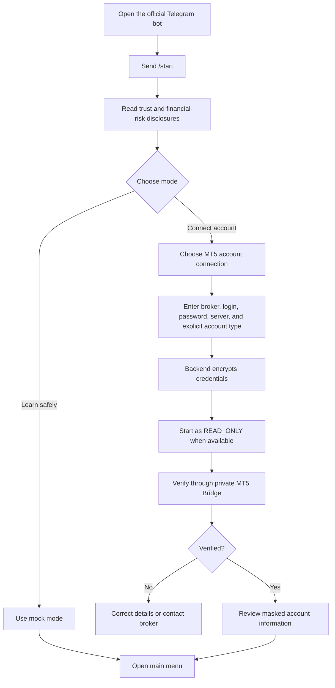
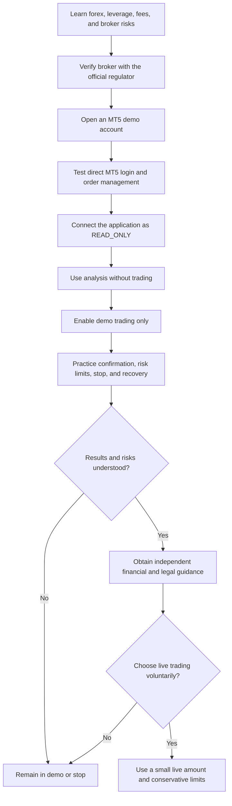

# How to Use the AI Forex Trading Assistant

## 1. Before You Begin

AI Forex Trading Assistant is a Telegram-based decision-support application for users who have their own MetaTrader 5 account.

The application can help you:

- Request structured AI-assisted market analysis
- Review possible `BUY`, `SELL`, or `WAIT` scenarios
- Configure a proposed trade
- Review risk information before acting
- Send a trade to your own MT5 account only after explicit confirmation
- View positions and trading history
- Stop new trading activity with an emergency control

The application is not a broker, bank, investment manager, or guaranteed-profit system. It does not accept deposits and cannot make forex trading safe or risk-free.

> Important: The current repository is a backend foundation and mock/demo development environment. The complete public Telegram onboarding interface is not implemented yet. The end-user journey in this guide describes the intended finished application; the operator section describes what can be run from the current repository.

## 2. Where Do I Register for MetaTrader 5?

### 2.1 MT5 is a platform, not a broker

MetaTrader 5 is trading software. It does not hold your trading funds. Your account is issued and managed by a brokerage company that supports MT5.

For real-money trading, you must open an account directly with a broker you have independently verified. MetaTrader's official documentation states that live accounts are opened by brokerage companies, while demo accounts can be opened from the platform when the selected broker server permits it. See the official [MetaTrader 5 account-management guide](https://www.metatrader5.com/en/terminal/help/start_advanced/account_manage).

Do not send a deposit to the AI Forex Trading Assistant or to anyone claiming to be an administrator of this application. Deposits and withdrawals must occur through the verified broker's official website or application.

### 2.2 Recommended starting point: a demo account

Start with an MT5 demo account. A demo account uses virtual funds and is intended for learning and workflow testing. MetaTrader provides an official explanation in its [Getting Started guide](https://www.metatrader5.com/en/terminal/help/startworking).

General demo-account steps:

1. Download MT5 from the broker's official website or an official MetaTrader distribution channel.
2. Open MT5 and choose **Open an Account** or **New Account**.
3. Search for the exact server name supplied by the broker.
4. Select a demo account.
5. Complete the broker's requested registration fields.
6. Store the generated login, password, and server name securely.
7. Confirm that MT5 labels the account as demo before connecting it to this application.

Demo trading avoids risking real money, but demo results do not predict live results. Live trading can behave differently because of spreads, liquidity, slippage, commissions, latency, and market conditions.

### 2.3 Opening a live account

To open a live account:

1. Select a broker that supports MT5 and is legally authorized for your jurisdiction.
2. Navigate to the broker through a verified official domain—not an unsolicited social-media or chat link.
3. Confirm the legal company name, license number, regulator, official domain, fees, withdrawal rules, and client-fund arrangements.
4. Complete the broker's identity and suitability process.
5. Read the account agreement and risk disclosure.
6. Open the smallest appropriate account and avoid depositing money you cannot afford to lose.
7. Obtain the exact MT5 login, password, and server name from the broker.
8. Test login and withdrawal procedures directly with the broker before connecting third-party software.

The application does not recommend or endorse a specific broker. Broker eligibility depends on your residence, applicable law, available products, and the regulator responsible for that market.

### 2.4 Checking broker legality in Indonesia

For users in Indonesia, verify a futures broker through Bappebti's official [Business Legality Check](https://ceklegalitas.bappebti.go.id/) and [Bappebti website](https://bappebti.go.id/). Bappebti provides the official list and licensing information for futures brokers.

Check the exact legal entity, license, official website, address, telephone number, representatives, and segregated-account information. Do not rely only on a brand name, MT5 logo, search advertisement, influencer, Telegram group, or screenshot.

For users outside Indonesia, use the official register of the regulator responsible for retail forex in your jurisdiction. For example, United States users can follow the CFTC's guidance to verify registration and disciplinary history; United Kingdom users can check the FCA Financial Services Register. See the [CFTC forex advisory](https://www.cftc.gov/LearnAndProtect/AdvisoriesAndArticles/CustomerAdvisory_MustKnowForex.html) and [FCA CFD guidance](https://www.fca.org.uk/firms/contract-for-differences).

Regulatory registration reduces some risks but does not guarantee that you will make a profit or recover every loss.

## 3. Information Needed to Connect an MT5 Account

The application requires:

- Broker name
- MT5 account login or account number
- MT5 password
- Exact broker server name
- Explicit account type: `DEMO` or `LIVE`
- Requested permission: `READ_ONLY` or `TRADING_ENABLED`

Do not call the MT5 account number a generic username when communicating with broker support; ask specifically for the **MT5 login/account number** and **trading server**.

### 3.1 Read-only and trading passwords

Some MT5 accounts provide an investor/read-only password in addition to the master/trading password. MetaTrader documents the investor password as allowing account viewing and price analysis without trading. When supported by the broker, use read-only credentials first. See the official [MetaTrader demo-account documentation](https://www.metatrader5.com/en/mobile-trading/iphone/help/settings_accounts/account_open).

Use `TRADING_ENABLED` only after you understand the workflow and intentionally want the application to submit confirmed instructions.

### 3.2 Credential rules

- Never send your password in a Telegram group.
- Never share credentials with a support agent through chat or email.
- Enter credentials only through the application's designated secure private flow.
- Never reuse your email, banking, or primary personal password.
- Prefer a read-only/investor password for analysis when supported.
- Change or revoke the MT5 password immediately if you suspect exposure.
- Confirm every broker server name independently.

## 4. Intended End-User Setup

When the Telegram interface is complete, the intended setup is:



After verification, check that the displayed broker, masked account number, server, balance, equity, and account type match the information shown directly in MT5.

Stop if anything differs.

## 5. Requesting Market Analysis

The intended Telegram flow is:

1. Send `/analyze` or select **Analyze Market**.
2. Select one of your verified accounts.
3. Select a symbol such as `EURUSD`.
4. Select a timeframe such as `H1`.
5. Wait while the backend retrieves fresh broker market data.
6. Review the AI result, supporting reasons, risk notes, and timestamp.

The result may contain:

- `BUY`, `SELL`, or `WAIT`
- Market bias
- Confidence percentage
- Suggested entry
- Suggested stop loss
- Suggested take profit
- Risk/reward ratio
- Reasoning summary
- Risk warnings

An analysis is not a promise, recommendation guarantee, or order. You remain responsible for deciding whether to do nothing, investigate further, or configure a trade.

## 6. Creating and Confirming a Trade

### 6.1 BUY and SELL do not execute immediately

Selecting `BUY` or `SELL` creates a proposed trade intent. The application must then collect and validate:

- Account
- Symbol
- Side
- Lot size
- Stop loss
- Take profit
- Maximum slippage

If you choose no stop loss, the application must show a strong warning. A stop loss can reduce risk but cannot guarantee the exit price during gaps, extreme volatility, or limited liquidity.

### 6.2 Final review

Before confirmation, compare the application review with MT5:

- `DEMO` or `LIVE` mode
- Masked account number
- Broker and server
- Symbol
- `BUY` or `SELL`
- Lot size
- Current price
- Stop loss
- Take profit
- Estimated loss and possible profit
- Risk/reward ratio

For live accounts, the screen must display a real-money warning. Do not confirm if the environment, account, price, size, or risk is unclear.

### 6.3 Explicit confirmation

Only the separate final confirmation can submit the trade. After confirmation, Rust:

1. Locks the trade intent.
2. Prevents duplicate confirmation with an idempotency key.
3. Retrieves a new MT5 quote.
4. Checks account ownership and trading permission.
5. Checks demo/live feature gates.
6. Applies configured risk limits.
7. Rejects stale prices or excessive slippage.
8. Sends the validated instruction to the private MT5 Bridge.
9. Stores the outcome and audit event.

If successful, verify the returned MT5 ticket directly in your MetaTrader 5 terminal.

```mermaid
sequenceDiagram
    actor U as User
    participant A as Application
    participant M as MT5
    participant B as Broker

    U->>A: Select BUY or SELL
    A-->>U: Request lot, SL, and TP
    U->>A: Configure proposed trade
    A-->>U: Final review; no order placed
    U->>A: Explicitly confirm
    A->>A: Recheck permissions, price, risk, and slippage
    alt Validation fails
        A-->>U: Rejected; no order placed
    else Validation passes
        A->>M: Submit confirmed instruction
        M->>B: Send order
        B-->>M: Execution result
        M-->>A: Status, fill, and ticket
        A-->>U: Show result and MT5 ticket
    end
```

## 7. Viewing Positions and History

Use `/positions` to view current positions associated with your selected account. Compare critical information with MT5:

- Symbol and side
- Volume
- Entry and current price
- Stop loss and take profit
- Current floating profit or loss
- MT5 ticket

Use `/history` to review completed trading activity.

Changing SL, changing TP, or closing a position must use a separate review and confirmation. The application must never modify a position silently.

## 8. Emergency Stop

Use `/stoptrading` to block new `BUY` and `SELL` orders.

The emergency stop should continue to allow:

- Market analysis
- Viewing balances and positions
- Reviewing history
- Closing an existing position after confirmation

Resuming trading requires a separate explicit confirmation. Always verify the effective status in the application before assuming new orders are blocked or enabled.

If the application is unavailable during a market event, use MetaTrader 5 or the broker's official channel directly to manage your account. Do not depend on this application as your only access path.

## 9. Is My Money Safe?

### 9.1 Direct answer

No system can guarantee that your money is completely safe.

Your trading funds remain with your broker, not inside this application. The application is not designed to accept deposits or process withdrawals. This separation limits what the application is intended to control, but it does not eliminate broker, market, credential, software, cyber, or operational risk.

### 9.2 What the application protects

The architecture is designed to provide:

- AES-256-GCM encryption for stored MT5 passwords
- Encryption keys stored outside PostgreSQL
- No MT5 password in OpenAI requests
- No secrets in Telegram messages, API responses, or audit logs
- User and account ownership checks
- Human confirmation before trading actions
- Demo/live separation
- Multiple independent live-trading gates
- Slippage and stale-price protection
- Idempotency to reduce duplicate-order risk
- Audit records and MT5 ticket verification
- An emergency stop for new trades
- Account-session isolation in the production MT5 architecture

These are risk-reduction controls, not guarantees.

### 9.3 What the application cannot protect you from

The application cannot guarantee protection against:

- Trading losses
- Broker insolvency or misconduct
- An unlicensed or fraudulent broker
- Price gaps and slippage
- Losses amplified by leverage
- Incorrect AI analysis
- Stolen Telegram, email, device, or MT5 credentials
- Malware on your device or MT5 host
- Internet, cloud, MT5, broker, or OpenAI outages
- Broker rejection, requotes, or liquidation
- Changes in law or regulatory protection

The CFTC warns that retail forex deposits may not be protected if a dealer disappears or fails and that leverage can cause the loss of all margin and potentially more. It also advises users to investigate dealer registration and disciplinary history before depositing money. Read the official [CFTC customer advisory](https://www.cftc.gov/LearnAndProtect/AdvisoriesAndArticles/CustomerAdvisory_MustKnowForex.html).

### 9.4 How to reduce custody and credential risk

1. Use a regulated broker verified through the regulator's own website.
2. Use demo mode first.
3. Use read-only/investor credentials for analysis when possible.
4. Use a unique MT5 password.
5. Enable all broker and Telegram security options available to you.
6. Deposit only through the broker's verified official channel.
7. Test the broker's withdrawal process before depositing a large amount.
8. Regularly compare application records with MT5 and broker statements.
9. Revoke credentials and stop trading immediately after suspicious activity.
10. Never believe claims of guaranteed returns, no risk, or mandatory additional payment to release a withdrawal.

## 10. Is This Application Risky?

### 10.1 Direct answer

Yes. Forex trading is high risk, and using AI does not remove that risk.

The FCA describes CFDs, including rolling spot forex, as high-risk products that are not suitable for all retail consumers and requires providers to disclose the percentage of retail accounts that lose money. See the official [FCA CFD guidance](https://www.fca.org.uk/firms/contract-for-differences).

### 10.2 Main risk categories

| Risk | What it means | Practical mitigation |
|---|---|---|
| Market risk | Prices can move against your position | Use small size, defined limits, and money you can afford to lose |
| Leverage risk | A small market move can create a large gain or loss | Use conservative leverage and understand margin/liquidation rules |
| AI risk | The model can be wrong, incomplete, or based on insufficient data | Treat output as one input, prefer `WAIT`, and verify independently |
| Execution risk | Fill price may differ or the broker may reject the order | Use slippage limits and verify the MT5 result |
| Gap risk | SL may execute at a worse price than requested | Avoid assuming a stop loss guarantees a maximum loss |
| Broker risk | Broker failure or misconduct can affect funds and withdrawals | Verify licensing, history, legal entity, and client-fund arrangements |
| Cybersecurity risk | Stolen credentials can expose the account | Use unique credentials, secure devices, encryption, and rapid revocation |
| Availability risk | Application, internet, MT5, or broker may become unavailable | Maintain direct MT5/broker access and an emergency procedure |
| Operational risk | Incorrect account, symbol, lot, or mode can cause harm | Review every field and require explicit confirmation |
| Regulatory risk | Product availability and protection vary by country | Use authorized providers and obtain local professional advice |

### 10.3 Never trade money you need

Do not trade funds required for food, housing, healthcare, education, debt payments, or emergency savings. Do not borrow money or mortgage property to fund forex trading. The CFTC similarly advises users not to deposit more than they can afford to lose in its [forex fraud and risk guidance](https://www.cftc.gov/LearnAndProtect/AdvisoriesAndArticles/fraudadv_forex.html).

## 11. Safe Beginner Journey



There is no requirement to progress to live trading. Remaining in demo mode or deciding not to trade is a valid outcome.

## 12. Warning Signs and Scam Prevention

Stop and independently investigate if anyone:

- Promises guaranteed or unusually high returns
- Claims that AI cannot lose
- Pressures you to deposit immediately
- Contacts you unexpectedly through social media or private chat
- Requests cryptocurrency-only deposits
- Provides a broker link that does not match the regulator's record
- Asks for your MT5 password through chat
- Requests an additional tax, commission, or deposit to release a withdrawal
- Asks you to install remote-access software
- Claims that the MT5 logo proves the broker is regulated

Trading software does not prove that a broker is legitimate. The CFTC specifically warns that unregistered dealers may use popular trading software to appear credible. Verify the legal entity independently through the appropriate regulator.

## 13. Current Developer and Operator Usage

The current repository can be run as a backend development environment:

1. Copy `.env.example` to `.env`.
2. Generate a base64 32-byte encryption key.
3. Set strong database and internal bridge secrets.
4. Keep `TRADING_MODE=DEMO`, `LIVE_TRADING_ENABLED=false`, and `MT5_MODE=MOCK`.
5. Run `docker compose up --build`.
6. Check `GET http://localhost:8080/health`.
7. Use the documented HTTP endpoints to test analysis and trade-intent behavior.

Do not configure a real MT5 password or expose the MT5 Bridge publicly in the development stack. Real MT5 integration requires a separately hardened Windows terminal/worker deployment and additional broker-derived validation.

See the [API documentation](api.md), [MT5 deployment guide](mt5-deployment.md), and [security documentation](security.md) for the current technical interface.

## 14. Frequently Asked Questions

### Can I register a real MT5 account with this application?

No. A real account must be opened with a verified broker that supports MT5. The application connects to an account you already own.

### Can I open a demo account without depositing money?

Generally yes. MT5 and participating brokers support demo accounts with virtual funds. Availability and expiry rules depend on the broker server.

### Does the application hold my deposit?

No. Funds remain with the broker. Never send a deposit to the application operator.

### Can the application withdraw my money?

The product is not designed to provide withdrawal functionality. Withdrawals must be performed through the broker's verified official channel. This does not eliminate the risk associated with sharing trading-capable credentials.

### Is a regulated broker completely safe?

No. Regulation can provide oversight and legal requirements, but it does not guarantee profit, uninterrupted service, or full recovery in every failure scenario.

### Does a stop loss guarantee the maximum amount I can lose?

No. Gaps, volatility, liquidity, and execution conditions can cause a worse fill than the requested stop price.

### Does AI improve my chance of profit?

The application does not make that guarantee. AI can organize supplied market information, but its analysis may be incorrect and future prices are uncertain.

### Should I start with live trading?

No. Start with mock and demo modes. Move to live trading only if you independently decide it is appropriate, understand the risks, and can afford the potential loss.

### What should I do if the application is unavailable while I have an open position?

Use MetaTrader 5 or the broker's official application/support channel directly. Always retain independent access to your account.

## 15. Final Safety Checklist

Before connecting an account:

- [ ] I verified the broker in the official regulator's register.
- [ ] I opened the broker website independently and checked the domain.
- [ ] I understand that MT5 is software, not the broker.
- [ ] I started with a demo account.
- [ ] I use a unique password and read-only access when possible.
- [ ] I understand that the application and AI do not guarantee profit.

Before confirming any trade:

- [ ] I checked whether the account is `DEMO` or `LIVE`.
- [ ] I verified the symbol, side, lot size, SL, and TP.
- [ ] I understand the possible loss and leverage involved.
- [ ] I can afford to lose the money at risk.
- [ ] I made the decision myself and was not pressured.
- [ ] I know how to access MT5 directly if the application fails.

After execution:

- [ ] I verified the ticket and position directly in MT5.
- [ ] I confirmed the actual fill price, SL, and TP.
- [ ] I know how to close or manage the position directly through the broker.

## 16. Risk Notice

Forex and leveraged-product trading involves substantial risk and may result in loss of capital. Depending on the product, broker, and jurisdiction, losses may exceed the amount initially committed. AI-generated analysis may be incorrect, delayed, or unsuitable for your circumstances.

This application provides technical decision support and user-confirmed execution. It does not provide a guarantee, personalized financial advice, or protection from market loss. Seek appropriately licensed independent advice if you do not understand the product, legal framework, tax consequences, or risks.

