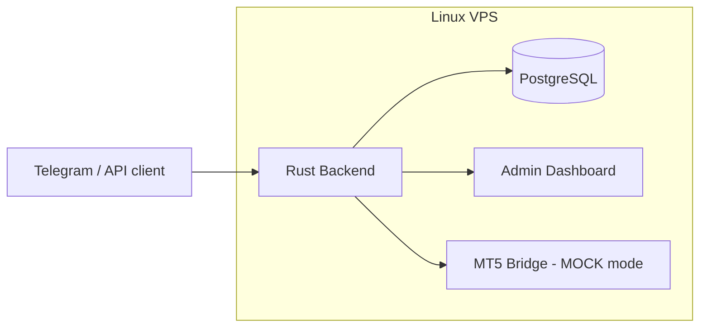
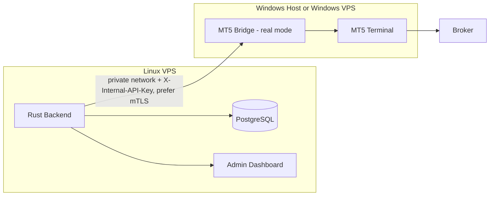

# Can This Run on a Linux VPS Instead of Windows?

## 1. Direct Answer

**Partially, and it depends on which part of the system you mean.**

| Component | Runs on a plain Linux VPS? |
|---|---|
| Rust backend (Axum, risk engine, AI integration, admin dashboard) | **Yes** — no modification needed |
| PostgreSQL | **Yes** — standard Linux database |
| Admin dashboard (`/admin/`) | **Yes** — served by the Rust backend |
| MT5 Bridge in **mock mode** (`MT5_MODE=MOCK`) | **Yes** — this is the default and what `docker compose up` runs today |
| MT5 Bridge in **real mode** (a genuine MT5 demo or live account) | **No** — the official `MetaTrader5` Python package and the MT5 terminal it talks to are Windows-only |

So: if your goal is to run the application's current foundation — analysis endpoints, trade-intent/confirmation workflow, risk engine, admin dashboard — against **mock** data for development, demo, or portfolio purposes, a Linux VPS works out of the box today. If your goal is to connect a **real** MT5 demo or live broker account, the MT5-facing piece specifically needs a Windows host; the rest of the stack can still live on Linux. This is not an arbitrary choice made by this project — it is a constraint of MetaQuotes' official MT5 Python integration, explained in detail below.

## 2. Why the Constraint Exists

MetaTrader 5 does not publish a network-facing trading API. The only officially supported way to automate an MT5 account is the `MetaTrader5` Python package, which works by talking to a **running MT5 terminal process on the same Windows machine** through a local IPC mechanism. There is no official Linux build, and no official remote/headless mode.

This is a MetaQuotes platform limitation, not a Rust-vs-Python or architecture decision this project made. It is why the project already separates the stack into a Windows-capable adapter (the MT5 Bridge) and an OS-independent core (Rust + PostgreSQL) — see [MT5 and the Rust–Python architecture](mt5-and-dual-tech-stack.md) for the full rationale.

## 3. Evidence From This Codebase

You do not need to take this on faith — the current repository already encodes the constraint in three places:

**`mt5-bridge/requirements.txt`:**

```text
MetaTrader5==5.0.5120; platform_system == "Windows"
```

The `; platform_system == "Windows"` clause is a [PEP 508](https://peps.python.org/pep-0508/) environment marker. `pip install -r requirements.txt` on Linux silently **skips** installing the `MetaTrader5` package — it is not an installation failure, the package is simply absent.

**`mt5-bridge/app/mt5_client.py`:**

```python
MOCK = os.environ.get("MT5_MODE", "MOCK").upper() == "MOCK"

def quote(symbol: str) -> Quote:
    if MOCK:
        ...  # returns synthetic data, no import needed
    import MetaTrader5 as mt5   # only imported when MT5_MODE != MOCK
    tick = mt5.symbol_info_tick(symbol)
```

The `import MetaTrader5` is deferred until a real (non-mock) call is made. On a Linux host, that import raises `ModuleNotFoundError` at the moment a user requests real analysis or execution — because the package was never installed per the marker above. Mock mode never hits this line, which is why it works everywhere.

**`mt5-bridge/Dockerfile` and `docker-compose.yml`:**

```dockerfile
FROM python:3.12-slim
```

The bridge's container image is Debian-based Linux. `docker compose up --build` therefore always builds a Linux container for the bridge, which — per the two points above — can only ever run in `MT5_MODE=MOCK`. There is no Windows service defined anywhere in `docker-compose.yml`; real MT5 was never in scope for the Docker Compose stack.

By contrast, `backend-rust/Dockerfile` builds from `rust:1.85-bookworm` / `debian:bookworm-slim`, and `postgres:17-alpine` is likewise Linux-native — confirming the Rust backend and database have **zero** Windows dependency and are fully portable to any Linux VPS as-is.

## 4. Deployment Topologies

### 4.1 Option A — Single Linux VPS, mock mode only



This is exactly what `docker compose up --build` gives you today on any Linux VPS with Docker installed. Suitable for: development, CI, demos, portfolio/reference deployments, and testing the confirmation/risk/audit workflow end-to-end with synthetic prices. **Not suitable** for connecting a real broker account — every real-mode call will fail with a bridge-side import error.

### 4.2 Option B — Hybrid: Linux VPS + a separate Windows host (recommended for real MT5)



This is the topology already recommended in [MT5 deployment](mt5-deployment.md#mt5-deployment) and [MT5 and the dual tech stack §10.2](mt5-and-dual-tech-stack.md#102-real-mt5-mode): everything that has no Windows dependency (Rust, PostgreSQL, admin dashboard, Telegram adapter once built) stays on your Linux VPS; only the MT5 Bridge and the MT5 terminal itself run on a Windows machine. The two communicate over a private network connection — a VPN/WireGuard tunnel, a private cloud VPC, or an equivalent — never over the public internet, authenticated with the existing `X-Internal-API-Key` header (mTLS recommended for production, per [security.md](security.md)).

To point your Linux-hosted Rust backend at a remote Windows bridge, no code change is required — only configuration:

```dotenv
MT5_BRIDGE_URL=https://<private-network-address-of-windows-host>:8000
MT5_BRIDGE_API_KEY=<same-secret-configured-on-the-windows-bridge>
MT5_MODE=DEMO   # or LIVE, once every live gate in risk-controls.md is satisfied
```

Practical ways to obtain the Windows side:

- A conventional Windows Server VPS/VM from any cloud provider.
- A **broker-provided MT5 VPS** — many MT5 brokers rent Windows VPS instances specifically for hosting terminals close to their trading servers; this is a common, broker-native option worth comparing against a generic cloud Windows VM for latency and cost.
- An on-premises Windows machine reachable over a secured tunnel, for smaller/self-hosted setups.

In every case, follow the per-account isolation guidance already documented: one terminal/worker per active account, request serialization, and no asynchronous account-switching inside one global MT5 session (see [MT5 and the dual tech stack §8](mt5-and-dual-tech-stack.md#8-multi-user-session-isolation)).

### 4.3 Option C — Wine-based Linux workaround (unofficial, not implemented here)

It is technically possible for enthusiasts to run the MT5 terminal under [Wine](https://www.winehq.org/) on Linux, and community projects (for example `mt5linux`, which runs a Windows-side Python interpreter inside Wine and exposes it to native Linux Python over RPC) build on that to avoid a second physical/virtual Windows machine.

This repository does **not** implement or test that path, and it comes with real caveats worth stating plainly:

- It is unsupported by MetaQuotes; terminal behavior, updates, and stability under Wine are not guaranteed.
- It adds an extra unofficial dependency layer (Wine + an RPC bridge) between Rust's validated order request and the broker, which cuts against this project's core design goal of a narrow, well-understood execution path (see [security.md](security.md) and [risk-controls.md](risk-controls.md)).
- Adopting it would require code changes: replacing the direct `import MetaTrader5` call in `mt5_client.py` with an RPC client, removing or adjusting the `platform_system == "Windows"` marker, and validating that every MT5 call this project depends on (`symbol_info_tick`, `order_send`, position/history queries) behaves identically through the RPC layer.

**Recommendation:** use Option C only for personal experimentation or non-financial testing. For anything connected to a real broker account — and certainly for live trading — Option B (a genuine Windows host) is the supportable path consistent with the rest of this project's risk-control posture.

## 5. What Definitely Does Not Change

Regardless of which topology you choose, none of these move to Windows or change behavior:

- User/account identity, ownership checks, and multi-tenant isolation (Rust, Linux-native).
- AI request sanitization and OpenAI response validation (Rust, Linux-native).
- Trade-intent state machine, human-confirmation enforcement, and idempotency (Rust, Linux-native).
- Risk engine: lot/position/trade limits, slippage checks, live-trading gates (Rust, Linux-native).
- Credential encryption (AES-256-GCM) and audit logging (Rust, Linux-native).
- PostgreSQL data storage, including the billing schema (Linux-native).
- The admin dashboard (served by the Rust backend, Linux-native).

Rust remains the policy and security authority in every topology; only the narrow MT5-terminal adapter needs Windows, exactly as designed in [MT5 and the dual tech stack](mt5-and-dual-tech-stack.md).

## 6. Summary

| Question | Answer |
|---|---|
| Can I deploy the whole current repo on a Linux VPS today? | Yes, in mock mode, unmodified. |
| Can a Linux VPS alone connect to a real MT5 demo or live account? | No — the official MT5 Python integration requires a Windows host. |
| Do I need to rewrite the Rust backend to use Linux? | No — it already runs on Linux by default (`rust:1.85-bookworm` / `debian:bookworm-slim` base images). |
| What's the supported way to get real MT5 data/execution while keeping most infrastructure on Linux? | Run the Rust backend, PostgreSQL, and admin dashboard on your Linux VPS; run the MT5 Bridge and MT5 terminal on a separate Windows host reachable only over a private, authenticated connection. |
| Is there an unofficial all-Linux path? | Wine-based workarounds exist in the community but are unsupported, untested in this repository, and not recommended for real-money trading. |

## 7. Related Documentation

- [MT5 and the Rust–Python architecture](mt5-and-dual-tech-stack.md) — why the stack is split this way
- [MT5 deployment](mt5-deployment.md) — production worker/terminal isolation guidance
- [Security](security.md) — internal bridge authentication and network boundary requirements
- [Risk controls](risk-controls.md) — the gates that must pass before real trading, on any host
