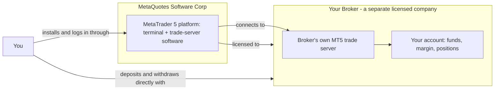
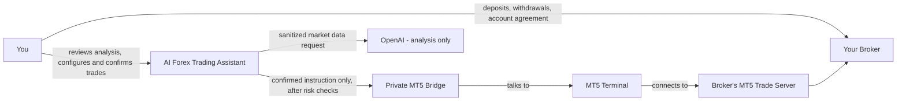

# MetaTrader 5 and the Broker: What's the Difference, and How Do They Relate?

## 1. Direct Answer

**MetaTrader 5 (MT5) is trading software. A broker is a licensed financial company that holds your trading account and money.** MT5 is not a broker, does not hold funds, and does not decide who can open an account. A broker is not software — it is the business you actually open an account with, deposit money into, and trade against.

They are two different things made by two different kinds of organizations, and this application depends on both, in different ways:

This document explains what each party actually is, who is responsible for what, and where this application (AI Forex Trading Assistant) fits in relative to both.

## 2. What Is a Broker?

A **broker** (sometimes called a brokerage firm, forex broker, or CFD provider, depending on jurisdiction and product) is a company that:

- Is legally authorized — ideally licensed by a financial regulator — to accept clients and offer trading accounts
- Opens and administers your trading account, including your login, balance, and margin
- Holds your deposited funds (directly, or through a regulated custody/segregation arrangement required by its license)
- Provides the prices (bid/ask quotes) you actually trade on
- Accepts or rejects your orders, and is the counterparty (or routes to liquidity providers) that fills them
- Applies its own trading costs — spread, commission, swap/overnight financing — and its own margin, leverage, and symbol rules
- Processes deposits and withdrawals through its own official channels
- Is the entity you have a legal account agreement with, and the entity responsible if something goes wrong with your funds or execution

In short: **the broker is who you are actually doing business with.** Your trading capital, your profit, and your loss all happen inside your broker account — not inside MT5, and not inside this application.

## 3. What Is MetaTrader 5?

**MetaTrader 5** is trading platform software developed and owned by **MetaQuotes Software Corp.**, a software company — not a broker. MetaQuotes does not open trading accounts for the public and does not hold client funds. Its business is building the MT5 platform and licensing it to brokers who want to offer it to their clients.

MT5 has two halves:

| Part | What it is | Who runs it |
|---|---|---|
| MT5 **terminal** | The desktop/mobile/web application you install and look at — charts, order tickets, account view | You, on your own device |
| MT5 **trade server** | The server-side software that actually holds account state, prices, and matches orders | The broker, on its own infrastructure |

When you connect, your terminal talks to one specific broker's trade server — identified by the exact **server name** you're given (for example, something like `BrokerName-Live` or `BrokerName-Demo3`). That server name is not a technicality; it is literally which broker, and which of that broker's environments (demo or live), you are connecting to.

## 4. How MT5 and the Broker Relate

Think of it like this analogy: **MetaTrader 5 is like a web browser; the broker is like the website you visit through it.** The browser (MT5) is the same software regardless of which broker you use it with. The broker is the actual business — with its own license, its own prices, its own servers, and its own terms — that the software connects you to.

Concretely:

1. **MetaQuotes builds MT5** and licenses it to brokers.
2. **A broker deploys its own MT5 trade server**, configures its own tradable symbols, spreads, commissions, leverage, and margin rules, and opens accounts on it.
3. **You download the MT5 terminal** (often from the broker's own site, sometimes visually branded with the broker's logo, but running the same underlying MetaQuotes software) and log in using the **login, password, and exact server name** the broker gave you.
4. **Your terminal connects to that broker's server** — not to MetaQuotes, and not to any other broker's server. Prices, execution, balance, and history you see all come from that one broker's server.
5. **Your money stays with the broker**, subject to that broker's account agreement, licensing, and (where applicable) regulatory fund-segregation rules — never inside the MT5 software itself.

MT5 also offers its own generic demo servers (e.g., a `MetaQuotes-Demo` option) so someone can try the terminal software itself without first picking a broker. That is useful for learning the interface, but it is not a real broker account and is a separate thing from connecting to a specific broker's demo or live server.

## 5. Who Owns / Controls What

| Responsibility | MetaQuotes (MT5 platform) | Your broker |
|---|---|---|
| Builds and maintains the terminal/server software | Yes | No |
| Licenses the platform to brokers | Yes | Licenses it, does not build it |
| Opens your trading account | No | Yes |
| Holds your deposited funds | No | Yes |
| Sets your leverage, margin, and symbol rules | No | Yes |
| Provides the prices you trade on | No | Yes |
| Accepts, rejects, or fills your orders | No | Yes |
| Charges spread, commission, or swap | No | Yes |
| Is regulated for your specific account (where applicable) | Not applicable | Yes, if properly licensed |
| Processes your deposits and withdrawals | No | Yes |

## 6. Common Misconceptions

**"The MT5 logo means the broker is regulated and safe."** No. MT5 is licensed to thousands of brokers worldwide, regulated and unregulated alike. Seeing the familiar MT5 interface tells you nothing about whether the specific company behind that server is legitimate, solvent, or licensed in your jurisdiction. This exact point is called out in [how-to-use-the-application.md §12](how-to-use-the-application.md#12-warning-signs-and-scam-prevention): *"Trading software does not prove that a broker is legitimate."*

**"All MT5 brokers are basically the same."** No. Different brokers running MT5 are separate legal entities with different licenses (or none), different spreads and commissions, different execution quality, different withdrawal processes, and different fund-safety arrangements. Always verify the specific legal entity, not just "it uses MT5."

**"My MT5 password is like my app login — low risk to share."** No. Your MT5 password is trading-capable broker-account access. Sharing it is materially different from sharing a low-stakes app password — see [how-to-use-the-application.md §3.2](how-to-use-the-application.md#32-credential-rules).

**"A demo account proves the broker is trustworthy."** No. Demo accounts use virtual money and test the trading experience, not the broker's real-money withdrawal process, fund segregation, or legal standing. Verify those separately, as described in §7 below.

**"MT5 executed my trade, so MT5 is responsible for the result."** No. MT5 is the interface and messaging layer; the broker's trade server is what actually accepts, prices, and fills (or rejects) the order. Execution quality, requotes, slippage policy, and order handling are broker decisions, not MT5 decisions.

## 7. How to Check Whether a Broker Is Legitimate

Because the broker — not MT5 — is who actually holds your money, verifying the broker is the step that matters most. Never rely on a brand name, search ad, social-media post, influencer, or Telegram group.

- **Indonesia:** check Bappebti's official [Business Legality Check](https://ceklegalitas.bappebti.go.id/) and [Bappebti website](https://bappebti.go.id/).
- **United States:** follow CFTC guidance to verify registration and disciplinary history — see the [CFTC forex advisory](https://www.cftc.gov/LearnAndProtect/AdvisoriesAndArticles/CustomerAdvisory_MustKnowForex.html).
- **United Kingdom:** check the FCA Financial Services Register — see the [FCA CFD guidance](https://www.fca.org.uk/firms/contract-for-differences).
- **Other jurisdictions:** use the official register of the regulator responsible for retail forex/CFDs where you live.

This full checklist, including credential-handling rules and how to open a demo account safely, is covered in [how-to-use-the-application.md §2](how-to-use-the-application.md#2-where-do-i-register-for-metatrader-5).

## 8. Where This Application Fits Between MT5 and the Broker

AI Forex Trading Assistant is **neither MT5 nor a broker**. It is a third party that sits on top of your own MT5 connection to your own broker account, adding AI-assisted analysis and a controlled, human-confirmed workflow — without ever holding your funds or becoming your broker.

Concretely, per account/order:

1. You open and fund your account **directly with the broker** — this application is never in that path (see [product-overview.md §7](product-overview.md#7-what-the-application-does-not-do)).
2. You give the application your MT5 **login, password, and server name** so it can connect to your account through MT5, the same way any MT5-based tool would; the password is encrypted at rest and never sent to OpenAI (see [security.md](security.md)).
3. The application reads live prices and account data from your broker's MT5 server through MT5, and asks OpenAI to analyze only the sanitized market fields — never your credentials.
4. If you choose to act on the analysis, you configure and then **explicitly confirm** a trade; only after that confirmation does the application send a validated instruction through the private MT5 Bridge to your MT5 terminal, which submits it to your broker's server.
5. Your **broker** — not MT5, not this application — decides whether to accept, reject, or fill that order, and applies its own spread, commission, and margin rules to the result.
6. The resulting MT5 ticket lets you verify directly in MetaTrader 5 (and with your broker) that the order genuinely reached your account.

This three-layer separation — broker (funds and execution), MT5 (connectivity and terminal software), and this application (analysis and controlled workflow) — is intentional and is the same boundary described in [MT5 and the Rust–Python architecture](mt5-and-dual-tech-stack.md) and [product boundaries](product-overview.md#9-product-boundaries).

## 9. Quick Reference

| Question | Answer |
|---|---|
| Who holds my money? | Your broker. Never MT5, never this application. |
| Who sets my spread, commission, leverage, and margin rules? | Your broker. |
| Who provides the terminal software I install? | MetaQuotes (MT5), typically distributed via your broker's site. |
| Does MT5 guarantee my broker is licensed or trustworthy? | No — verify the broker independently through the relevant regulator. |
| Does this application hold my funds or act as my broker? | No — it only connects to your existing broker account through MT5, with your confirmation required for every trade. |
| If my order is rejected, whose rule caused it? | Almost always the broker's (margin, symbol status, filling rules) — MT5 and this application pass the request through and report the broker's result. |
| Can I use this application with any broker? | Only brokers that offer an MT5 account, since the application connects specifically through the MT5 terminal and its Python integration. |

## 10. Related Documentation

- [MT5 and the Rust–Python architecture](mt5-and-dual-tech-stack.md) — how this application technically talks to MT5
- [Application user guide and safety FAQ](how-to-use-the-application.md) — opening an account, verifying a broker, credential rules
- [Platform subscription fees vs. MT5 and broker costs](subscription-fees-vs-mt5-and-broker-costs.md) — why subscription, MT5, and broker costs are three separate things
- [Product overview](product-overview.md) — what the application does and does not do
- [Security](security.md) — how MT5 credentials are protected
