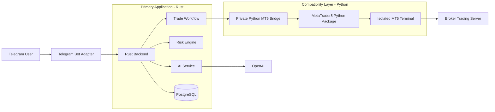
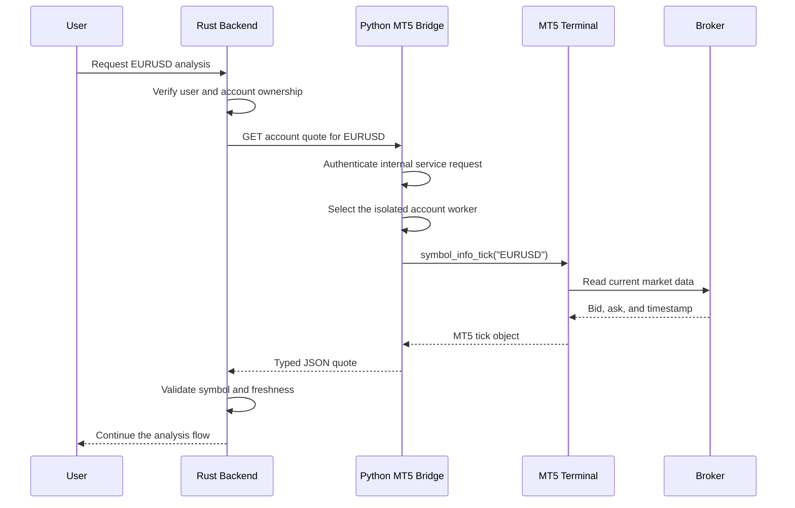
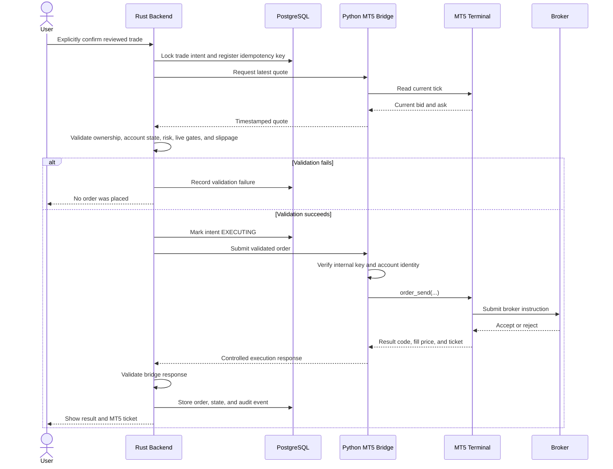
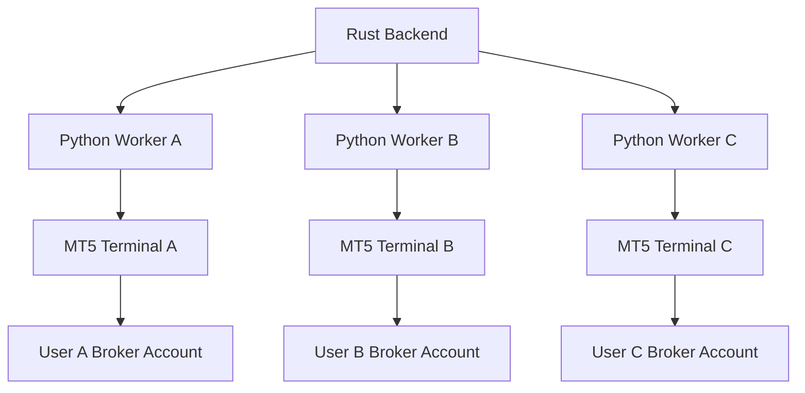

# MetaTrader 5, the MT5 Bridge, and the Rust–Python Architecture

## 1. Purpose

This document explains:

- What MetaTrader 5 is
- What the MT5 Bridge does
- Why the application uses both Rust and Python
- Which responsibilities belong to each technology
- How the two services communicate safely

The short version is:

> Rust is the application and security authority. Python is a small compatibility adapter for MetaTrader 5.

Python does not replace the Rust backend, and MetaTrader 5 does not contain the application's user, AI, confirmation, or risk workflow.

## 2. What Is MetaTrader 5?

MetaTrader 5, commonly called **MT5**, is an electronic trading platform used to view markets, analyze price data, manage trading accounts, and submit trading instructions to participating brokers.

In this application, MT5 is the connection point between the platform and each user's broker account. The user's money remains in the broker account. The AI Forex Trading Assistant does not hold deposits and does not control withdrawals.

### 2.1 What MT5 provides

Depending on the broker and account permissions, MT5 can provide:

- Account information such as balance, equity, margin, and account currency
- Available symbols and broker-specific symbol properties
- Current bid and ask prices
- Historical candles and tick data
- Open positions
- Pending and completed orders
- Deal and trading history
- Order submission, modification, and closing operations
- Broker execution results and MT5 ticket numbers

### 2.2 The MT5 terminal and the broker

MT5 should not be confused with the broker itself.

| Component | Role |
|---|---|
| MT5 terminal | Local trading software that maintains a session with the broker |
| Broker trading server | Authenticates the trading account, supplies prices, and accepts or rejects orders |
| User's broker account | Holds the user's funds, positions, and trading history |
| AI Forex Trading Assistant | Provides analysis and submits only user-confirmed instructions |

An order is not successful merely because the application requested it. The broker can still reject it because of insufficient margin, an unavailable market, invalid volume, unsupported filling rules, price movement, or other broker conditions.

### 2.3 Account identity

An MT5 connection normally requires:

- An account login or account number
- An MT5 password
- The exact broker server name
- An explicitly declared account type: `DEMO` or `LIVE`

The application never infers whether an account is demo or live only from its server name. The account type is stored explicitly and must be verified.

### 2.4 MT5 is not the AI

MT5 supplies market and account data and executes broker instructions. It does not provide the OpenAI analysis used by this product. Similarly, OpenAI never receives MT5 passwords and cannot directly call MT5 or submit an order.

## 3. What Is the MT5 Bridge?

The **MT5 Bridge** is a small internal service that translates the Rust backend's typed HTTP requests into operations supported by the MetaTrader 5 Python package and terminal.

It is called a bridge because it connects two different interfaces:

```text
Rust application request
        ↓
Private authenticated HTTP API
        ↓
Python MT5 Bridge
        ↓
MetaTrader 5 Python package
        ↓
MT5 terminal session
        ↓
Broker
```

### 3.1 Why a bridge is necessary

MetaTrader provides an official Python integration that can communicate with an installed MT5 terminal. Rust does not have an equivalent first-party MT5 SDK with the same supported terminal integration.

Instead of making the entire application a Python application, the project isolates that compatibility requirement behind a narrow internal API. The Rust backend can therefore remain responsible for the product workflow while Python handles only MT5-specific calls.

### 3.2 Bridge responsibilities

The bridge is responsible for operations such as:

- Initializing access to an MT5 terminal
- Authenticating an MT5 account session
- Reading account information
- Reading symbol metadata
- Retrieving current quotes and historical rates
- Retrieving positions and trade history
- Translating a validated order request into `order_send()` parameters
- Translating MT5 result codes into a controlled response
- Returning an MT5 ticket and execution price when available

Typical Python MT5 functions include:

- `mt5.initialize()`
- `mt5.login()`
- `mt5.account_info()`
- `mt5.symbol_info()`
- `mt5.symbol_info_tick()`
- `mt5.copy_rates_from_pos()`
- `mt5.positions_get()`
- `mt5.order_send()`
- `mt5.history_orders_get()`
- `mt5.history_deals_get()`

### 3.3 What the bridge must not do

The bridge must not:

- Register Telegram users
- Call OpenAI for trading decisions
- Decide whether the user should buy or sell
- Accept public internet traffic
- Bypass human confirmation
- Own the authoritative risk policy
- Store application-wide user sessions or business records
- Reuse one uncontrolled global MT5 login for multiple users
- Enable live trading by itself
- Log passwords or full credential payloads

The bridge performs an operation only after Rust has authorized and validated the request. It still validates its own request shape and account identity because external-service boundaries must use defense in depth.

## 4. Why Does the Application Use Two Technology Stacks?

The application uses two technologies because they solve different problems well:

- **Rust** is used for the primary, security-sensitive application backend.
- **Python** is used only where direct compatibility with the MT5 Python package is needed.

This is an intentional architectural boundary rather than duplicated backend logic.

### 4.1 Why Rust is the primary backend

Rust is well suited to the core platform because it provides:

- Strong compile-time type checking
- Memory safety without a garbage collector
- Predictable performance
- Safe asynchronous concurrency with Tokio
- Explicit error handling through `Result`
- Strong domain models for order states, account modes, and validated inputs
- Reliable long-running network services
- A useful foundation for security-sensitive authorization and trading workflows

The Rust backend owns:

- Telegram user identity and multi-user isolation
- Account ownership checks
- API request validation
- Credential encryption and decryption boundaries
- AI request sanitization and AI response validation
- Trade-intent state management
- Human-confirmation enforcement
- Risk validation
- Demo/live feature gates
- Slippage checks
- Idempotency and duplicate-order prevention
- Database transactions
- Audit logging
- Calls to the internal MT5 Bridge

### 4.2 Why Python is still used

Python is used because the supported MetaTrader 5 integration is exposed through the `MetaTrader5` Python package and communicates with an installed MT5 terminal.

Python therefore provides a practical compatibility layer for:

- Converting HTTP models into MT5 function calls
- Converting MT5 result objects into JSON responses
- Operating alongside the MT5 terminal in its supported environment
- Keeping vendor-specific behavior out of the Rust domain layer

Python was not selected to own the whole application. Its scope is deliberately small so that sensitive policy cannot drift between two independent backends.

### 4.3 Responsibility comparison

| Concern | Rust backend | Python MT5 Bridge |
|---|---:|---:|
| Telegram interaction | Owner | No |
| User registration | Owner | No |
| Multi-user authorization | Owner | Validates requested account identity defensively |
| PostgreSQL business data | Owner | No |
| Credential encryption | Owner | Receives credentials only when required for an isolated session |
| OpenAI integration | Owner | No |
| AI-output validation | Owner | No |
| Human confirmation | Owner | No |
| Risk rules | Owner | Optional broker-level defensive validation only |
| Idempotency | Owner | May add secondary replay protection |
| MT5 SDK calls | No | Owner |
| MT5 terminal session | No | Owner |
| Broker result translation | Validates response | Owner |
| Audit trail | Owner | Emits operational logs without secrets |

## 5. High-Level Architecture



The direction of control is important. The bridge does not call Rust to ask whether it should trade, and OpenAI does not call the bridge. Rust initiates all external operations after applying the appropriate policy.

## 6. Example: Reading a Market Quote



The returned timestamp is essential. Rust rejects stale market data instead of presenting it as current analysis.

## 7. Example: Executing a Confirmed Order



Clicking a `BUY` or `SELL` button is not the confirmation step. It creates a trade intent. Only a later, explicit confirmation can reach the execution sequence.

## 8. Multi-User Session Isolation

The MetaTrader 5 Python integration is terminal-session oriented. Careless use of one global session can create a serious account-confusion risk: one asynchronous request could switch the session while another request is still running.

The application must never switch multiple user accounts concurrently inside one uncontrolled global MT5 process.

Preferred production isolation is:



Recommended controls include:

1. One isolated worker process and MT5 terminal data directory per active account.
2. A strict mapping between the internal `account_id`, worker, terminal, login, and server.
3. Per-account request serialization.
4. Identity validation before and after terminal initialization.
5. Worker recycling when an account session becomes invalid.
6. No credential values in application or operational logs.

The repository's current bridge provides a per-account lock for the mock/foundation flow. A production Windows deployment should strengthen this into process and terminal isolation.

## 9. Communication and Security Boundary

The bridge is an internal service and must not be directly exposed to the internet.

```text
Internet
   ↓
Telegram platform
   ↓
Rust backend
   ↓ private network + service authentication
Python MT5 Bridge
   ↓ local/isolated terminal access
MetaTrader 5
```

Current internal requests use the `X-Internal-API-Key` header. Production deployments should also consider mutual TLS, network allowlists, short timeouts, request-size limits, rate limits, key rotation, and independent worker authentication.

The bridge must return safe error categories such as `market data unavailable` or `order execution failed`. It must not expose:

- MT5 passwords
- Internal addresses
- Python stack traces
- Terminal filesystem paths
- Raw credential payloads
- Secret environment variables

## 10. Deployment Considerations

### 10.1 Development and mock mode

The bridge can run in `MT5_MODE=MOCK` without a real terminal. This supports application development and workflow testing without connecting to a broker or placing a real order.

### 10.2 Real MT5 mode

The native MetaTrader 5 terminal integration is generally deployed on Windows with the terminal installed and configured. For that reason, the Linux Python container in the local Docker Compose configuration is intended for mock mode.

A real deployment commonly separates the services:

- Rust backend and PostgreSQL on the primary private application infrastructure
- Python worker and MT5 terminal on a private Windows host
- Encrypted, authenticated internal communication between them
- Separate terminal/worker isolation for each active account

### 10.3 Demo before live

Real integration should be enabled in this order:

1. Mock execution
2. MT5 demo account
3. Multi-user isolation and failure testing
4. Security, audit, risk, slippage, and idempotency verification
5. Legal and compliance review
6. Optional live mode behind every required feature gate

Live trading is not enabled merely because a live account can log in.

## 11. Why Not Use Only Rust?

Using only Rust would remove one runtime and simplify deployment, but it would require a reliable and fully compatible Rust integration with the installed MT5 terminal. Reimplementing or depending on an unofficial trading connector would introduce additional compatibility and operational risk.

The narrow Python bridge keeps the vendor-specific SDK at the edge while preserving Rust as the policy and workflow authority.

## 12. Why Not Use Only Python?

Python could technically host the bot, database access, AI calls, risk logic, and MT5 integration in one application. However, that would combine application policy and vendor-terminal state in one process and make the MT5 compatibility constraint determine the architecture of the entire platform.

The chosen design keeps:

- Security-sensitive workflow and concurrency in Rust
- Vendor-specific terminal operations in Python
- The boundary explicit, typed, authenticated, testable, and replaceable

This design also allows the MT5 adapter to be upgraded or replaced without rewriting user registration, AI analysis, risk controls, confirmation state, idempotency, and audit logging.

## 13. Failure Ownership

| Failure | Responsible response |
|---|---|
| Invalid user or cross-user account request | Rust rejects before contacting the bridge |
| Stale price | Rust rejects analysis or execution |
| Duplicate confirmation | Rust idempotency layer rejects it |
| Live trading disabled | Rust rejects before execution |
| Invalid request shape or account mismatch | Bridge rejects defensively |
| MT5 terminal unavailable | Bridge returns a safe service error; Rust records failure |
| Broker rejects an order | Bridge translates the result; Rust persists the failed outcome |
| Network timeout after submission | Mark outcome uncertain and reconcile with MT5 history before any retry |

The final case is especially important. A timeout does not prove that the broker failed to receive an order. The system must reconcile using the trade intent reference, MT5 history, and ticket information before retrying.

## 14. Summary

MT5 provides access to the user's broker account and trading functions. The MT5 Bridge converts controlled internal HTTP requests into MT5 Python operations. Rust remains the primary backend because it owns identity, authorization, AI validation, human confirmation, risk controls, database state, idempotency, and auditability.

The two-stack architecture exists for a clear reason:

> Rust provides the trusted application workflow; Python provides the smallest practical adapter to the supported MT5 integration.

This separation reduces the amount of code that handles MT5 terminal state and helps ensure that neither AI output nor the bridge can independently authorize a trade.

