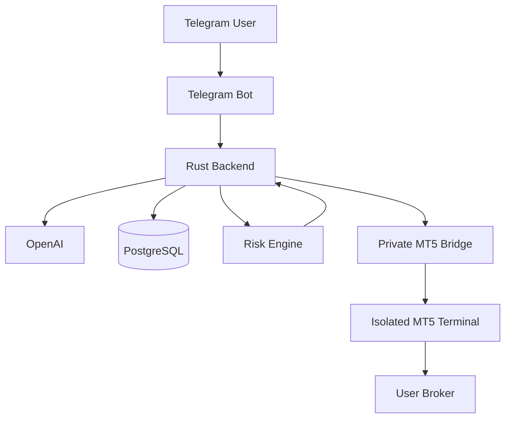

# Product Requirements Document (PRD)

## 1. Document Control

| Field | Value |
|---|---|
| Product | AI Forex Trading Assistant |
| Document type | Product Requirements Document |
| Status | Draft — derived from [BRD](brd.md) and current repository state |
| Related documents | [BRD](brd.md), [Product overview](product-overview.md), [Architecture](architecture.md), [User journey and data flow](user-journey-and-data-flow.md), [API](api.md), [Security](security.md), [Risk controls](risk-controls.md), [MT5 and the dual tech stack](mt5-and-dual-tech-stack.md), [Pricing, billing, and payment administration](pricing-billing-and-payment-administration.md), [Admin dashboard](admin-dashboard.md) |

Status tags used throughout this document:

- **Implemented** — present in the current repository today.
- **Partial** — a foundation exists but the full requirement is not met yet.
- **Planned** — not yet implemented; required before the corresponding commercial milestone.

## 2. Product Principle

> AI analyzes. The user decides. Rust controls the workflow. MT5 executes. The broker holds the user's funds.

Every requirement in this document must preserve this operating principle. No feature may let AI output, a Telegram callback, the MT5 Bridge, or a broker response independently become trusted authority to execute a trade (see [Product boundaries](product-overview.md#9-product-boundaries)).

## 3. Product Vision

Deliver a Telegram-based, multi-tenant SaaS that turns live MT5 market data into structured, AI-assisted analysis, and lets a user configure and explicitly confirm a trade that the backend independently re-validates before sending it — unmodified by AI or chat state — to the user's own broker account through a private MT5 adapter. The product's differentiation is **auditable human control**, not automation.

## 4. Target Users and Personas

| Persona | Description | Primary needs |
|---|---|---|
| Learning trader | New to MT5/forex, wants to understand structured analysis before risking money | Mock/demo mode, clear risk education, low-cost trial |
| Active demo-to-live trader | Comfortable with MT5, wants AI-assisted analysis and a safer path to live trading | Multiple accounts, higher AI quota, advanced risk controls, live eligibility |
| Operations/support staff | Platform employee handling account and billing support | Read-only dashboards, masked data, safe support actions |
| Platform owner/operator | Runs the business | Revenue visibility, compliance posture, security control |

The product explicitly does **not** target users seeking unattended/autonomous trading bots (see [product overview §4](product-overview.md#4-who-is-this-application-for)).

## 5. Scope and Non-Goals

In scope: Telegram interaction, AI analysis, trade-intent/confirmation workflow, risk-controlled execution, MT5 integration, subscription billing, restricted admin operations, audit logging.

Non-goals: autonomous execution, holding user funds, brokerage services, performance-fee pricing, guaranteed-return claims, BYOK at launch. See [BRD §5.2](brd.md#52-out-of-scope-current-commercial-phase) for the authoritative list.

## 6. System Architecture Summary

Rust owns identity, authorization, risk policy, idempotency, and persistence. Python (the MT5 Bridge) is a narrow, replaceable adapter to the MetaTrader5 SDK. Full rationale is in [MT5 and the dual tech stack](mt5-and-dual-tech-stack.md).

## 7. Functional Requirements

Each requirement maps to a BRD business requirement ID where applicable.

### 7.1 Epic: Identity and Onboarding (→ BR-15, BR-28)

| ID | Requirement | Acceptance criteria | Status |
|---|---|---|---|
| FR-1.1 | System creates or retrieves a unique internal user record from the Telegram identity on `/start` | A second `/start` from the same `telegram_user_id` never creates a duplicate user | Implemented (data model); Telegram command handler is **Planned** |
| FR-1.2 | System presents trust/risk disclosures (fund custody, AI fallibility, human confirmation requirement) before any account connection | Disclosures are shown before account-connection flow begins and cannot be silently skipped | Planned |
| FR-1.3 | New MT5 account connections default to `READ_ONLY` permission and unverified state | A freshly connected account cannot place a trade until explicitly upgraded and verified | Implemented (data model default) |
| FR-1.4 | System verifies a connected account through the private MT5 Bridge before displaying it as usable | Unverifiable accounts show a safe error with no credential leakage | Partial — bridge verification path exists; public onboarding endpoint is **Planned** |

### 7.2 Epic: MT5 Account Management (→ BR-16, BR-17)

| ID | Requirement | Acceptance criteria | Status |
|---|---|---|---|
| FR-2.1 | MT5 passwords are encrypted with AES-256-GCM using a fresh nonce per write | Ciphertext, nonce, and key version are stored; plaintext is never persisted | Implemented |
| FR-2.2 | Encryption keys are stored outside PostgreSQL and support versioned rotation | Rotating the key does not require re-encrypting all rows synchronously | Implemented (utility-level) |
| FR-2.3 | A user can view only their own accounts, masked (login/server), never full credentials | Cross-user account queries return zero rows, not an authorization error that leaks existence | Implemented (ownership checks) |
| FR-2.4 | Account type (`DEMO`/`LIVE`) is explicitly declared and stored, never inferred from server name | Live-gate logic reads the stored field only | Implemented |
| FR-2.5 | Public account-connection API/UI endpoint | User can submit broker, login, password, server, and account type through a safe channel | Planned |

### 7.3 Epic: AI-Assisted Market Analysis (→ BR-05, BR-06, BR-07)

| ID | Requirement | Acceptance criteria | Status |
|---|---|---|---|
| FR-3.1 | `POST /api/v1/analyses` returns a structured analysis (signal, bias, confidence, entry, SL, TP, risk/reward, reasoning, risk notes) for an owned account/symbol/timeframe | Response validates against a fixed schema; malformed AI output is rejected, not passed through | Implemented |
| FR-3.2 | Market data freshness is validated before analysis; stale data is rejected | Requests using data older than `MARKET_DATA_MAX_AGE_SECONDS` fail closed | Implemented |
| FR-3.3 | Only an approved, sanitized field allowlist is sent to OpenAI; no credentials, tokens, or raw user identity | Automated test asserts the outbound payload contains no denylisted fields | Implemented (allowlist); expanded indicator set (EMA/RSI/MACD/ATR) is **Planned** |
| FR-3.4 | Per-user/per-plan AI analysis quota is enforced monthly | Requests beyond quota are blocked with a clear message; no silent overage charge | Planned |
| FR-3.5 | Analysis and its sanitized market snapshot are persisted for audit/history | Every analysis has a queryable `ai_analyses` record scoped to `user_id`/`account_id` | Implemented |

### 7.4 Epic: Trade Intent, Review, and Confirmation (→ BR-08, BR-09, BR-10)

| ID | Requirement | Acceptance criteria | Status |
|---|---|---|---|
| FR-4.1 | `POST /api/v1/trade-intents` creates a non-executing intent in `PENDING_CONFIRMATION` with a short expiry | No order is created or sent to MT5 by this call | Implemented |
| FR-4.2 | System presents a final review (account, environment, symbol, side, size, price, SL, TP, risk) before confirmation | UI/response includes every listed field; live accounts show a stronger warning | Implemented at API level; Telegram presentation is **Planned** |
| FR-4.3 | `POST /api/v1/trade-intents/{id}/confirm` requires a client-generated idempotency key; duplicate keys are rejected without side effects | Replaying the same key never creates a second order | Implemented |
| FR-4.4 | Confirmation expires after a fixed window (5 minutes) if unused | An expired, unconfirmed intent cannot be confirmed later | Implemented |
| FR-4.5 | On success, the MT5 ticket is stored and returned for independent user verification | Executed order record includes `mt5_ticket` and fill price when available | Implemented |

### 7.5 Epic: Risk-Controlled Execution (→ BR-09, BR-12, BR-13, BR-14)

| ID | Requirement | Acceptance criteria | Status |
|---|---|---|---|
| FR-5.1 | Immediately before execution, the backend re-fetches a live quote and re-validates ownership, account status, permission mode, and kill-switch state | A request that passed validation minutes earlier is still re-checked, not cached | Implemented |
| FR-5.2 | Backend enforces max lot size, open-position count, and max trades/day limits from the user's/account's risk profile | Exceeding any configured limit rejects the order before it reaches the MT5 Bridge | Implemented |
| FR-5.3 | Backend enforces maximum slippage between analysis/confirmation price and the pre-execution quote | Price movement beyond the configured threshold cancels execution with a clear "no order placed" response | Implemented |
| FR-5.4 | Backend enforces daily-loss amount/percentage and per-trade risk percentage against authoritative broker equity and deal history | Limits are computed from live broker data, not client-supplied values | Planned (schema reserved; not wired to broker equity/history yet — see [risk controls](risk-controls.md)) |
| FR-5.5 | Backend validates margin, broker min/max/step volume, symbol trading status, and market session before non-mock execution | Orders violating broker-specific constraints are rejected pre-submission, not only by broker rejection | Planned |
| FR-5.6 | Live execution requires all of: `TRADING_MODE=LIVE`, global `LIVE_TRADING_ENABLED=true`, user `live_trading_enabled=true`, verified `LIVE` account, `TRADING_ENABLED` permission, and per-order confirmation | Flipping any single gate off blocks live execution; defaults ship with live trading disabled | Implemented |

### 7.6 Epic: Position and History Management (→ product overview §2.5)

| ID | Requirement | Acceptance criteria | Status |
|---|---|---|---|
| FR-6.1 | User can view current positions for an owned account with live floating P/L | Response includes symbol, side, volume, entry/current price, SL/TP, P/L, MT5 ticket | Planned |
| FR-6.2 | User can view order/deal history scoped to their own accounts | History never includes another user's records | Planned |
| FR-6.3 | SL/TP modification and position close each require a separate final review and explicit confirmation | No silent modification path exists; every mutation is preceded by a review step | Planned |
| FR-6.4 | The kill switch (`/stoptrading` equivalent) blocks new BUY/SELL but never blocks viewing or closing existing positions | Verified by test: with kill switch active, close-position requests still succeed | Implemented at API level (`POST /api/v1/trading/stop`); position closing is **Planned** |

### 7.7 Epic: Emergency and Safety Controls (→ BR-11)

| ID | Requirement | Acceptance criteria | Status |
|---|---|---|---|
| FR-7.1 | `POST /api/v1/trading/stop` immediately sets the user's risk profile to block new orders and records an audit event | Effective within the same request; subsequent BUY/SELL attempts are rejected | Implemented |
| FR-7.2 | Resuming trading after a stop requires a separate, explicit confirmation step (not automatic re-enable) | No code path re-enables trading without a new explicit action | Planned |

### 7.8 Epic: Subscription and Billing (→ BR-18 through BR-23)

| ID | Requirement | Acceptance criteria | Status |
|---|---|---|---|
| FR-8.1 | Server-controlled plan catalogue (Free Trial, Demo, Pro, Business) with entitlements (AI quota, account limit, retention, live eligibility) | Prices/quotas are never accepted from client input; catalogue is the single source of truth | Partial — `pricing_plans` table exists and is seeded; no `/plans` UI yet |
| FR-8.2 | Hosted checkout integration with a payment gateway (e.g., Midtrans/Xendit/Stripe) | Application never collects raw card/bank credentials; user pays only on the provider's domain | Planned |
| FR-8.3 | Signed webhook processing activates subscription access only after authoritative confirmation | Browser redirect alone never activates an entitlement; invalid signatures are rejected and logged | Planned |
| FR-8.4 | Idempotent webhook handling with a reconciliation queue for mismatches | Duplicate webhook delivery updates state at most once; mismatches surface in an admin queue | Planned |
| FR-8.5 | Usage-limit exhaustion blocks new AI analysis/trade creation but preserves safety-critical access (positions, close, billing, security) | Verified by test: quota-exhausted user can still view/close positions | Planned |
| FR-8.6 | Grace period on renewal failure before entitlement removal | Configurable grace window; safety access preserved throughout | Planned |
| FR-8.7 | Cancellation takes effect at period end by default and never auto-closes open positions | Verified by test | Planned |
| FR-8.8 | Subscription state changes never alter live-trading gates (payment ≠ trading authorization) | A newly `ACTIVE` Pro subscription does not itself set `live_trading_enabled` | Implemented as an architectural constraint; enforced once billing ships |

Full state model, schema, and webhook flow: [Pricing, billing, and payment administration](pricing-billing-and-payment-administration.md).

### 7.9 Epic: Admin/Operations Dashboard (→ BR-24 through BR-27)

| ID | Requirement | Acceptance criteria | Status |
|---|---|---|---|
| FR-9.1 | Dashboard at `/admin/` showing system health, user/account counts, daily analysis/trade/order counts, subscription and revenue summary, and recent audit events | Matches the feature list in [admin-dashboard.md](admin-dashboard.md) | Implemented |
| FR-9.2 | Argon2 password hash plus mandatory TOTP MFA, short-lived cookie session, CSRF-protected mutations | Login requires username, password, and a current authenticator code together; a session cannot be created or used without all three | Implemented |
| FR-9.3 | `GET /admin/api/overview` and `GET /admin/api/users` with subscription-status filtering | Endpoints require authentication; never return plaintext credentials or secrets | Implemented |
| FR-9.4 | Role-based access control with distinct roles (owner, security operator, ops admin, support agent, read-only auditor) | Each role's allowed/forbidden actions match the matrix in [SaaS, administration, AI, and market data §3.1](saas-administration-ai-and-market-data.md#31-recommended-administrative-roles) | Implemented |
| FR-9.5 | Multi-factor authentication and short-lived sessions for admin access | Required before production commercial launch | Implemented |
| FR-9.6 | Safe billing actions (resend invoice, refresh provider status, scheduled cancellation, provider-backed refund, promotional credit with audit reason) | Every action writes an immutable audit event with operator identity and reason | Partially implemented — cancellation/refund/credit exist as local audit-trailed actions; "resend invoice" and provider-verified refund/status-refresh depend on Phase 3 payment-gateway integration, not yet started |
| FR-9.7 | Dashboard must never expose plaintext MT5 passwords/API keys, nor provide a "trade as user" or silent live-trading-enable action | Enforced by design; covered by security review before each release | Implemented as a hard constraint |

### 7.10 Epic: Audit and Observability (→ BR-27, BR-33)

| ID | Requirement | Acceptance criteria | Status |
|---|---|---|---|
| FR-10.1 | Every material event (registration, account add/verify, analysis, intent creation/confirmation/rejection, execution, failure, kill-switch toggle) writes an `audit_logs` record | Coverage verified by test per event type | Implemented |
| FR-10.2 | Audit records never contain credentials, tokens, or full broker responses with secrets | Automated check on audit payload shape | Implemented |
| FR-10.3 | Audit log is append-only through normal admin workflows (no deletion path) | No admin API supports audit deletion | Implemented |

## 8. Non-Functional Requirements

| Category | Requirement | Status |
|---|---|---|
| Security | All MT5 Bridge calls require `X-Internal-API-Key`; bridge is not publicly reachable | Implemented (dev); mTLS/network allowlisting for production is **Planned** |
| Security | AI prompts never include raw user text as system instructions (prompt-injection resistance) | Implemented |
| Security | Regular dependency scanning, secret rotation policy, and encrypted backups before production | Planned |
| Reliability | Duplicate-order prevention via unique idempotency hash and row locking | Implemented |
| Reliability | Timeout/uncertain-outcome reconciliation against MT5 history before any retry after a network timeout | Planned (see [MT5 and the dual tech stack §13](mt5-and-dual-tech-stack.md#13-failure-ownership)) |
| Data isolation | Every query on user-owned data is scoped by both `user_id` and resource ID; isolation covered by tests | Implemented |
| Auditability | State-changing actions are transactional with their audit event where practical | Implemented |
| Availability | Users must retain independent MT5/broker access; the application must never be a required sole access path | Implemented as a product/documentation constraint |
| Compliance | No absolute security or profit claims anywhere in the product | Implemented as a documentation/content constraint |
| Performance | Market-data freshness threshold configurable via `MARKET_DATA_MAX_AGE_SECONDS` | Implemented |
| Deployability | Mock mode (`MT5_MODE=MOCK`) allows full workflow testing without a broker/terminal | Implemented |
| Localization | Plan pricing and user-facing disclosures support IDR as the initial currency; multi-currency is **Planned** for expansion markets | Partial |

## 9. Data Model Summary

The system's core entities — `users`, `mt5_accounts`, `ai_analyses`, `trade_intents`, `orders`, `positions_snapshot`, `risk_profiles`, `user_settings`, `audit_logs`, `idempotency_keys` — and the billing entities — `pricing_plans`, `subscriptions`, `invoices` (with `payment_transactions`, `refunds`, and `payment_webhook_events` planned) — are fully specified with an ERD in [User journey and data flow §6](user-journey-and-data-flow.md#6-entity-relationship-diagram) and [Pricing, billing, and payment administration §10](pricing-billing-and-payment-administration.md#10-proposed-billing-database-schema). This PRD does not duplicate those diagrams; it references them as the authoritative schema.

## 10. API Summary

Current implemented endpoints (see [API](api.md) for full detail):

| Endpoint | Purpose |
|---|---|
| `POST /api/v1/analyses` | Request structured AI market analysis |
| `POST /api/v1/trade-intents` | Create a non-executing trade intent |
| `POST /api/v1/trade-intents/{id}/confirm` | Explicitly confirm and execute, idempotency-protected |
| `POST /api/v1/trading/stop` | Kill switch — block new orders |
| `GET /admin/api/overview` | Admin dashboard summary metrics |
| `GET /admin/api/users` | Admin dashboard filterable user/billing table |
| `GET /health` | Service health check |

Planned endpoint groups: account onboarding/connection, positions/history, position modification/close, resume-trading confirmation, billing (`/plans`, checkout, webhook receiver), and admin mutation actions (refund, credit, cancellation).

## 11. Release Phases

| Phase | Scope | Depends on |
|---|---|---|
| **Phase 0 — Foundation (current state)** | Rust backend, PostgreSQL schema, analysis/trade-intent/confirm/stop endpoints, mock MT5 bridge, encryption utilities, RBAC/MFA admin dashboard with local audit-trailed mutations, seeded billing schema, Telegram MVP | — |
| **Phase 1 — Telegram product surface** | Account connection, `/positions`, position modify/close, `/risk`, `/settings` beyond the Phase 0 Telegram MVP (`/start`, `/analyze`, `/buy`/`/sell`, confirmation UI, `/history`, `/stoptrading`/`/resumetrading`) | Phase 0 |
| **Phase 2 — Billing foundation** | Plan catalogue exposure, trial entitlement enforcement, AI-quota metering, `/plans`/`/billing` views | Phase 0 |
| **Phase 3 — Hosted checkout** | Payment-gateway sandbox integration, signed webhook processing, reconciliation jobs | Phase 2 |
| **Phase 4 — Provider-verified admin billing operations** | Paid/unpaid views, resend invoice, provider status refresh, reconciliation queue UI, and upgrading the Phase 0 local refund/credit actions to provider-verified ones | Phase 3 |
| **Phase 5 — Production MT5 and full risk engine** | Windows worker/terminal isolation per account, broker-derived margin and daily-loss enforcement (FR-5.4/5.5), timeout reconciliation | Phase 1 |
| **Phase 6 — Commercial hardening** | Recurring billing, self-service billing portal, penetration testing, legal/compliance sign-off per jurisdiction, live-trading enablement | Phases 1–5 |

This mirrors and consolidates the phase lists already defined in [pricing-billing-and-payment-administration.md §17](pricing-billing-and-payment-administration.md#17-implementation-phases) and the demo-to-live journey in [user-journey-and-data-flow.md §9](user-journey-and-data-flow.md#9-demo-to-live-journey).

## 12. Success Metrics (Product-Level)

| Metric | Target framing |
|---|---|
| Onboarding completion rate (`/start` → verified account) | Measures friction in disclosures/connection flow |
| Analysis-to-trade-intent conversion rate | Indicates whether analysis output is perceived as useful |
| Confirmation abandonment rate | High abandonment may signal unclear review UI, not necessarily a problem |
| Execution rejection rate by cause (slippage, risk limit, permission, stale price) | Should be dominated by legitimate safety rejections, not defects |
| Mean time from kill-switch activation to effect | Should be immediate (same request) |
| Percentage of executed orders with a verifiable MT5 ticket displayed | Should be 100% |

See [BRD §10](brd.md#10-business-success-metrics) for commercial/business-level metrics.

## 13. Risks and Open Questions

| Item | Type | Notes |
|---|---|---|
| Production Windows worker/terminal isolation design is not yet implemented | Technical risk | Blocks Phase 5; required before any live account is supported at scale |
| Daily-loss/per-trade-risk enforcement is schema-only, not wired to broker equity | Technical/compliance risk | Must close before enabling live trading (FR-5.4) |
| Payment gateway selection (Midtrans vs. Xendit vs. Stripe) is undecided | Business/technical decision | Affects webhook implementation details and supported payment methods |
| BYOK OpenAI support | Deferred scope | Only add if a clear enterprise/Business-tier demand emerges |
| Multi-jurisdiction regulatory review | Compliance risk | Required before marketing live trading outside the initial target market |
| External market-data provider integration | Future enhancement | Must never silently replace the execution-account broker quote (see [SaaS doc §6.5](saas-administration-ai-and-market-data.md#65-external-market-data-providers)) |

## 14. Out of Scope for This Document

Commercial rationale, pricing philosophy, and legal/regulatory business risk are defined in the [BRD](brd.md). Step-by-step end-user instructions and safety FAQ live in [How to use the application](how-to-use-the-application.md).

## 15. Glossary

See [BRD §13](brd.md#13-glossary) for the shared glossary of product and domain terms.
