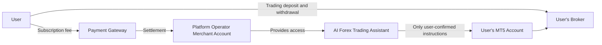
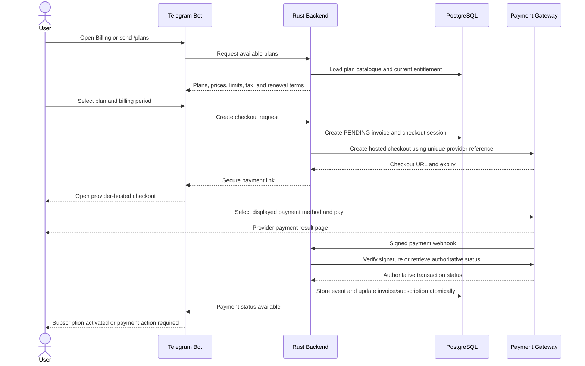
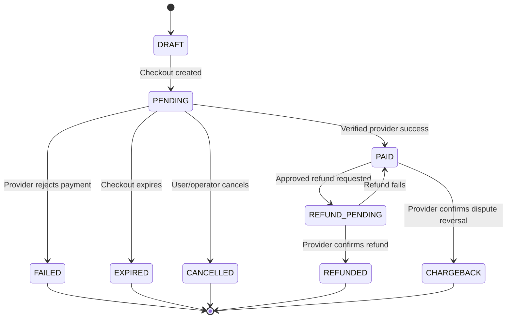
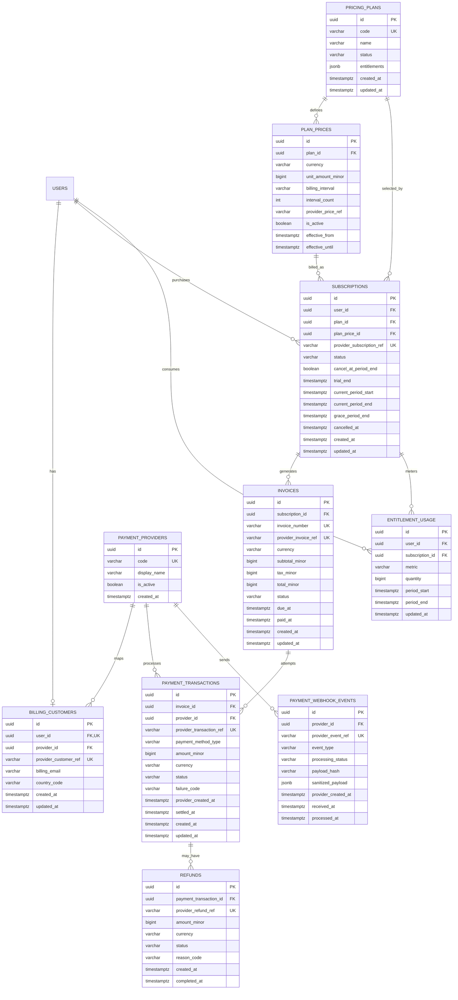
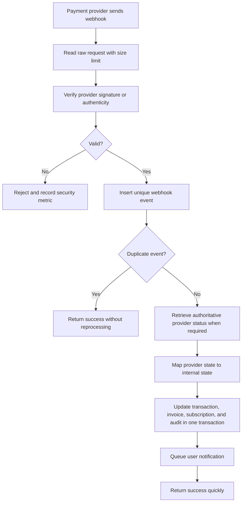
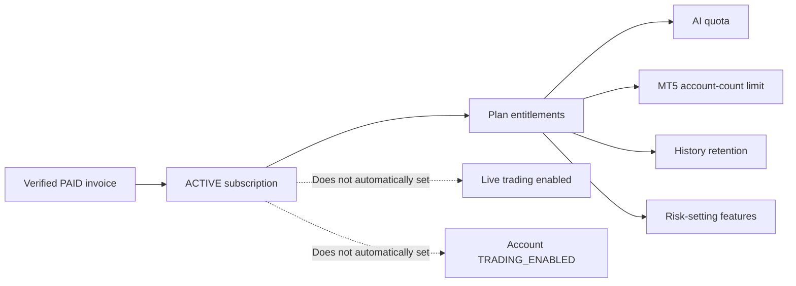

# Pricing, Billing, Payments, and Administrative Tracking

## 1. Purpose

This document defines the proposed commercial model for the AI Forex Trading Assistant. It explains:

- What users pay for
- Proposed subscription plans and limits
- How users complete payment
- How payment status reaches the application
- How access is granted, restricted, renewed, or canceled
- How administrators identify paid and unpaid users
- Which database records and dashboard views are required
- Security, accounting, refund, and operational controls

> Status: This is a product and technical design proposal. Billing, payment-provider integration, and the admin dashboard are not implemented in the current repository. Prices must be validated against infrastructure cost, OpenAI usage, payment-provider fees, taxes, customer research, and legal/compliance requirements before launch.

## 2. Commercial Principle

Users pay for access to software capabilities, infrastructure, AI analysis quotas, and operational services. They do not pay the application to hold or invest their trading capital.

Subscription payment and broker funding are completely separate:



The application must never:

- Receive a user's forex trading deposit
- Request that broker funds be transferred to the application operator
- Deduct a percentage of trading profit automatically
- Promise returns in exchange for a subscription
- Make subscription payment sufficient to enable live trading
- Describe subscription fees as an investment

For a user-facing explanation of how these fees differ from MT5, broker charges, and trading capital, see [Platform Subscription Fees vs. MT5 and Broker Costs](subscription-fees-vs-mt5-and-broker-costs.md).

## 3. Recommended Pricing Model

The recommended launch model is a **fixed SaaS subscription** with monthly and annual billing. It is easier for users to understand and easier to audit than per-trade charges or performance fees.

### 3.1 Proposed launch plans

All prices below are proposed prices in Indonesian rupiah and are not final commercial commitments.

| Capability | Free Trial | Demo | Pro | Business |
|---|---:|---:|---:|---:|
| Proposed monthly price | IDR 0 | IDR 99,000 | IDR 249,000 | From IDR 799,000 |
| Proposed annual price | Not applicable | IDR 990,000 | IDR 2,490,000 | Custom contract |
| Trial duration | 14 days | Ongoing while paid | Ongoing while paid | Contract term |
| AI analyses per month | 20 | 150 | 1,000 | Custom pooled quota |
| Connected MT5 accounts | 1 demo | 1 demo | Up to 3 | Custom |
| Mock mode | Included | Included | Included | Included |
| MT5 demo execution | Included | Included | Included | Included |
| Live-trading eligibility | No | No | Eligible after separate approval | Eligible after separate approval |
| Risk settings | Basic | Standard | Advanced | Advanced and managed policy |
| Audit-history retention | 7 days | 90 days | 1 year | Contract-defined |
| Support | Self-service | Standard | Priority | Contract-defined |

Annual pricing above represents ten months of the proposed monthly price. The final discount can be changed without altering the underlying entitlement model.

### 3.2 Plan interpretation

#### Free Trial

The Free Trial allows a new user to understand the product using mock data and, where operationally supported, one verified demo account. It must not require a trading deposit and must never enable live execution.

#### Demo

The Demo plan is for users who want regular AI analysis and confirmed execution in an MT5 demo account. It provides the complete learning workflow without real-money execution.

#### Pro

The Pro plan adds higher AI limits, multiple accounts, longer history, and advanced risk controls. It may make the user **eligible to apply** for live-account support, but it does not automatically enable live trading.

#### Business

The Business plan is for teams or managed deployments that require custom quotas, support, reporting, or isolated infrastructure. It requires a separate contract and security review.

### 3.3 Live trading is not a paid entitlement alone

Paying for Pro or Business must not bypass the live-trading gates. Live execution still requires:

1. The production deployment to permit live trading.
2. Legal and compliance approval for the applicable market.
3. A verified account explicitly classified as `LIVE`.
4. `TRADING_ENABLED` account permission.
5. Explicit user-level live-trading enablement.
6. An enabled risk profile.
7. Explicit confirmation of every order.

Payment controls product access; it does not replace trading authorization.

## 4. Why Fixed Subscription Pricing?

Fixed subscription pricing is recommended because it provides:

- Predictable cost for users
- Predictable recurring revenue for the operator
- A clear relationship between plan and service limits
- Straightforward invoice and access-expiry logic
- Easier refunds and customer support
- No incentive for the platform to encourage unnecessary trades
- Less ambiguity than charging a percentage of trading gains

The application should not initially charge per trade or take performance fees. Those models can create conflicts of interest and may introduce additional regulatory, licensing, accounting, and dispute risk. Any future change requires specialized legal review.

## 5. What Is Included in the Subscription?

Subscription fees can fund:

- Hosted Rust backend infrastructure
- PostgreSQL storage and encrypted backups
- Operator-owned OpenAI API usage within the plan quota
- MT5 Bridge and worker infrastructure
- Telegram bot operations
- Monitoring, incident response, and audit storage
- Security maintenance
- Standard product support

Subscription fees do not include:

- Broker deposits
- Broker commissions
- Spreads or swaps
- Market-data fees charged separately by a broker
- Trading losses
- Tax or legal advice
- Guaranteed support for every broker or symbol
- Unlimited OpenAI usage

## 6. Usage Limits and Overage Policy

The initial launch should use hard monthly AI-analysis limits rather than automatic overage billing.

When a user reaches the limit:

1. Existing account access, positions, history, emergency stop, and confirmed position closing remain available.
2. New AI-analysis requests are paused until renewal or upgrade.
3. The user receives a clear quota message.
4. No surprise charge is created.

The platform should never block safety-critical access, such as viewing or closing an existing position, merely because a subscription or AI quota has expired.

A future prepaid analysis add-on may be introduced, for example:

| Add-on | Proposed price |
|---|---:|
| 100 additional AI analyses | IDR 39,000 |
| 500 additional AI analyses | IDR 149,000 |

Add-ons should expire at the end of the applicable subscription period or follow a clearly disclosed validity period. Automatic overage billing must remain disabled unless the user explicitly opts in.

## 7. How Does a User Pay?

### 7.1 Recommended payment provider model

The operator creates and owns one merchant account with an approved payment gateway. For an Indonesia-first launch, a provider such as Midtrans or Xendit can supply hosted checkout, local payment methods, transaction status, and webhooks. The final provider depends on merchant onboarding, supported methods, commercial fees, settlement, recurring-payment support, and legal availability.

The application should use the provider's hosted payment page. It should not collect or store raw card numbers, CVV values, internet-banking passwords, or one-time passwords.

Midtrans documents that payment status changes are sent to the merchant backend using HTTP notifications and recommends verifying notification authenticity or retrieving status directly through its API. See the official [Midtrans webhook documentation](https://docs.midtrans.com/docs/https-notification-webhooks). Xendit similarly documents hosted subscription entry points and subscription webhooks in its [subscription guide](https://docs.xendit.co/docs/how-subscriptions-work). Stripe documents hosted subscription checkout and webhook-based subscription state in its [subscriptions integration guide](https://docs.stripe.com/billing/subscriptions/build-subscriptions).

### 7.2 User payment journey



### 7.3 Step-by-step user experience

1. The user sends `/plans` or opens **Settings → Billing**.
2. The bot displays current pricing, quota, tax treatment, renewal period, refund policy, and whether recurring payment is available.
3. The user selects a plan and monthly or annual billing.
4. Rust creates a unique internal invoice with `PENDING` status.
5. Rust creates a hosted checkout session with the payment gateway.
6. The bot sends a short-lived HTTPS checkout link.
7. The user pays only on the payment provider's verified domain.
8. The provider sends a server-to-server webhook to Rust.
9. Rust verifies the webhook signature and/or queries the provider's status API.
10. Only an authoritative successful state changes the invoice to `PAID` and activates the subscription.
11. The user receives a Telegram receipt containing the internal invoice number, plan, paid amount, billing period, and provider transaction reference.

The browser redirect or Telegram callback after checkout is not proof of payment. Webhooks are designed to handle asynchronous payment status; Stripe specifically recommends webhook fulfillment because the customer may complete payment without successfully returning to the application. See the official [Stripe fulfillment guide](https://docs.stripe.com/checkout/fulfillment).

### 7.4 Payment methods

The user sees only the methods enabled for the operator's merchant account and supported by the selected gateway. These may include bank transfer, virtual account, e-wallet, QR payment, card, or recurring tokenized payment, depending on provider and merchant eligibility.

Documentation and UI must not promise a specific method until the payment provider confirms it for the merchant account.

### 7.5 Recurring versus manual renewal

The recommended rollout is:

1. **Phase 1:** monthly or annual invoices paid through hosted checkout; the user renews manually.
2. **Phase 2:** optional recurring payment for supported methods after explicit consent.
3. **Phase 3:** self-service billing portal for plan change, payment-method update, invoice download, and cancellation.

Recurring payment must clearly disclose the amount, billing interval, next charge date, cancellation method, and retry behavior. Midtrans documents recurring subscriptions for supported payment methods in its [Subscription API reference](https://docs.midtrans.com/reference/api-methods-1).

## 8. Payment State Model

### 8.1 Invoice states



### 8.2 Subscription states

| Status | Meaning | Access decision |
|---|---|---|
| `TRIALING` | Free trial is within its defined period | Grant trial entitlements |
| `PENDING_PAYMENT` | Checkout exists but payment is not verified | Do not grant paid entitlements |
| `ACTIVE` | Latest required invoice is paid and period is current | Grant plan entitlements |
| `PAST_DUE` | Renewal failed or remains unpaid during grace period | Restrict new analysis/trading creation; preserve safety access |
| `SUSPENDED` | Administrative or risk suspension | Block plan features according to suspension reason |
| `CANCEL_AT_PERIOD_END` | User canceled but paid period remains current | Keep access until `current_period_end` |
| `CANCELLED` | Subscription ended | Remove paid entitlements; preserve records and safety access |
| `EXPIRED` | Trial or fixed period ended without renewal | Remove paid entitlements |

Stripe's official subscription guidance describes webhook-driven states such as `trialing`, `active`, `past_due`, `canceled`, and `unpaid`, and recommends changing access based on verified subscription and invoice events. See [Stripe subscription webhooks](https://docs.stripe.com/billing/subscriptions/webhooks).

### 8.3 Grace period

A proposed three-day grace period may be used after a renewal failure:

- Notify the user immediately.
- Retry only according to provider configuration and user consent.
- Preserve access to billing, account security, positions, history, kill switch, and confirmed position closing.
- Block new analysis and new opening trades when the grace period ends.
- Never silently extend live-trading capability because payment data is uncertain.

The final grace duration must be part of the published billing policy.

## 9. How Does the Administrator Know Who Has Paid?

The administrator does not determine payment by reading Telegram messages, screenshots, browser redirects, or bank-transfer receipts manually. Payment status comes from verified payment-provider events stored in the application database.

### 9.1 Source of truth

The source-of-truth hierarchy is:

1. Authoritative provider transaction status
2. Verified webhook event stored by the backend
3. Local invoice and subscription projection in PostgreSQL
4. Admin dashboard view generated from those local records

If the provider and local database disagree, the subscription enters a reconciliation queue. The administrator may trigger a read-only provider status refresh but must not manually mark an invoice paid without controlled evidence and audit approval.

### 9.2 Proposed admin dashboard summary

```text
Billing Overview

Active paid users           1,248
Trial users                   314
Pending payment                42
Past due                       27
Canceled this month            18
Failed webhook events           3
Transactions to reconcile       2
Monthly recurring revenue       —
Collected this month            —
Refunded this month             —
```

### 9.3 User billing table

The dashboard should provide a filterable view such as:

| User | Telegram | Plan | Subscription | Latest invoice | Paid through | Auto-renew | Action required |
|---|---|---|---|---|---|---|---|
| Masked user A | `@user_a` | Pro | `ACTIVE` | `PAID` | 30 Sep 2026 | Yes | None |
| Masked user B | `@user_b` | Demo | `PAST_DUE` | `FAILED` | 13 Sep 2026 | Yes | Update payment method |
| Masked user C | `@user_c` | Trial | `TRIALING` | None | 21 Sep 2026 | No | Trial ending |
| Masked user D | `@user_d` | Pro | `PENDING_PAYMENT` | `PENDING` | None | No | Complete checkout |

The administrator can filter by:

- Plan
- Subscription status
- Latest invoice status
- Payment provider
- Billing period
- Paid-through date
- Trial-end date
- Failed-payment count
- Reconciliation status
- Creation and cancellation date

### 9.4 Safe administrative actions

The dashboard may allow authorized billing staff to:

- View provider and internal transaction references
- Resend an invoice or checkout link
- Refresh status from the provider
- Grant a documented promotional credit
- Schedule cancellation at period end
- Start a provider-supported refund
- Export a financial reconciliation report
- Add a non-sensitive internal support note

It must not allow staff to:

- Edit a provider transaction into a successful state without evidence
- Change payment amount after checkout creation
- Display full card, bank, or wallet credentials
- Enable live trading merely because payment succeeded
- Delete payment-event history
- Use billing access to view MT5 passwords
- Submit trades for the user

## 10. Proposed Billing Database Schema

The existing project schema does not yet contain billing tables. The following schema is recommended for a future migration.



In the ERD, a column labeled `FK, UK` is both a foreign key and uniquely constrained.

### 10.1 Why prices use integer minor units

Store monetary amounts as integers in the currency's minor unit rather than floating-point numbers. For example, when a currency has no minor fractional unit for the configured payment flow, `249000` represents IDR 249,000. The application must use the payment provider's currency rules and never calculate money with binary floating point.

### 10.2 Required uniqueness and integrity constraints

- One unique internal invoice number per invoice.
- Provider customer, subscription, invoice, transaction, event, and refund references are unique within their provider scope.
- One active base subscription per user unless the product explicitly supports multiple subscriptions.
- Webhook event references are unique so delivery retries are idempotent.
- Invoice totals are immutable after checkout is issued; corrections use a replacement or credit note.
- A `PAID` invoice must have verified successful transaction evidence.
- Subscription access periods are updated in a database transaction with invoice status.

## 11. Webhook Processing and Reconciliation

### 11.1 Secure webhook flow



Midtrans recommends HTTPS, notification authenticity verification, idempotent handling, and GET Status reconciliation for delayed, missed, or out-of-order notifications. These practices are described in its official [webhook guide](https://docs.midtrans.com/docs/https-notification-webhooks).

### 11.2 Scheduled reconciliation

A scheduled job should compare local and provider states for:

- Pending transactions older than the expected payment window
- Paid browser redirects without a verified webhook
- Failed webhook processing
- Out-of-order events
- Refunds still pending
- Chargebacks or disputes
- Active subscriptions without a paid current period
- Paid invoices without active entitlements

The result appears in an admin **Needs Reconciliation** queue. Every manual resolution requires a reason, operator identity, before/after values, and an audit event.

## 12. Access-Control Rules After Payment

Payment success should provision product entitlements, not trading authority.



If a subscription expires or becomes unpaid:

- Block new premium analysis after the disclosed grace period.
- Block creation of new opening-trade intents that require a paid plan.
- Preserve login, billing, security, audit receipt, and data-export access.
- Preserve access needed to view and safely close existing positions.
- Do not delete trading records immediately.
- Apply the published retention policy.

## 13. Notifications to Users

The application should notify users through Telegram for:

- Trial started
- Trial ending soon
- Checkout created
- Payment confirmed
- Payment pending
- Payment failed
- Subscription renewal approaching
- Renewal successful
- Renewal failed
- Grace period ending
- Subscription scheduled for cancellation
- Subscription canceled
- Refund initiated and completed

Messages must include the internal invoice number and safe provider reference but must not include sensitive payment credentials.

Example successful-payment message:

```text
PAYMENT CONFIRMED

Plan: Pro Monthly
Amount: IDR 249,000
Invoice: AIFRX-202609-000123
Access valid through: 14 October 2026
Auto-renewal: Disabled

This subscription pays for application access.
It is not a trading deposit and does not enable live trading automatically.
```

## 14. Refunds, Cancellations, and Plan Changes

### 14.1 Cancellation

- Users should be able to cancel from Telegram or a hosted billing portal.
- Default cancellation occurs at the end of the paid period.
- The application displays the exact final access date before confirmation.
- Canceling a subscription must not close MT5 positions automatically.

### 14.2 Refunds

The operator must publish a refund policy before accepting payments. A proposed starting policy could allow refunds for duplicate charges or verified platform billing errors while treating consumed subscription periods according to local law and the published terms.

Refunds must be processed through the original payment provider where possible. A local `REFUNDED` state is set only after provider confirmation.

### 14.3 Upgrades and downgrades

- Upgrade pricing, proration, and effective time must be shown before confirmation.
- Downgrades should normally take effect at the next billing period.
- Historical data must not disappear unexpectedly because of a downgrade.
- A plan change never overrides live-trading safety gates.

## 15. Security and Fraud Controls

- Use hosted checkout; never store raw payment-card credentials.
- Keep provider server keys and webhook secrets in a secret manager.
- Verify every webhook using the provider's documented mechanism.
- Use unique checkout and invoice idempotency keys.
- Do not trust price, plan, amount, currency, or user identity sent by Telegram or the browser.
- Build invoice amounts from the server-side plan catalogue.
- Bind provider references to one internal user and invoice.
- Store a sanitized webhook payload or required audit fields, not unnecessary payment data.
- Rate-limit checkout creation and status refreshes.
- Alert on repeated failed payments, mismatched amounts, invalid signatures, duplicate references, refunds, and chargebacks.
- Require MFA and role-based access for the admin billing dashboard.
- Audit every refund, credit, override, cancellation, and reconciliation action.

## 16. Accounting and Tax Considerations

Before launch, the operator should obtain professional accounting and tax guidance for:

- Whether displayed prices include or exclude applicable tax
- Invoice and tax-document requirements
- Revenue recognition for annual subscriptions
- Payment-provider fees
- Refund and chargeback accounting
- Foreign-currency payments
- Record-retention periods
- Merchant legal-name and address disclosure

The checkout screen and receipt must clearly display currency, subtotal, tax when applicable, total charged, billing period, and renewal terms.

## 17. Implementation Phases

### Phase 1: Billing foundation

- Add pricing, subscription, invoice, transaction, webhook, refund, and usage tables.
- Add server-controlled plan catalogue.
- Implement trial entitlements and analysis metering.
- Add `/plans`, `/billing`, and `/subscription` Telegram views.

### Phase 2: Hosted one-time checkout

- Integrate one approved payment gateway in sandbox mode.
- Create monthly and annual checkout invoices.
- Implement signature verification and idempotent webhooks.
- Activate access only after authoritative payment confirmation.
- Add reconciliation jobs and operator reports.

### Phase 3: Admin billing dashboard

- Add role-based administrator authentication and MFA.
- Add paid/unpaid status views and filters.
- Add webhook failures and reconciliation queues.
- Add controlled cancellation and refund operations.

### Phase 4: Optional recurring billing

- Collect explicit recurring-payment consent.
- Add provider subscription references.
- Handle renewal, failure, retry, past-due, cancellation, and refund events.
- Add a self-service billing portal.

### Phase 5: Commercial hardening

- Complete penetration and financial-control testing.
- Validate taxation and invoicing.
- Publish terms, pricing, privacy, refund, and cancellation policies.
- Complete legal and regulatory review.

## 18. Required Test Cases

- Trial starts and expires correctly
- User cannot create two simultaneous free trials
- Invoice amount comes only from the server plan catalogue
- Checkout is bound to the authenticated user
- Invalid webhook signature is rejected
- Duplicate webhook is processed once
- Out-of-order webhook cannot regress a final status
- Browser success redirect does not activate access
- Verified successful payment activates the correct plan
- Payment for User A cannot activate User B
- Wrong amount or currency enters reconciliation
- Failed renewal moves subscription to `PAST_DUE`
- Grace-period expiration removes premium entitlements
- Safety-critical position access remains available after expiry
- Cancellation preserves access through the paid period
- Refund updates invoice, subscription, and audit records
- Chargeback restricts access and alerts administrators
- Manual credit requires authorization and an audit reason
- Subscription payment does not enable live trading
- AI quota resets at the correct billing boundary
- Admin filters correctly identify paid, trial, pending, past-due, canceled, and unpaid users

## 19. Direct Answers

### What pricing will users be charged?

The proposed launch pricing is Free Trial, Demo at IDR 99,000/month, Pro at IDR 249,000/month, and Business from IDR 799,000/month. These values are proposals and must be approved before public display.

### How does the user pay?

The user selects a plan in Telegram and opens a secure hosted checkout page from the operator's payment gateway. The payment method is selected and processed on the gateway page. The application never collects raw card or banking credentials.

### How is payment confirmed?

The payment provider sends a signed webhook. Rust verifies the event and, when required, retrieves the authoritative transaction status from the provider. A browser redirect or screenshot is not sufficient proof.

### How does the administrator know who has paid?

The database stores verified invoices, transactions, subscriptions, paid-through dates, and webhook events. A restricted admin dashboard displays users by `ACTIVE`, `TRIALING`, `PENDING_PAYMENT`, `PAST_DUE`, `CANCELLED`, or `EXPIRED` state and provides reconciliation filters.

### Does paying enable live trading?

No. Payment grants plan entitlements only. Live trading remains controlled by separate deployment, compliance, account, permission, user, risk, and per-order confirmation gates.

### Does the subscription include trading funds?

No. Subscription fees pay for application access. Trading funds remain with the user's broker and are deposited or withdrawn only through the broker's official channel.
