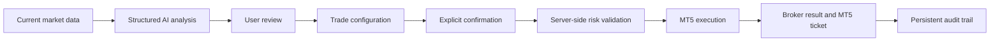
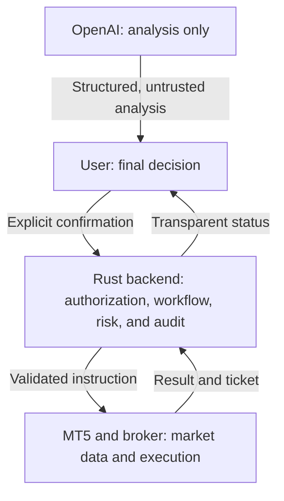

# AI Forex Trading Assistant: Product Overview

## 1. What Is This Application?

**AI Forex Trading Assistant** is a Telegram-based, AI-assisted forex market analysis and trade-execution platform for MetaTrader 5 accounts.

The application helps users move from market analysis to a reviewed and explicitly confirmed trading instruction. It connects each user to their own MT5 broker account while keeping analysis, account data, risk settings, orders, positions, and audit records separated from every other user.

It is not an autonomous trading bot and is not designed to trade without the user's knowledge.

The product follows this operating principle:

> AI analyzes. The user decides. Rust controls the workflow. MT5 executes. The broker holds the user's funds.

The application does not receive trading deposits, hold user funds, or control broker withdrawals. It does not guarantee profits or claim that forex trading is risk-free.

## 2. What Is the Application Used For?

The application provides one controlled workflow for five related activities.

### 2.1 Market analysis

Users can request analysis for supported forex or related trading symbols and timeframes. The backend collects current market data, validates its freshness, and sends only approved market fields to OpenAI.

The resulting analysis can include:

- Market bias
- A `BUY`, `SELL`, or `WAIT` signal
- Confidence level
- Suggested entry price
- Suggested stop loss and take profit
- Risk/reward ratio
- A short reasoning summary
- Risk notes

The analysis is decision support, not an instruction that the system may execute automatically.

### 2.2 Human-controlled trade preparation

If a user wants to act on an analysis, the application helps prepare a trade by collecting:

- The selected MT5 account
- Trading symbol
- Buy or sell direction
- Lot size
- Stop-loss level
- Take-profit level
- Maximum allowed slippage

Selecting `BUY` or `SELL` creates a trade intent. It does not place an order.

### 2.3 Final review and explicit confirmation

Before execution, the application presents a final order review containing the account, environment, symbol, direction, size, price, SL, TP, and risk information.

The user must explicitly confirm the reviewed action. Live accounts receive a stronger real-money warning. If the user cancels, does not confirm in time, or fails a validation rule, no order is submitted.

### 2.4 Risk-controlled execution

Immediately before sending a confirmed order, the Rust backend retrieves a new market quote and validates:

- User and account ownership
- Account status and verification
- Read-only or trading permission
- Mock, demo, or live mode
- Global and user-level live-trading gates
- Trading kill-switch state
- Market-data freshness
- Lot-size limits
- Stop-loss and take-profit direction
- Open-position and daily-trade limits
- Maximum slippage
- Confirmation idempotency

Only a request that passes every required check can reach the private MT5 Bridge and the user's MT5 account.

### 2.5 Visibility and accountability

The platform is designed to show users what happened after each important action. Executed orders include the MT5 ticket when available, allowing the user to verify the transaction directly in MetaTrader 5.

Important events are recorded in an audit trail, including analysis requests, trade-intent creation, confirmation, rejection, execution, failure, and emergency-stop activity.

## 3. What Problems Does This Application Solve?

### Problem 1: Market information is difficult to turn into a structured decision

Forex traders often review prices, indicators, volatility, support, resistance, and momentum across multiple tools. This process can become inconsistent or overwhelming, especially for less experienced users.

**How the application helps:** It converts validated market data into a consistent, structured analysis containing a signal, market bias, price levels, reasoning, and risk notes.

The AI does not replace user judgment. It organizes information so the user can review a possible setup more clearly.

### Problem 2: AI suggestions can be mistaken for executable instructions

An AI model can produce incorrect, incomplete, or overconfident output. Allowing AI text to trigger broker actions directly creates unacceptable financial and security risk.

**How the application helps:** AI output is treated as untrusted data. The backend validates it, stores it as analysis only, and never allows it to execute a tool or order automatically. A separate human-confirmation workflow is mandatory.

### Problem 3: Trading decisions and execution are disconnected

A user may analyze a market in one tool and manually reproduce prices, lot sizes, stop losses, and take profits in another. This creates friction and opportunities for transcription errors.

**How the application helps:** The platform connects analysis, order configuration, final review, server-side validation, and confirmed MT5 execution in one traceable workflow.

### Problem 4: Users can lose control when trading tools automate too much

Some trading systems are designed around automatic execution. This can make it difficult for users to understand why a trade was created, what risk was accepted, or how to stop new trades quickly.

**How the application helps:** Every material action requires explicit confirmation. Users can activate an emergency trading stop that blocks new `BUY` and `SELL` orders while preserving access to analysis, positions, and position closing.

### Problem 5: Risk rules are often applied inconsistently

Even when users define personal trading rules, they may exceed their intended lot size, trade too frequently, accept excessive slippage, or trade after reaching a loss threshold.

**How the application helps:** Risk controls are enforced in the backend rather than relying only on the Telegram interface or the AI response. The system is designed to support maximum lot, open-position limits, daily-trade limits, daily-loss limits, per-trade risk, symbol allowlists, and slippage limits.

### Problem 6: Multi-user trading systems can mix account data

A platform serving many users must prevent one user from accessing another user's balance, credentials, positions, history, or orders. A shared, uncontrolled MT5 terminal session can also execute an operation under the wrong account.

**How the application helps:** Every user owns separate account and trading records. Rust performs ownership checks using the authenticated user identity, and the MT5 architecture requires account-specific locking and production worker/terminal isolation.

### Problem 7: Users need evidence that an order reached MT5

A success message from a chat bot is not sufficient evidence of broker execution.

**How the application helps:** The application stores and displays the MT5 ticket and execution details when provided. Users are encouraged to verify the ticket directly in MetaTrader 5.

### Problem 8: Credential handling creates a trust barrier

Connecting a broker account requires highly sensitive credentials. Plain-text storage, careless logging, or sending credentials to AI services would create serious security risk.

**How the application helps:** MT5 passwords are encrypted with authenticated encryption, encryption keys remain outside PostgreSQL, secrets are excluded from AI requests and audit logs, and the MT5 Bridge is intended to run on a private network.

### Problem 9: Moving from experimentation to live trading is too easy in many tools

An accidental transition from simulation to real-money execution can cause immediate financial loss.

**How the application helps:** The required progression is mock trading, then MT5 demo, then optional MT5 live. Live trading remains disabled by default and requires multiple independent configuration, user, account, permission, and confirmation gates.

## 4. Who Is This Application For?

The intended users include:

- Forex traders who want structured AI-assisted analysis without surrendering final control
- MT5 users who want a Telegram-based interface for reviewing markets and confirmed actions
- Users who want to test a workflow in mock and demo environments before considering live trading
- Teams building a controlled, auditable multi-user MT5 decision-support service
- Operators who need explicit risk limits, account isolation, and execution records

The application assumes that users understand that leveraged forex trading involves substantial risk and may result in loss of capital.

## 5. Core Value Proposition

The main value is not simply “AI trading.” The value is a controlled bridge between AI-assisted analysis and user-authorized execution.



The product combines:

- Convenient Telegram interaction
- Structured AI analysis
- Human decision authority
- Server-side risk enforcement
- Direct use of the user's own broker account
- Transparent MT5 ticket verification
- Multi-user separation
- Auditability
- Demo-first deployment

## 6. Typical User Scenario

Consider a user who wants to evaluate EURUSD on the H1 timeframe:

1. The user opens Telegram and requests `/analyze EURUSD`.
2. The application retrieves a fresh EURUSD quote and approved market data from the user's MT5 account.
3. OpenAI returns a structured analysis, for example `BUY`, with suggested price levels and risk notes.
4. The user reviews the analysis and decides whether it is useful.
5. If the user chooses `BUY`, the application creates a trade intent and asks for lot size, stop loss, and take profit.
6. The application displays a final review. No trade has been placed yet.
7. The user explicitly confirms.
8. Rust fetches the latest price and reruns ownership, permission, risk, live-mode, freshness, slippage, and idempotency checks.
9. If any check fails, the application explains that no order was placed.
10. If every check succeeds, the private MT5 Bridge submits the instruction to the user's MT5 terminal.
11. The broker accepts or rejects the order.
12. On success, the application stores and displays the MT5 ticket for independent verification.

```mermaid
sequenceDiagram
    actor U as User
    participant A as AI Forex Trading Assistant
    participant AI as OpenAI
    participant M as MT5
    participant B as Broker

    U->>A: Analyze EURUSD H1
    A->>M: Request fresh market data
    M-->>A: Quote and market data
    A->>AI: Sanitized market fields
    AI-->>A: Structured analysis
    A-->>U: Signal, reasoning, and risk notes
    U->>A: Configure BUY intent
    A-->>U: Final review; no order placed yet
    U->>A: Explicitly confirm
    A->>A: Validate risk, permissions, and slippage
    A->>M: Submit confirmed instruction
    M->>B: Submit order
    B-->>M: Execution result
    M-->>A: Result and ticket
    A-->>U: Status and MT5 ticket
```

## 7. What the Application Does Not Do

The application does not:

- Guarantee profits or a specific win rate
- Eliminate market or execution risk
- Hold user funds
- Receive trading deposits
- Control withdrawals from the broker
- Automatically execute an AI recommendation
- Allow OpenAI to access MT5 credentials
- Treat AI output as trusted authorization
- Pool many users into one shared trading account
- Enable live trading by default
- Replace professional financial, legal, tax, or compliance advice

## 8. Trust and Safety Model

Trust is established through verifiable controls rather than absolute security claims.

| User concern | Product control |
|---|---|
| “Where is my money?” | It remains in the user's broker account |
| “Can the AI place trades?” | No; AI output is analysis only |
| “Can a button immediately place an order?” | Selecting BUY/SELL creates an intent; later confirmation is required |
| “Can another user see my account?” | Ownership is enforced for all user-owned resources |
| “Are credentials sent to OpenAI?” | No; AI receives only approved market fields |
| “Can I stop new trades?” | Yes; the kill switch blocks new BUY and SELL requests |
| “Can I verify an executed order?” | Yes; the MT5 ticket is displayed when available |
| “Can the app accidentally trade live?” | Live execution requires multiple independent gates and explicit confirmation |

The product must never describe itself as unhackable, perfectly secure, risk-free, or guaranteed to make money.

## 9. Product Boundaries

The platform contains four clearly separated responsibilities:



Maintaining these boundaries prevents an AI response, Telegram callback, bridge process, or broker response from independently becoming trusted authority.

## 10. Success Criteria

The product succeeds when a user can:

1. Register through Telegram.
2. Understand the product's role and risk disclosures.
3. Connect and verify an MT5 demo account securely.
4. Request current, structured AI-assisted market analysis.
5. Configure a trade without executing it prematurely.
6. Review and explicitly confirm the final order.
7. Have the backend revalidate price and risk immediately before execution.
8. Execute on MT5 demo and receive a real MT5 ticket.
9. Verify the order directly in MetaTrader 5.
10. View positions and history without exposure to another user's data.
11. Stop new trading immediately through an emergency control.

Success is not measured by guaranteed profit. It is measured by safe workflow execution, user control, transparent results, data isolation, and reliable enforcement of risk policies.

## 11. Current Product Status

The repository currently provides the foundational backend vertical slice:

- Rust HTTP backend
- PostgreSQL data model
- Structured AI-analysis integration
- Trade-intent creation
- Explicit confirmation
- Idempotency protection
- Core ownership and risk validation
- Slippage protection
- Demo/live safety gates
- Trading kill switch
- Private Python MT5 adapter with mock execution
- Credential-encryption utilities
- Audit-event persistence

The complete Telegram user interface, account-onboarding endpoints, position and history screens, confirmed close/modify operations, full broker-derived risk calculations, and production Windows MT5 worker orchestration remain subsequent implementation phases.

## 12. Summary

AI Forex Trading Assistant is designed to make forex analysis and MT5 execution more structured, controlled, and transparent without removing the user from the decision.

It addresses the gap between untrusted AI analysis and sensitive broker execution by introducing explicit human confirmation, independent backend validation, account isolation, risk controls, live-trading gates, idempotency, and an audit trail.

Its purpose is not to promise profit. Its purpose is to help users make and execute their own decisions through a safer, clearer, and verifiable workflow.

