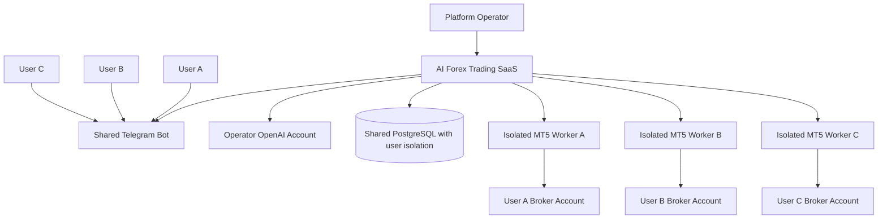
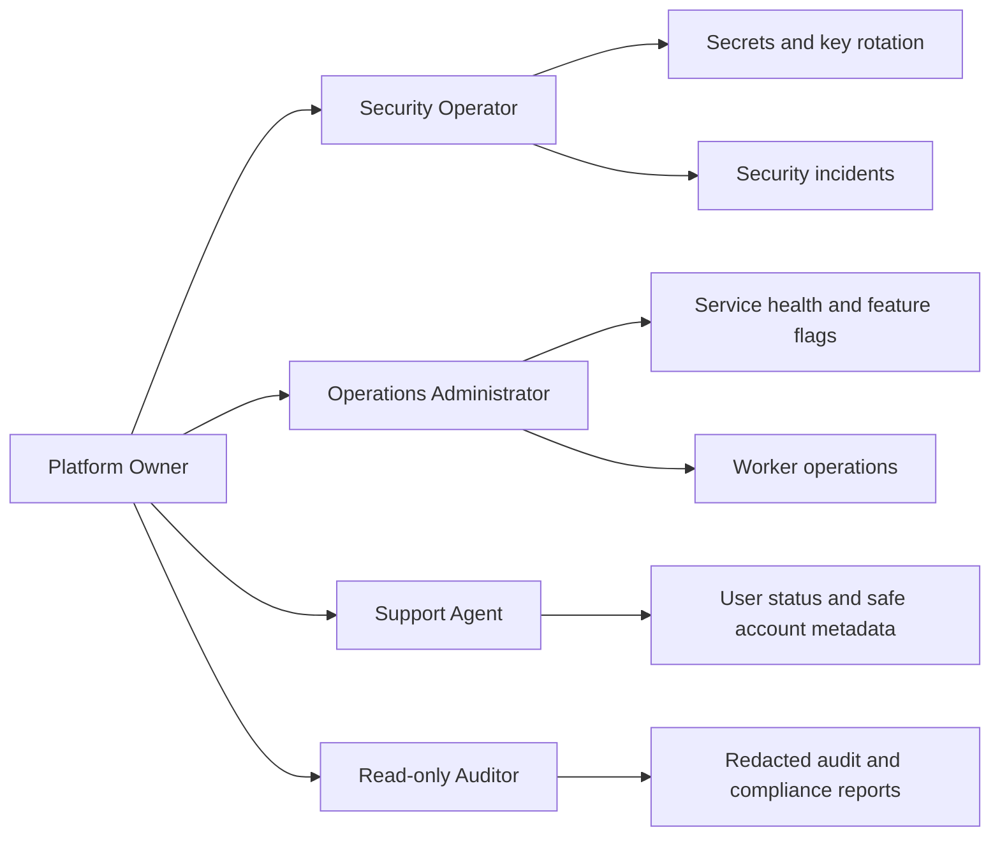
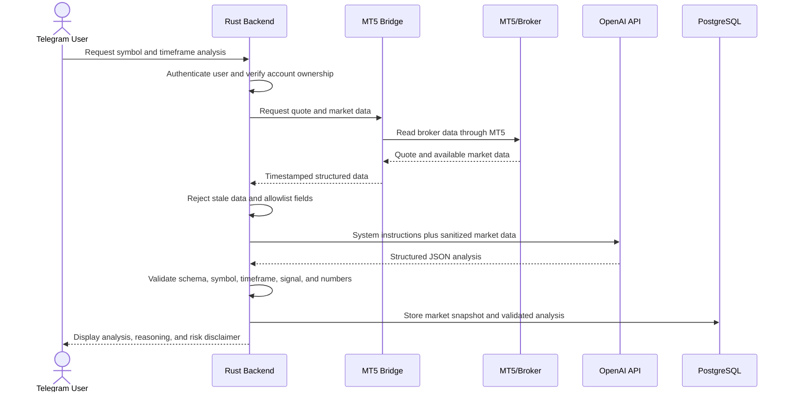
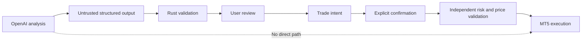
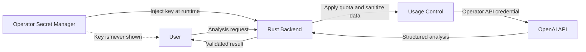
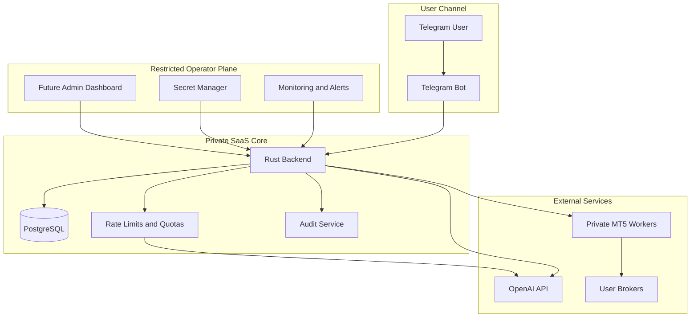

# SaaS Model, Administration, AI, Market Data, and API Ownership

## 1. Purpose

This document answers the following product and operational questions:

1. Is the AI Forex Trading Assistant a SaaS application?
2. Is there an administrator who manages the platform?
3. Does the application have an administration dashboard?
4. How does the AI work?
5. Where does market data come from?
6. Who owns and pays for the OpenAI API credentials?

It also distinguishes the **target product architecture** from the features that are **currently implemented in the repository**.

## 2. Is This a SaaS Application?

### 2.1 Target product model

Yes. The intended product is a **multi-user Software as a Service platform**, delivered primarily through Telegram.

Users do not need to install the Rust backend, PostgreSQL database, or OpenAI integration. The platform operator hosts and maintains those services. Each user interacts with the shared application through the Telegram bot while connecting one or more of their own MetaTrader 5 accounts.

The SaaS platform provides:

- Telegram-based onboarding and interaction
- User and MT5 account management
- AI-assisted market analysis
- Trade-intent and human-confirmation workflows
- Risk controls
- MT5 connectivity
- Position and trading-history access
- Security controls and an emergency trading stop
- Audit logging

The user's trading funds are not part of the SaaS platform. They remain in the user's individual broker account.



### 2.2 What is shared and what is isolated?

| Resource | Shared or isolated? | Explanation |
|---|---|---|
| Telegram bot | Shared | One bot can serve many users |
| Rust backend | Shared | One application service enforces tenant ownership and policy |
| PostgreSQL server | Shared infrastructure | Records are logically isolated by `user_id` and `account_id` |
| OpenAI integration | Shared operator service | Requests use the operator's API project, with per-user quotas |
| MT5 credentials | Isolated per account | Credentials are encrypted and never mixed between users |
| MT5 worker/session | Isolated per account | Production should use a dedicated worker/terminal boundary per active account |
| Broker funds | Fully external and user-owned | Funds remain with each user's broker |
| Risk settings | Isolated per user/account | A user cannot read or change another user's settings |
| Orders and audit logs | Isolated per user/account | Ownership checks apply to every query and operation |

### 2.3 Current implementation status

The repository is currently a **SaaS-ready backend foundation**, not a complete production SaaS product.

It already contains multi-user data structures, ownership checks, analysis, trade intents, confirmation, risk validation, idempotency, audit storage, and an internal MT5 adapter. It does not yet contain all customer-facing onboarding, subscription, billing, support, administration, and production operations required for a commercial SaaS launch.

## 3. Who Manages the Application?

The target SaaS product requires a **platform operator** and one or more restricted administrative roles.

The operator is responsible for:

- Deploying and maintaining the services
- Managing the Telegram bot configuration
- Managing the operator-owned OpenAI API project
- Maintaining PostgreSQL and encrypted backups
- Operating private MT5 worker infrastructure
- Monitoring service health, latency, and failures
- Managing system-wide feature flags
- Responding to account and security incidents
- Enforcing usage limits and abuse controls
- Rotating application secrets and encryption keys
- Maintaining legal, privacy, risk, and compliance documentation

Administration must not give staff unlimited access to user secrets or trading powers.

### 3.1 Recommended administrative roles



| Role | Intended access | Must not access |
|---|---|---|
| Platform owner | Role assignment, global configuration, commercial settings | Plain-text MT5 passwords |
| Security operator | Key rotation, incident response, security alerts | Trading decisions or arbitrary user orders |
| Operations administrator | Service status, worker health, queue and failure management | Credential plaintext and unrestricted order execution |
| Support agent | User status, masked account identity, safe error information | Passwords, API keys, encryption keys, full broker responses |
| Read-only auditor | Redacted audit events and compliance evidence | Secret material or mutation capabilities |

No administrator should be able to withdraw broker funds through this application. Administrative actions must not silently submit, close, or modify a user's position.

## 4. Is There an Admin Dashboard?

### 4.1 Current state

No. The current repository does **not** include an implemented web-based admin dashboard.

The existing foundation provides the Rust service, database model, OpenAI integration, trading workflow, risk checks, and MT5 Bridge. Claiming that an admin dashboard already exists would be inaccurate.

### 4.2 Target dashboard

A restricted dashboard is recommended before production operations. Its purpose is platform operations and support—not discretionary trading on behalf of users.

Recommended dashboard sections include:

- System health for Rust, PostgreSQL, OpenAI, and MT5 workers
- Active-user and usage metrics
- Analysis request volume and failure rate
- Trade-intent, confirmation, execution, and failure metrics
- Redacted user and account lookup
- Masked MT5 account status and worker health
- Risk-control and kill-switch status
- Audit-log search with sensitive-field redaction
- Rate-limit and abuse events
- Global demo/live feature flags
- Security alerts and secret-rotation status

### 4.3 Actions the dashboard must not provide

The admin dashboard must not provide:

- Plain-text MT5 password display
- OpenAI, Telegram, database, bridge, or encryption-key display
- A general “trade as user” function
- Silent enabling of user live trading
- Silent position modification or closing
- Cross-user credential export
- Audit-log deletion through normal administrative workflows
- Arbitrary SQL or internal network access

### 4.4 Sensitive administrative actions

Actions such as disabling a compromised user, suspending an account connection, or globally disabling live trading may be necessary for safety. These actions should require:

- Strong administrator authentication
- Role-based authorization
- Multi-factor authentication
- A reason entered by the administrator
- An immutable audit event
- Optional dual approval for high-impact global changes

The system may safely block future actions during an incident, but administrative authority should not be expanded into authority to place trades for users.

## 5. How Does the AI Work?

The AI is a **market-analysis component**, not the trading authority.

### 5.1 AI analysis flow



### 5.2 Information sent to OpenAI

The intended analysis payload contains approved market information such as:

- Symbol
- Timeframe
- Bid and ask
- Spread
- Market-data timestamp
- OHLC candles
- Volume when available
- EMA 20, EMA 50, and EMA 200
- RSI 14
- MACD
- ATR
- Support and resistance levels
- Recent volatility

The current foundational implementation sends a smaller quote-based dataset. Additional indicators and candle-derived features are part of the planned market-data service.

### 5.3 Information never sent to OpenAI

OpenAI must never receive:

- MT5 passwords
- Full credential payloads
- Telegram bot tokens
- Database passwords
- Encryption keys
- Internal MT5 Bridge keys
- Application API secrets
- Arbitrary Telegram messages as system instructions

Account identifiers should be omitted unless a non-sensitive internal correlation identifier is strictly necessary. Market analysis normally does not require the user's identity.

### 5.4 Expected AI output

The application asks OpenAI for structured JSON rather than unrestricted prose. The response includes fields such as:

- `symbol`
- `timeframe`
- `signal`: `BUY`, `SELL`, or `WAIT`
- `market_bias`
- `confidence`
- `entry`
- `stop_loss`
- `take_profit`
- `risk_reward_ratio`
- `reasoning_summary`
- `risk_notes`

The model is instructed to use only supplied market data, avoid invented prices, avoid certainty or profit guarantees, and prefer `WAIT` when the setup is unclear.

### 5.5 Why AI cannot execute a trade

AI output can be wrong or malformed. It may not reflect changes that occur after the market-data snapshot. For that reason:

1. The backend validates the structured output.
2. The result is stored as analysis only.
3. A user must separately choose an action.
4. The application creates a trade intent rather than an order.
5. The user configures and explicitly confirms the final trade.
6. Rust retrieves a new quote and independently validates risk and slippage.
7. Only Rust can authorize a call to the MT5 Bridge.



## 6. Where Does Market Data Come From?

### 6.1 Primary source

The primary market-data source is the **user's broker through the user's MetaTrader 5 terminal session**.

The data path is:

```text
Broker trading server
        ↓
User's authenticated MT5 terminal session
        ↓
MetaTrader5 Python package
        ↓
Private Python MT5 Bridge
        ↓
Rust backend
        ↓
Validated analysis request
```

This design is important because prices, symbols, spreads, contract specifications, and available trading sessions can vary between brokers. The price used for analysis and pre-execution validation should correspond as closely as possible to the account that would execute the trade.

### 6.2 Mock mode

During local development and early workflow testing, the MT5 Bridge can use `MT5_MODE=MOCK`. Mock prices exist only to exercise application behavior. They are not real market data and must not be presented as a basis for live trading.

### 6.3 Demo and live modes

| Mode | Data source | Execution behavior |
|---|---|---|
| Mock | Generated test data | Simulated execution only |
| MT5 Demo | Broker demo feed through MT5 | Orders affect a demo account |
| MT5 Live | Broker live account feed through MT5 | Orders can affect real funds after every live gate passes |

### 6.4 Data validation

Every market-data payload must contain a timestamp. Rust checks that the data is within the configured freshness threshold. Before a confirmed order, Rust requests a new quote and compares it with the analysis and confirmation prices.

If price movement exceeds the user's allowed slippage, the application cancels execution and reports that no order was placed.

### 6.5 External market-data providers

The architecture can later support a licensed external market-data provider for richer analytics or redundancy. Such a provider should not silently replace the execution-account quote.

Before order execution, broker/MT5 data remains authoritative for:

- Current executable bid and ask
- Symbol availability
- Volume minimum, maximum, and step
- Margin requirements
- Trading session state
- Broker-specific order and filling rules

If external analytics data and the broker quote disagree materially, the system should warn or reject rather than assume that one source is interchangeable with the other.

## 7. Who Owns the OpenAI API Key?

### 7.1 Recommended SaaS model: operator-owned API

For this product, the recommended default is that the **platform operator owns and manages the OpenAI API project and API key**.

Users do not need to supply their own OpenAI API key. The Rust backend uses the operator's key from a protected environment variable or secret manager.



The operator is responsible for:

- Creating and securing the OpenAI API project
- Paying OpenAI API usage charges
- Selecting approved models
- Setting project budgets and alerts
- Rotating credentials
- Monitoring latency, errors, and token usage
- Defining per-user and per-plan quotas
- Preventing users from converting the bot into an unrestricted AI proxy

### 7.2 Why the operator-owned model is recommended

It provides:

- Simpler user onboarding
- Centralized model and prompt configuration
- Consistent structured-output behavior
- Centralized monitoring and abuse prevention
- Predictable product behavior across users
- The ability to include AI usage in a subscription or usage-based plan
- No need to store many user-owned OpenAI keys

### 7.3 Cost allocation

Although the operator initially pays the OpenAI invoice, AI usage is a product cost. The SaaS can recover that cost through:

- Subscription plans with analysis quotas
- Usage-based billing
- A limited free/demo allowance
- Rate limits and fair-use policies

The platform should meter analysis usage by internal user, model, token count, status, and time period without storing sensitive prompt content unnecessarily.

Recommended controls include:

- Per-user requests per minute
- Daily or monthly analysis quotas
- Global API budget alerts
- Maximum input size
- Approved symbol and timeframe lists
- Retry limits
- Model allowlists
- Circuit breakers when OpenAI is unavailable

### 7.4 Optional BYOK model

A future enterprise or advanced-user feature could support **Bring Your Own Key (BYOK)**, where a user supplies their own OpenAI API key. BYOK is not the recommended default and is not implemented in the current repository.

If BYOK is introduced, the application must:

- Encrypt the user API key separately
- Never log or display the full key
- Prevent administrators from viewing plaintext
- Validate the key without exposing provider errors containing secret data
- Define who pays and owns usage clearly
- Allow key revocation and deletion
- Keep operator and user usage records separated

BYOK adds credential-management and support complexity, so it should be added only for a clear product requirement.

### 7.5 Current repository behavior

The current backend reads one operator-managed `OPENAI_API_KEY` from the service environment.

- If the key is configured, the Rust backend calls OpenAI's Responses API using the configured model.
- If the key is absent, the foundational implementation returns a controlled mock `WAIT` analysis for development.
- The API key is not stored in PostgreSQL.
- The API key is not returned to Telegram users or sent to the MT5 Bridge.

Therefore, the current implementation follows the **operator-owned API model**, not a per-user OpenAI-key model.

## 8. SaaS Subscription and Usage Model

Billing is not currently implemented, but a production SaaS will need a clear commercial model. A possible model is:

| Plan | Example capability |
|---|---|
| Trial | Mock mode and a limited number of AI analyses |
| Demo | MT5 demo account connection, larger analysis quota, and trade workflow testing |
| Pro | Multiple accounts, additional analysis quota, advanced risk settings, and operational history |
| Live-enabled | Optional live capability only after eligibility, compliance, and safety checks; never enabled automatically by payment alone |

Payment must not automatically override risk, permission, verification, or live-trading controls. A subscription grants product access, not permission for the AI to trade.

## 9. Data and Privacy Responsibilities

### 9.1 Platform operator

The operator processes and protects:

- Telegram identity and profile data
- Encrypted MT5 credentials
- Account metadata
- Market snapshots
- AI analysis records
- Trade intents and order records
- Position snapshots
- Risk settings
- Audit events
- AI usage and operational metadata

The operator must publish an appropriate privacy notice, retention policy, acceptable-use policy, and incident-response process before production.

### 9.2 OpenAI

OpenAI receives only the sanitized data required for market analysis. The exact handling and retention obligations depend on the operator's selected OpenAI product, account settings, and current contractual terms. The operator must review those terms before production and disclose relevant subprocessors and data flows to users.

### 9.3 Broker and MetaTrader 5

The broker remains responsible for the trading account, funds, prices, margin, and final execution. MetaTrader 5 provides the terminal connection used to access that broker account.

## 10. Operational Ownership Matrix

| Item | Owner | User visibility |
|---|---|---|
| Telegram bot token | Platform operator | Never visible |
| OpenAI API project and key | Platform operator | Key never visible; usage limits should be visible |
| Application database | Platform operator | User sees only their own product data |
| Encryption master keys | Platform operator/security role | Never visible |
| MT5 login and password | User supplies; operator processes encrypted credential | User sees masked login; password is never redisplayed |
| MT5 account and funds | User and broker | User verifies directly with broker/MT5 |
| AI model configuration | Platform operator | Model or capability may be disclosed |
| User risk settings | User within platform safety limits | Visible and manageable by that user |
| Global live-trading feature flag | Platform operator | Effective mode should be visible |
| User live-trading permission | User, subject to platform eligibility | Visible and requires explicit enablement |
| Trading decision | User | Explicit review and confirmation required |
| Final broker execution | Broker through MT5 | Status and ticket returned to user |

## 11. Target Administration and AI Architecture



The future dashboard belongs to a restricted operator plane. It is not a replacement for the user's Telegram trading confirmation and must not create an alternative execution path.

## 12. Direct Answers

### Is this a SaaS application?

**Target architecture: yes.** It is designed as a hosted, multi-user Telegram SaaS. The repository is currently a SaaS-ready foundation rather than a complete commercial SaaS offering.

### Is there an administrator?

**The target platform requires restricted operator and administrative roles.** Administrators manage infrastructure, safety, support, and configuration. They must not view plaintext credentials or trade arbitrarily for users.

### Is there an admin dashboard?

**Not currently.** A restricted operational dashboard is recommended for a later implementation phase.

### How does the AI work?

Rust retrieves fresh market data, sends an allowlisted and sanitized payload to OpenAI, validates the structured response, and displays it as decision support. The AI cannot execute trades.

### Where does market data come from?

The primary source is the user's broker through the user's authenticated MT5 terminal and the private MT5 Bridge. Development mock data is clearly separated from demo and live broker data.

### Whose OpenAI API is used?

**The current and recommended default uses an API key owned and paid for by the platform operator.** Users do not supply their own key. Per-user BYOK could be added later but is not currently implemented.

