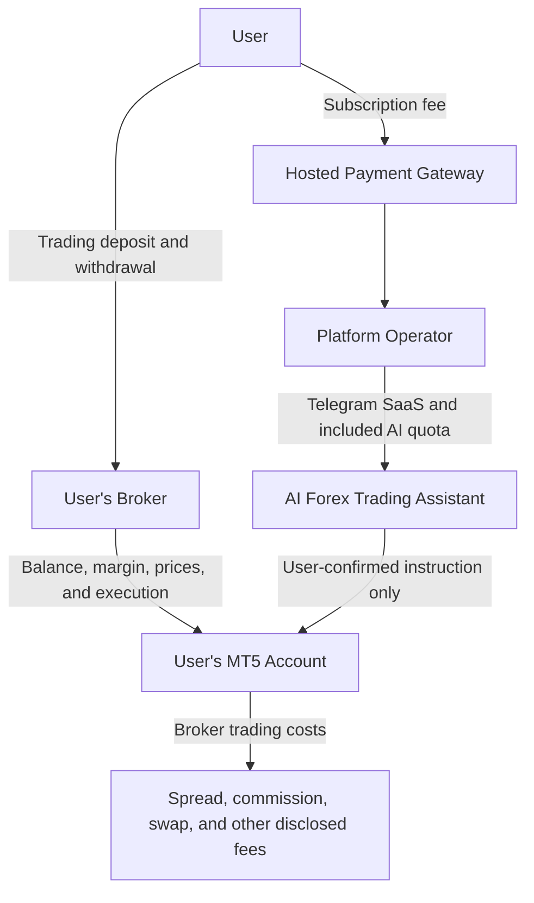
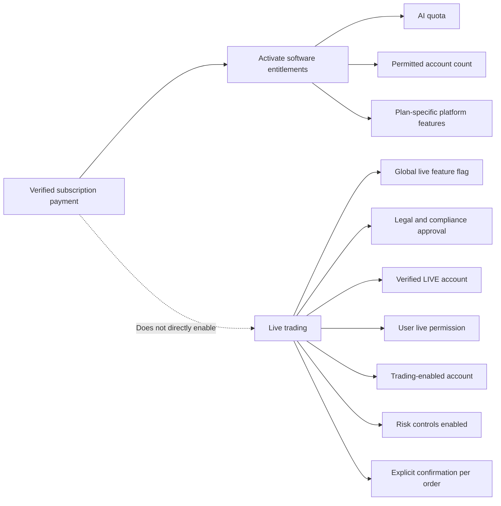
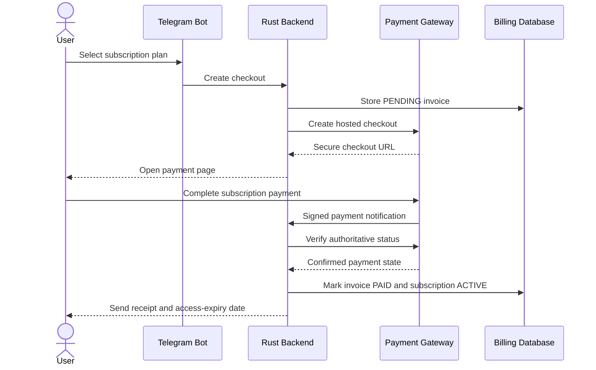

# Platform Subscription Fees vs. MT5 and Broker Costs

## 1. Purpose

This document explains what users pay for when subscribing to the AI Forex Trading Assistant Telegram bot and how that subscription differs from MetaTrader 5 costs, broker charges, and trading capital.

The most important distinction is:

> The platform subscription pays for access to the AI Forex Trading Assistant service. It is not an MT5 license fee, broker fee, trading deposit, or investment.

There are three separate financial relationships:

1. The user pays the platform operator for the Telegram SaaS subscription.
2. The user deposits trading capital directly with their chosen broker.
3. The broker may charge spreads, commissions, swaps, and other account or transaction costs.

These relationships must never be combined or presented as one payment.

## 2. What Is the Subscription For?

The subscription is a fee for using the hosted software and supporting infrastructure behind the Telegram bot.

Depending on the selected plan, the subscription can provide access to:

- The hosted Telegram bot interface
- User onboarding and account management
- Secure connection to one or more user-owned MT5 accounts
- AI-assisted market analysis within a monthly quota
- Sanitization and structured validation of AI output
- Trade-intent preparation
- Human-confirmation workflows
- Server-side risk controls
- Stale-price and slippage checks
- Duplicate-order protection through idempotency
- Position and trade-history access
- MT5 ticket recording and verification support
- Encrypted MT5 credential storage
- Multi-user account isolation
- Trading audit history
- Emergency stop controls
- Platform monitoring, maintenance, and customer support

The platform operator uses subscription revenue to operate services such as:

- Rust backend infrastructure
- PostgreSQL databases and backups
- Private MT5 Bridge workers
- Telegram bot services
- Operator-owned OpenAI API usage within plan limits
- Monitoring and incident response
- Security maintenance
- Product development and support

The exact limits and features depend on the selected subscription plan.

## 3. Proposed Subscription Prices

The current pricing proposal is:

| Plan | Proposed price | Primary purpose |
|---|---:|---|
| Free Trial | IDR 0 for 14 days | Evaluate the workflow with limited mock/demo usage |
| Demo | IDR 99,000 per month | Regular AI analysis and confirmed MT5 demo-account workflows |
| Pro | IDR 249,000 per month | Higher AI quota, multiple accounts, advanced controls, and possible live eligibility |
| Business | From IDR 799,000 per month | Custom quotas, reporting, support, and deployment requirements |

These prices are proposals and are not final public prices. The operator must validate them against OpenAI costs, infrastructure, payment-provider fees, taxes, customer research, support costs, and legal requirements before launch.

The complete pricing design is available in the [Pricing, Billing, Payments, and Administrative Tracking guide](pricing-billing-and-payment-administration.md).

## 4. What the Subscription Does Not Include

The platform subscription does not include:

- Money for opening a forex position
- A deposit into the user's broker account
- Broker minimum-deposit requirements
- Trading margin
- Trading profit or loss
- Broker spreads
- Broker commissions
- Overnight swaps or financing costs
- Currency-conversion fees
- Withdrawal fees
- Inactivity or account fees charged by the broker
- Premium market-data fees charged by another provider
- Taxes related to the user's trading activity
- A guarantee that an order will be accepted
- A guarantee of profit

The subscription also does not purchase a broker account on behalf of the user. Users must independently open and verify their own account with a broker that supports MT5.

## 5. Is the Subscription an MT5 Fee?

No. The subscription is not a payment to MetaTrader 5 and does not purchase MetaTrader 5 from this application.

MT5 is the trading platform used to connect to a broker account. The user normally receives access to the relevant MT5 terminal, server, login, and account conditions through their broker. Any commercial relationship between the broker and MetaTrader is separate from the AI Forex Trading Assistant subscription.

The application uses MT5 as an integration point for:

- Reading broker-provided quotes
- Reading account information
- Retrieving positions and history
- Sending an order only after user confirmation and backend validation
- Receiving broker execution results and MT5 ticket numbers

The platform subscription pays for the application's workflow around MT5, not for market exposure or broker execution itself.

## 6. Is the Subscription a Broker Fee?

No. The platform operator and the broker are different service providers.

| Provider | Service | Who receives the payment? |
|---|---|---|
| AI Forex Trading Assistant | Telegram SaaS, AI analysis, risk workflow, confirmation, audit, and integration | Platform operator through its payment gateway |
| Broker | Trading account, prices, margin facility, execution, custody arrangements, and withdrawals | Broker through its official deposit and fee mechanisms |
| MetaTrader 5 | Trading-terminal technology used by the broker and account holder | Governed by the broker/MetaTrader arrangement, not this subscription |
| OpenAI | AI model API consumed by the platform | Paid by the platform operator under the default SaaS model |

The application must not represent broker charges as platform charges or add undisclosed broker markups.

## 7. Three Separate Money Flows



### Flow A: Platform subscription

The user pays the operator through the platform's hosted payment gateway. A verified payment activates software entitlements for the selected billing period.

### Flow B: Broker funding

The user deposits and withdraws funds only through the verified broker's official website, application, or banking instructions. The platform operator must never ask the user to transfer trading capital to the operator.

### Flow C: Trading costs

When the user trades, the broker applies its own pricing and account rules. Those costs are reflected in the broker account and MT5—not charged as part of the platform subscription.

## 8. What Costs Can a Broker Charge?

Broker costs vary by broker, account type, symbol, jurisdiction, and market condition. Users must read the broker's official pricing and account agreement.

Common costs can include:

### 8.1 Spread

The spread is the difference between the bid and ask price. A position generally begins with a cost related to that difference. Spreads can widen during volatility, low liquidity, market opening, news events, or broker-specific conditions.

### 8.2 Commission

Some accounts charge a separate commission based on lot size, notional value, or each side of the transaction. Other accounts advertise no separate commission but use a wider spread.

### 8.3 Swap or overnight financing

A broker may apply a charge or credit when a position remains open across the broker's rollover time. The amount can vary by symbol, direction, day, and market rate.

### 8.4 Currency conversion

If the account currency differs from the instrument, profit, loss, commission, or deposit currency, the broker or payment provider may apply conversion rates or fees.

### 8.5 Deposit and withdrawal costs

A broker, bank, card issuer, wallet, or payment intermediary may charge funding or withdrawal fees. These are not controlled by the AI Forex Trading Assistant.

### 8.6 Other broker charges

Depending on the broker, there may be inactivity fees, data fees, administrative charges, guaranteed-stop premiums, or account-specific costs. Users must verify the complete official fee schedule before funding an account.

## 9. How Subscription Price Relates to Trading Volume

Under the proposed launch model, the platform subscription is a fixed fee. It does not increase merely because the user:

- Deposits more broker funds
- Opens a larger position
- Makes a profit
- Makes a loss
- Pays a wider broker spread

Plan limits may restrict the number of AI analyses, connected accounts, or supported product features. Those limits are service-capacity controls, not broker trading charges.

The initial product should not charge:

- A percentage of broker deposits
- A percentage of profits
- A percentage of losses
- An undisclosed markup on spread
- An automatic fee per executed trade

Any future transaction-based or performance-based pricing would require separate product disclosure and specialized legal, regulatory, accounting, and conflict-of-interest review.

## 10. Example Monthly Cost Breakdown

The following example illustrates how the costs remain separate. It is not a broker quote or prediction.

Assume a user selects the proposed Pro plan:

| Item | Example amount | Paid to | Included in subscription? |
|---|---:|---|---|
| Pro subscription | IDR 249,000/month | Platform operator | Yes |
| Broker deposit | IDR 5,000,000 | User's broker account | No |
| Spread | Depends on broker and market | Broker/execution economics | No |
| Commission | Depends on broker account | Broker | No |
| Overnight swap | Depends on position and broker | Broker | No |
| Trading profit or loss | Depends on market outcome | Reflected in broker account | No |

The IDR 5,000,000 example remains trading capital at the broker subject to the broker's terms and market results. It is not revenue received by the platform operator.

Paying IDR 249,000 for the software does not turn the broker deposit into a protected amount and does not guarantee that the user will earn back the subscription fee.

## 11. Does a Higher Plan Produce Better Trading Results?

No result is guaranteed.

A higher plan can provide more software capacity or features, such as:

- A larger AI-analysis quota
- More connected MT5 accounts
- Longer audit-history retention
- Advanced risk settings
- Priority support

It does not guarantee:

- Higher-confidence predictions
- A better win rate
- Lower broker costs
- Better execution
- Protection from losses
- Approval for live trading
- Priority treatment from the broker

Pricing must never be marketed as a promise that a more expensive plan creates higher profit.

## 12. Relationship Between Payment and Live Trading



A Pro or Business subscription can make live support available as a product capability, but live execution remains disabled unless every independent safety gate passes.

Subscription expiration must not automatically close an open broker position. It must also not remove access required to view or safely close an existing position.

## 13. How the User Pays the Subscription

The intended payment process is:

1. The user opens `/plans` or **Settings → Billing** in Telegram.
2. The application displays the plan, price, currency, quota, billing period, tax treatment, renewal terms, and cancellation policy.
3. The user selects a plan.
4. Rust creates a pending invoice using the server-controlled price catalogue.
5. The application provides a secure link to the operator's hosted payment-gateway page.
6. The user selects one of the methods actually available from the gateway.
7. Payment credentials are entered only on the gateway page.
8. The provider sends a signed server-to-server payment notification.
9. Rust verifies the payment with the provider.
10. The application activates the plan only after authoritative confirmation.



The payment gateway is used only for the SaaS subscription. It must not be used as a route for broker deposits.

## 14. How Users See Their Costs

The Telegram billing screen should display:

- Current plan
- Monthly or annual price
- Subscription currency
- Tax, if applicable
- Included AI-analysis quota
- Current usage and remaining quota
- Connected-account limit
- Billing-period start and end
- Next renewal date and amount
- Automatic-renewal status
- Latest invoice and payment status
- Link to invoices and cancellation

The trading review screen should separately display broker-related values when they can be calculated reliably:

- Current bid and ask
- Current spread
- Requested lot size
- Estimated margin
- Estimated commission, if broker metadata provides it
- Estimated swap only when reliable and clearly qualified
- Estimated risk at the stop loss

Never combine the monthly SaaS fee with estimated trading profit or loss in a way that implies the subscription is part of the trade.

## 15. Who Issues Each Receipt or Statement?

| Document | Issued by | Covers |
|---|---|---|
| SaaS subscription invoice/receipt | Platform operator and payment gateway | Access to application services |
| Broker deposit confirmation | Broker/payment institution | Funds added to the broker account |
| Broker trading statement | Broker | Orders, positions, profit/loss, spread/commission/swap entries |
| MT5 ticket | MT5/broker execution system | Identifier for a submitted or executed trading operation |

The platform's subscription invoice must not be presented as evidence of a broker deposit or trade execution.

## 16. User Communication Examples

### 16.1 Plan-selection notice

```text
PRO PLAN

Subscription: IDR 249,000 per month
Includes: up to 1,000 AI analyses and 3 connected MT5 accounts

This fee pays for access to the AI Forex Trading Assistant.
It is not an MT5 deposit, broker fee, trading margin, or investment.
Broker spreads, commissions, swaps, and trading losses are separate.
```

### 16.2 Payment receipt notice

```text
SUBSCRIPTION PAYMENT CONFIRMED

Plan: Pro Monthly
Amount: IDR 249,000
Access valid through: 14 October 2026

Your subscription is active.
Your broker balance has not been changed.
Live trading is not enabled automatically.
```

### 16.3 Broker-cost reminder before a live trade

```text
LIVE MONEY WARNING

This trade uses funds held in your broker account.
The broker may apply spread, commission, swap, slippage, or other charges.
These costs are separate from your platform subscription.
Losses are possible. Review the order carefully before confirming.
```

## 17. Administrator Responsibilities

The platform administrator manages subscription pricing and entitlements. The administrator must:

- Publish the current plan catalogue and effective dates
- Disclose included features and quotas
- Display whether prices include applicable tax
- Reconcile subscription payments with the payment provider
- Provide invoices and receipts
- Handle cancellations and refunds according to published policy
- Monitor OpenAI and infrastructure costs
- Notify users before material renewal-price changes
- Preserve historical invoice prices after catalogue changes

The administrator does not manage the user's broker pricing. Broker spreads, commissions, swaps, margin, and withdrawal costs must come from the broker's official sources.

If the platform receives referral or affiliate compensation from a broker, that relationship must be disclosed clearly because it may create a conflict of interest.

## 18. Frequently Asked Questions

### What exactly am I buying?

You are buying time-limited access to the hosted AI Forex Trading Assistant features and the usage limits included in your selected plan.

### Does my subscription become trading capital?

No. The subscription is revenue for the software service. Trading capital must be deposited separately into your own broker account.

### Does the subscription pay the broker?

No. Broker costs are charged separately according to the broker's account agreement and trading conditions.

### Does the subscription pay for MT5?

No separate MT5 license is sold by this application. The application uses the MT5 connection associated with the user's broker account.

### Is OpenAI usage included?

Yes, under the proposed operator-owned API model, AI usage is included up to the plan's stated monthly quota. Additional usage is unavailable or separately purchased according to the published plan rules.

### Will I still pay the subscription if my trades lose money?

Yes. The subscription price pays for software access and is independent of trading outcome. The platform does not guarantee that trading results will cover the subscription cost.

### Will a larger broker deposit increase my subscription price?

No under the proposed fixed-subscription model. Broker balance and platform subscription price are independent.

### Does Pro automatically enable real-money trading?

No. Pro may provide eligibility for live functionality, but every compliance, account, risk, configuration, and confirmation requirement must still pass.

### Who pays broker spreads and commissions?

The user pays broker trading costs through their broker account when applicable. They are not included in the platform subscription.

### What happens when my subscription expires while I have an open position?

The platform must not automatically close the position. Safety access to view and explicitly close existing positions should remain available. Users must also retain direct MT5 and broker access.

## 19. Direct Summary

The proposed subscription prices pay for the Telegram SaaS platform, included AI usage, secure MT5 integration, confirmation workflows, risk controls, audit history, infrastructure, and support.

They do not pay for MetaTrader 5 trading capital, broker deposits, margin, spreads, commission, swap, withdrawal costs, or trading losses.

The platform subscription and broker account have separate payment flows, separate records, and separate legal relationships. Paying for the platform gives access to software features. It does not guarantee profit, make broker funds risk-free, or automatically authorize live trading.

