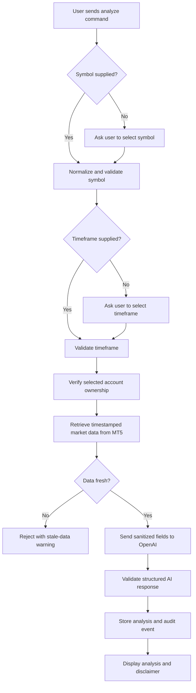
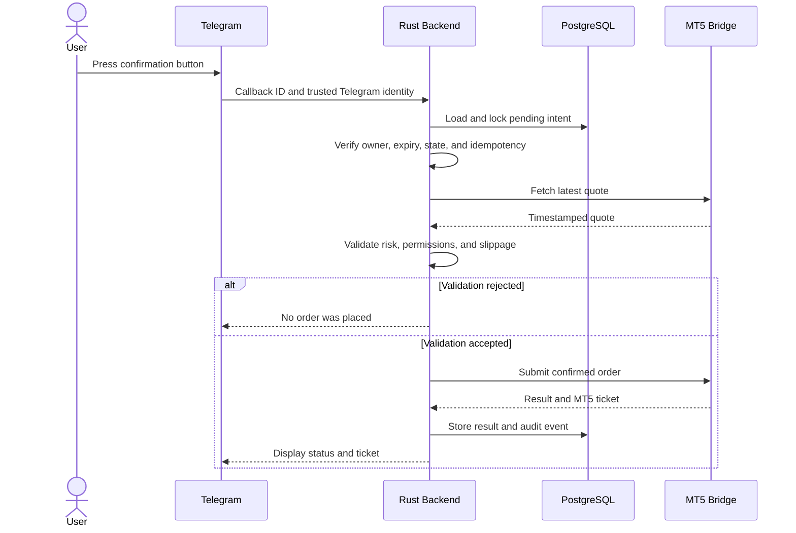

# Telegram Bot Command Reference

## 1. Purpose

This document defines the intended behavior of every Telegram command in the AI Forex Trading Assistant.

The supported command set is:

```text
/start
/menu
/analyze
/buy
/sell
/positions
/history
/accounts
/security
/risk
/stoptrading
/resumetrading
/settings
/help
```

> Implementation status: this document is the functional specification for the Telegram interface. The current repository implements the underlying Rust HTTP foundation for analysis, trade-intent creation, confirmation, and the trading kill switch. The complete Teloxide command and callback layer is not implemented yet.

## 2. General Command Rules

### 2.1 Private chat requirement

Account, balance, position, history, risk, billing, and trading commands should be used only in a private chat with the official bot.

If a sensitive command is used in a group, the bot must not display private information. It should reply with a short message directing the user to the private bot conversation.

Full MT5 account numbers, credentials, balances, positions, order history, and detailed errors must never be posted in a group.

### 2.2 User identity

The backend derives the internal user from the trusted Telegram user ID. A user cannot supply another person's internal `user_id` or access another user's account by guessing an account identifier.

### 2.3 Command arguments

Commands are case-insensitive, but symbols and timeframes are normalized to uppercase.

Examples:

```text
/analyze EURUSD H1
/buy EURUSD
/positions
```

When an argument is missing, the bot should continue with buttons or a guided prompt instead of failing immediately.

### 2.4 Canceling a flow

Every multi-step flow must provide a **Cancel** button. `/menu` should also abandon the current non-executing conversation flow and return to the main menu.

Canceling a trade flow changes the associated intent to `CANCELLED`. It never sends an order.

### 2.5 Expiration

Trade confirmations and other sensitive callbacks must expire after a short configured period. Pressing an old confirmation button must not execute the original action. The bot should ask the user to create a new intent and review current prices again.

### 2.6 Financial-risk notice

Analysis and trading screens must explain that AI analysis may be incorrect, forex trading can result in loss, and the user remains responsible for the decision.

## 3. Command Summary

| Command | Purpose | Can place an order immediately? | Sensitive/private? |
|---|---|---:|---:|
| `/start` | Register and begin onboarding | No | Yes |
| `/menu` | Open the main navigation menu | No | No |
| `/analyze` | Request AI-assisted market analysis | No | Account data is private |
| `/buy` | Start configuration of a BUY intent | No | Yes |
| `/sell` | Start configuration of a SELL intent | No | Yes |
| `/positions` | View open MT5 positions | No | Yes |
| `/history` | View account trading history | No | Yes |
| `/accounts` | Add and manage MT5 accounts | No | Highly sensitive |
| `/security` | View security and trust information | No | Partly user-specific |
| `/risk` | View or configure risk limits | No | Yes |
| `/stoptrading` | Immediately block new BUY and SELL orders | No | Yes |
| `/resumetrading` | Start explicit confirmation to allow new trades | No | Yes |
| `/settings` | Manage language, account, alerts, and billing preferences | No | Yes |
| `/help` | Show command guidance and support information | No | No |

## 4. `/start`

### Purpose

Registers a new Telegram user or resumes onboarding for an existing user.

### Syntax

```text
/start
```

Telegram referral parameters may be supported later:

```text
/start <referral-code>
```

Referral parameters must never change trading permissions or bypass eligibility checks.

### Backend behavior

1. Read the trusted Telegram user ID, username, first name, and language.
2. Create the user when the Telegram ID is not registered.
3. Create default settings and a conservative risk profile.
4. Record `USER_REGISTERED` in the audit trail for a new user.
5. Show onboarding and required disclosures.

### Expected response

```text
WELCOME TO AI FOREX TRADING ASSISTANT

AI provides market analysis.
You make every trading decision.

Your funds remain with your broker.
This application does not receive deposits or control withdrawals.

Forex trading involves substantial risk and may result in loss of capital.
AI-generated analysis may be incorrect.
```

Recommended buttons:

- **Try Mock Mode**
- **Connect MT5 Demo**
- **How It Works**
- **Security and Risk**

### Important rules

- Live trading is never enabled during `/start`.
- MT5 credentials are never requested in a group chat.
- The user does not create a separate application password for Telegram login.

## 5. `/menu`

### Purpose

Returns the user to the main navigation menu.

### Syntax

```text
/menu
```

### Expected menu

- **Analyze Market**
- **Positions**
- **Trade History**
- **MT5 Accounts**
- **Security**
- **Risk Settings**
- **Settings**
- **Help**

The menu should also display a compact status summary:

```text
Mode: DEMO
Account: *****678
Trading: ENABLED
Live trading: DISABLED
Subscription: PRO
```

### Important rules

- `/menu` does not submit, confirm, or repeat a trade.
- Returning to the menu cancels an unfinished conversational configuration flow.
- An already executing order cannot be canceled merely by sending `/menu`.

## 6. `/analyze`

### Purpose

Requests structured AI-assisted market analysis using fresh market data.

### Syntax

```text
/analyze
/analyze EURUSD
/analyze EURUSD H1
```

### Supported timeframes

```text
M1  M5  M15  M30  H1  H4  D1
```

Default symbol choices may include:

```text
EURUSD  GBPUSD  USDJPY  AUDUSD  USDCHF  USDCAD  XAUUSD
```

Custom symbols may be allowed only when the selected broker account supports them.

### Prerequisites

- The user is registered.
- A selected account belongs to the user.
- The account is active and verified when broker data is required.
- The subscription has remaining analysis quota.
- The requested symbol and timeframe are supported.

Trading permission is not required for analysis. A `READ_ONLY` account can request analysis.

### Flow



### Expected response

```text
EURUSD MARKET ANALYSIS

Timeframe: H1
Market bias: BULLISH
Signal: BUY
Confidence: 72%

Entry: 1.1750
Stop loss: 1.1710
Take profit: 1.1810
Risk/reward: 1 : 1.5

Why:
• Price is above EMA50
• Momentum is positive
• Support is detected near 1.1720

Risk:
• Volatility is elevated

AI-assisted analysis may be incorrect and does not guarantee profit.
```

Recommended buttons:

- **Create BUY Intent** when the signal permits
- **Create SELL Intent** when the signal permits
- **Analyze Again**
- **Cancel**

### Important rules

- AI analysis never executes an order.
- OpenAI never receives MT5 credentials.
- Stale data is rejected or clearly marked unavailable.
- Invalid AI values are rejected by Rust.
- `WAIT` is a valid and preferred result when the setup is unclear.

## 7. `/buy`

### Purpose

Starts configuration of a proposed BUY trade.

### Syntax

```text
/buy
/buy EURUSD
```

The command intentionally does not accept enough inline arguments to execute an order. Lot, SL, TP, account, current price, and confirmation must be reviewed interactively.

### Prerequisites

- The user has an active and verified account.
- The account belongs to the user.
- The account permission is `TRADING_ENABLED`.
- The trading kill switch is not active.
- The symbol is supported.
- Live accounts satisfy every global and user-level live gate.

### Flow

1. Select an MT5 account.
2. Select or validate the symbol.
3. Optionally link a recent AI analysis.
4. Select lot size: `0.01`, `0.05`, `0.10`, or custom.
5. Select stop loss: AI suggestion, custom, or no stop loss.
6. Select take profit: AI suggestion, custom, or no take profit.
7. Create a `BUY` trade intent.
8. Display the final review.
9. Wait for **CONFIRM BUY** or **CANCEL**.

### Expected review

```text
CONFIRM TRADE

Mode: DEMO
Account: *****678
Broker: Example Broker
Symbol: EURUSD
Side: BUY
Lot: 0.01
Current price: 1.1752
Stop loss: 1.1710
Take profit: 1.1810
Estimated risk: IDR or account-currency amount
Risk/reward: 1 : 1.5

No order has been placed yet.
```

### Confirmation behavior

Pressing **CONFIRM BUY** causes Rust to retrieve a new quote and run all server-side risk, ownership, permission, margin, limit, freshness, and slippage checks. Only then may the bridge submit an order.

For a live account, the button must say **CONFIRM LIVE BUY** and the screen must display a real-money warning.

## 8. `/sell`

### Purpose

Starts configuration of a proposed SELL trade.

### Syntax

```text
/sell
/sell EURUSD
```

### Behavior

The flow is the same as `/buy`, but validation is direction-specific:

- A SELL stop loss normally must be above the current entry price.
- A SELL take profit normally must be below the current entry price.
- The execution quote uses the appropriate broker side.

### Expected review

```text
CONFIRM TRADE

Mode: DEMO
Account: *****678
Broker: Example Broker
Symbol: EURUSD
Side: SELL
Lot: 0.01
Current price: 1.1750
Stop loss: 1.1790
Take profit: 1.1690

No order has been placed yet.
```

The final buttons are **CONFIRM SELL** and **CANCEL**, or **CONFIRM LIVE SELL** for an eligible live account.

## 9. `/positions`

### Purpose

Displays current open positions from the selected MT5 account.

### Syntax

```text
/positions
```

Future account selection may support:

```text
/positions <account-alias>
```

### Prerequisites

- The user has at least one active and verified account.
- The account belongs to the user.
- Read-only permission is sufficient.

### Expected response

```text
OPEN POSITIONS

EURUSD BUY
Volume: 0.01
Entry: 1.1752
Current: 1.1770
SL: 1.1710
TP: 1.1810
Floating P/L: +1.80 USD
Ticket: 123456789
```

Position buttons:

- **Modify Stop Loss**
- **Modify Take Profit**
- **Close Position**
- **Refresh**

### Important rules

- Modification and closing always require a separate review and confirmation.
- The kill switch does not prevent a user from closing a position.
- MT5 is the live source of truth. Cached snapshots must show their timestamp.
- If MT5 is unavailable, the bot must not present old data as current.

## 10. `/history`

### Purpose

Shows the user's trading history for a selected account and date range.

### Syntax

```text
/history
/history 7d
/history 30d
```

Supported range shortcuts may include `today`, `7d`, `30d`, and `90d`, subject to subscription retention limits.

### Expected fields

- Open or close timestamp
- Symbol
- Side
- Volume
- Open price
- Close price
- Profit or loss
- MT5 ticket
- Masked account number
- Execution status

### Expected response

```text
TRADE HISTORY - LAST 7 DAYS

14 Sep 2026 10:42 UTC
EURUSD BUY · 0.01 lot
Open: 1.1752
Close: 1.1775
P/L: +2.30 USD
Ticket: 123456789
Account: *****678
```

### Important rules

- Only the authenticated user's records are returned.
- Broker/MT5 history is authoritative for execution reconciliation.
- Pagination is required for long histories.
- Export should require a private chat and an explicit user action.

## 11. `/accounts`

### Purpose

Adds, verifies, selects, reviews, or disconnects MT5 accounts.

### Syntax

```text
/accounts
```

### Expected response

```text
MT5 ACCOUNTS

1. Personal Demo
   Broker: Example Broker
   Login: *****678
   Server: Example-Demo
   Type: DEMO
   Permission: READ_ONLY
   Status: VERIFIED
```

Recommended buttons:

- **Add MT5 Account**
- **Select Active Account**
- **Verify Again**
- **Change Permission**
- **Disconnect Account**

### Adding an account

The private flow collects:

1. Broker name
2. MT5 login or account number
3. Exact broker server
4. Explicit `DEMO` or `LIVE` account type
5. MT5 password
6. Preferred `READ_ONLY` or `TRADING_ENABLED` permission

The backend encrypts the password with authenticated encryption before persistence. The password must never be sent to OpenAI, displayed again, or written to logs.

### Disconnecting an account

Disconnecting requires explicit confirmation and must explain the effect on analysis, positions, and trading access. It must not close positions or withdraw funds automatically.

## 12. `/security`

### Purpose

Explains the application's trust model and shows user-specific security status.

### Syntax

```text
/security
```

### Expected response

```text
SECURITY AND TRUST

✓ Funds remain with your broker
✓ MT5 credentials are encrypted
✓ MT5 passwords are never sent to OpenAI
✓ Human confirmation is required
✓ MT5 ticket verification is enabled
✓ Trading audit trail is enabled
✓ Emergency stop is available

No system is unhackable or completely risk-free.
```

Recommended buttons:

- **Review Connected Accounts**
- **Stop Trading**
- **View Active Sessions** when implemented
- **Security Help**

### Important rules

The bot must not claim that the system is unhackable, 100% secure, or risk-free.

## 13. `/risk`

### Purpose

Displays and configures user-level or account-specific trading limits.

### Syntax

```text
/risk
```

### Risk settings

- Maximum lot size
- Maximum open positions
- Maximum trades per day
- Maximum daily loss amount
- Maximum daily loss percentage
- Maximum risk per trade percentage
- Maximum slippage points
- Allowed symbols
- Trading-enabled state
- User-level live-trading permission

### Expected response

```text
RISK SETTINGS

Account: *****678
Maximum lot: 0.10
Maximum open positions: 5
Maximum trades per day: 20
Maximum daily loss: 3%
Maximum risk per trade: 1%
Maximum slippage: 20 points
Trading: ENABLED
Live trading: DISABLED
```

### Changing limits

Lowering a limit may take effect immediately. Increasing material risk limits should require a review and explicit confirmation.

Changing a risk profile does not modify an existing broker position automatically.

## 14. `/stoptrading`

### Purpose

Activates the emergency kill switch and blocks new opening trades.

### Syntax

```text
/stoptrading
```

### Effect

Immediately blocks:

- New BUY orders
- New SELL orders
- Confirmation of pending opening intents

Continues to allow:

- Market analysis
- Viewing balances
- Viewing positions
- Viewing history
- Confirmed position closing

### Expected response

```text
TRADING STOPPED

New BUY and SELL orders are blocked.
You can still view and close existing positions.

Use /resumetrading when you are ready. Resuming requires confirmation.
```

### Important rules

- The command should take effect immediately without requiring confirmation because it reduces risk.
- The backend stores `trading_enabled=false`.
- An audit event records the action.
- The command does not automatically close open positions.

## 15. `/resumetrading`

### Purpose

Starts a confirmation flow to allow new opening trades after the kill switch was activated.

### Syntax

```text
/resumetrading
```

### Expected response

```text
RESUME TRADING?

This will allow new BUY and SELL trade intents for account *****678.
All normal account, live-mode, confirmation, and risk checks will still apply.
```

Buttons:

- **CONFIRM RESUME**
- **KEEP TRADING STOPPED**

### Important rules

- Sending the command alone does not resume trading.
- The confirmation callback must be fresh and bound to the same user.
- Resuming the user kill switch does not enable global live trading.
- The action is recorded in the audit log.

## 16. `/settings`

### Purpose

Displays application preferences that do not directly execute a trade.

### Syntax

```text
/settings
```

### Recommended sections

- Language
- Time zone
- Default MT5 account
- Default symbol and timeframe
- Notification preferences
- Number and currency display
- Billing and subscription
- Data and privacy
- Account deletion request

### Important rules

- Changing the default account must not change ownership or account permission.
- Billing changes do not enable live trading.
- Disabling notifications must not suppress critical security or execution-result messages without a clear warning.
- Account deletion must explain retention requirements for financial and security audit records.

## 17. `/help`

### Purpose

Shows command guidance, safety information, and support options.

### Syntax

```text
/help
/help analyze
/help risk
```

### Expected response

```text
HELP

/analyze  Request AI-assisted market analysis
/buy      Create a BUY intent
/sell     Create a SELL intent
/positions View open positions
/history  View trading history
/accounts Manage MT5 connections
/risk     Review risk limits
/stoptrading Block new trades immediately

BUY and SELL never execute immediately. Final confirmation is required.
```

Recommended buttons:

- **Getting Started**
- **Command Reference**
- **MT5 Setup**
- **Payment and Subscription**
- **Security and Risk**
- **Contact Support**

The help flow must not ask users to send passwords, API keys, or identity documents through an ordinary support message.

## 18. Trade Confirmation Callback Rules

Telegram inline-button callbacks are not commands, but they are security-critical.

Every confirmation callback must be:

- Bound to the authenticated Telegram user
- Bound to one internal account
- Bound to one trade intent or position action
- Single use
- Short lived
- Protected by an idempotency key
- Revalidated against current database state
- Revalidated against current MT5 price and account identity



The text displayed on a Telegram button is never sufficient authorization by itself. Rust must load the authoritative server-side intent.

## 19. Error Messages

Errors should be specific enough to help the user but must not expose internal systems.

### Stale price

```text
Unable to continue.

The market price is no longer fresh. Request a new analysis or review.
No order was placed.
```

### Excessive slippage

```text
Trade canceled.

The price moved beyond your allowed slippage.
No order was placed.
```

### Trading disabled

```text
Trading is currently disabled for this account.

You can still analyze the market and view or close existing positions.
```

### MT5 unavailable

```text
Unable to contact MetaTrader 5.

Check the position directly in MT5 before retrying.
The application will reconcile any uncertain order result.
```

### Cross-user or unknown resource

The bot should return a generic access-denied or not-found message. It must not confirm whether another user's account, order, or ticket exists.

## 20. Rate Limits

Commands should have separate server-side rate limits.

Suggested initial policy:

| Command category | Suggested starting limit |
|---|---:|
| Navigation and help | 30 requests per minute |
| Analysis | 5 requests per minute plus plan quota |
| Account connection | 5 attempts per hour |
| MT5 login verification | 5 attempts per 15 minutes |
| Trade-intent creation | 10 requests per minute |
| Trade confirmation | 5 requests per minute |
| History and positions refresh | 10 requests per minute |

These are operational starting points, not final production values. Rate limiting must never prevent the emergency stop. Position-closing access requires a carefully designed safety allowance and abuse protection.

## 21. Command Availability by Account Permission

| Command | No account | READ_ONLY | TRADING_ENABLED |
|---|---:|---:|---:|
| `/start` | Yes | Yes | Yes |
| `/menu` | Yes | Yes | Yes |
| `/analyze` | Mock only | Yes | Yes |
| `/buy` | No | No | Yes |
| `/sell` | No | No | Yes |
| `/positions` | No | Yes | Yes |
| `/history` | No | Yes | Yes |
| `/accounts` | Yes | Yes | Yes |
| `/security` | Yes | Yes | Yes |
| `/risk` | Limited | Yes | Yes |
| `/stoptrading` | Yes | Yes | Yes |
| `/resumetrading` | Limited | Limited | Yes, with confirmation |
| `/settings` | Yes | Yes | Yes |
| `/help` | Yes | Yes | Yes |

Account permission is only one gate. Subscription, account verification, global mode, live eligibility, risk controls, and explicit confirmation remain separate checks.

## 22. Bot Command Registration

The following concise descriptions can be registered with Telegram's bot-command menu:

```text
start - Register and begin secure onboarding
menu - Open the main menu
analyze - Request AI-assisted market analysis
buy - Create a proposed BUY trade
sell - Create a proposed SELL trade
positions - View open MT5 positions
history - View trading history
accounts - Manage MT5 account connections
security - Review security and trust controls
risk - Review or configure risk limits
stoptrading - Block new BUY and SELL orders
resumetrading - Confirm resuming new trades
settings - Manage preferences and billing
help - Show guidance and support
```

## 23. Implementation Checklist

- [ ] Register every command with Telegram.
- [ ] Restrict sensitive output to private chats.
- [ ] Derive identity from Telegram rather than request parameters.
- [ ] Keep handlers thin and move business logic into Rust services.
- [ ] Persist conversational state with expiration.
- [ ] Bind every callback to the user and intended entity.
- [ ] Require explicit confirmation for opening, closing, and modification.
- [ ] Make `/stoptrading` immediate and highly available.
- [ ] Mask MT5 account numbers.
- [ ] Never log credentials or Telegram tokens.
- [ ] Apply per-command and per-user rate limits.
- [ ] Record required audit events.
- [ ] Test duplicate and expired callbacks.
- [ ] Test cross-user access for every resource command.
- [ ] Test mock, demo, and live separation.
- [ ] Use user-friendly errors and confirm when no order was placed.

