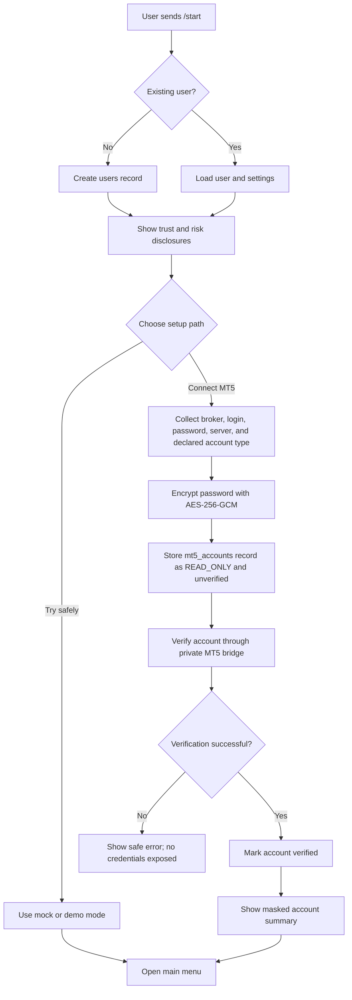
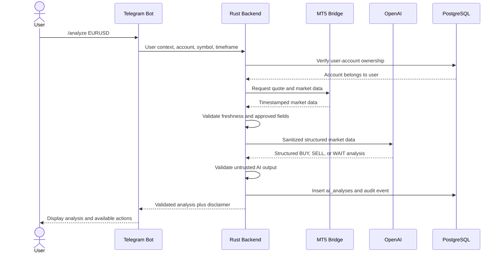
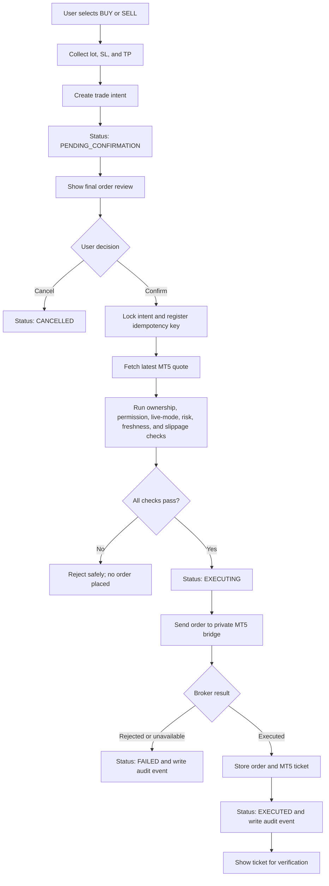
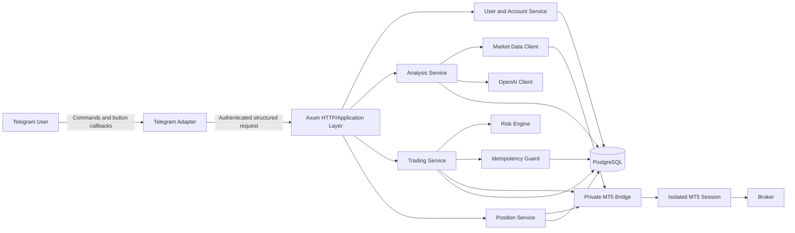
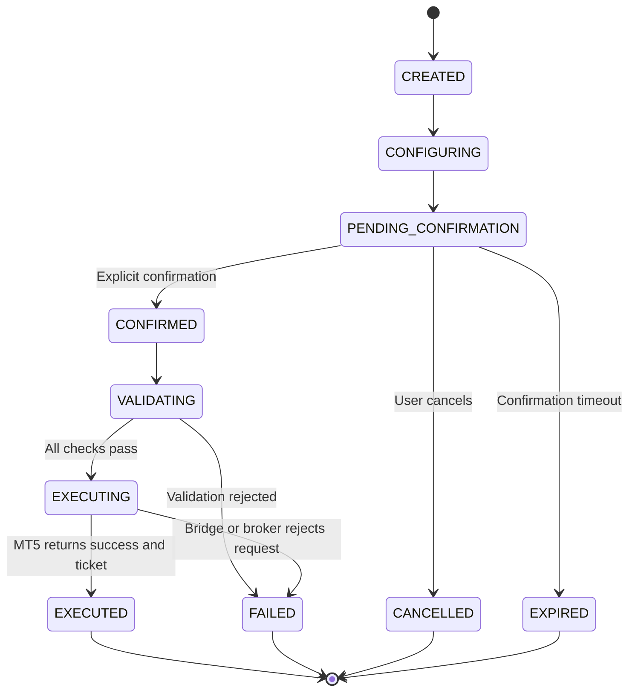
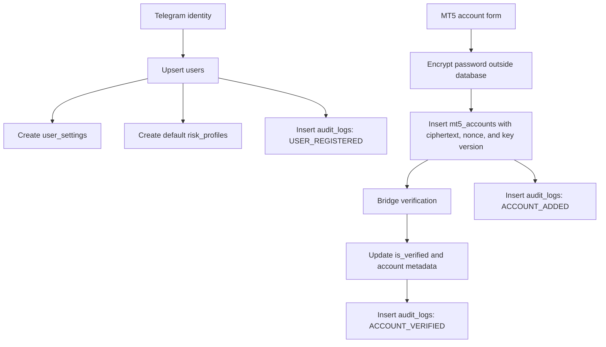
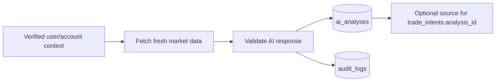
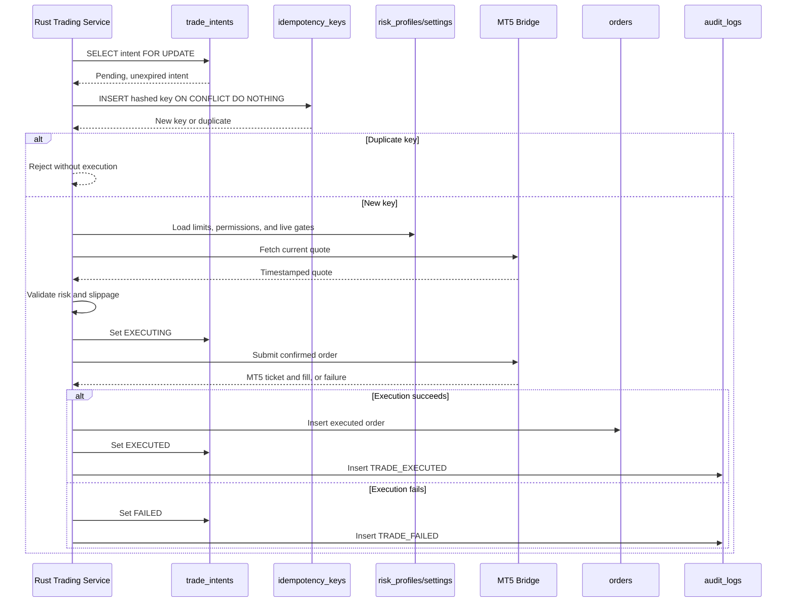
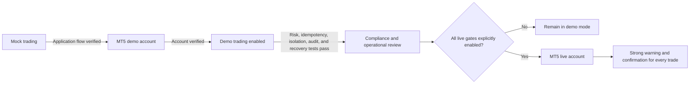

# User Journey, Application Flow, Database Flow, and ERD

## 1. Document Purpose

This document explains how users interact with the AI Forex Trading Assistant, how requests move through the application, and how application data is stored and related.

The product follows one non-negotiable operating model:

> AI analyzes. The user decides. Rust controls the workflow. MT5 executes. The broker holds the user's funds.

The application is an AI-assisted decision-support platform, not an autonomous trading bot. Every order-opening, position-closing, or major position-modification operation requires explicit user confirmation.

## 2. Actors and System Responsibilities

| Actor or component | Responsibility |
|---|---|
| Telegram user | Requests analysis, reviews risk, and explicitly confirms or cancels trading actions |
| Telegram bot | Presents menus, collects structured input, and displays results; it contains no trading business logic |
| Rust backend | Authenticates the user context, enforces ownership and risk controls, manages workflow state, and writes audit records |
| OpenAI | Produces structured analysis from sanitized market data; it cannot execute trades |
| PostgreSQL | Stores users, accounts, analyses, trade intents, orders, settings, risk profiles, snapshots, idempotency keys, and audit events |
| MT5 bridge | Provides a narrow private adapter between Rust and MetaTrader 5 |
| MetaTrader 5 | Reads broker data and submits confirmed orders to the user's broker account |
| Broker | Holds the user's account and funds and accepts or rejects trading instructions |

## 3. End-to-End User Journey

### 3.1 First-time onboarding

1. The user opens the Telegram bot and sends `/start`.
2. The application creates or retrieves the user by `telegram_user_id`.
3. The bot explains what the application does and does not do.
4. The bot displays the required trust and risk notices:
   - Funds remain with the user's broker.
   - The application does not accept deposits or control withdrawals.
   - MT5 credentials are encrypted.
   - AI-generated analysis can be incorrect.
   - Forex trading can result in loss of capital.
   - Every trading action requires human confirmation.
5. The user chooses mock/demo mode or starts connecting an MT5 account.
6. New accounts begin with conservative permissions, preferably `READ_ONLY`.
7. The backend verifies the account through the private MT5 bridge.
8. The bot displays the broker, masked login, server, balance, equity, explicit account type, and permission mode.
9. Trading remains disabled until the user explicitly enables it and all applicable system gates pass.



### 3.2 Market analysis journey

1. The user selects **Analyze Market** or sends `/analyze EURUSD`.
2. The user selects an account, symbol, and timeframe.
3. The backend verifies that the selected account belongs to the authenticated user.
4. The backend requests a timestamped quote and market data through the MT5 bridge.
5. Stale data is rejected. No analysis is generated from data outside the freshness threshold.
6. The backend sends only approved, sanitized market fields to OpenAI.
7. OpenAI returns a structured `BUY`, `SELL`, or `WAIT` assessment.
8. The backend treats this response as untrusted input, validates its schema and values, and stores it in `ai_analyses`.
9. The bot displays the analysis, reasoning, risk notes, and financial-risk disclaimer.
10. No order is created or executed by the analysis operation.



### 3.3 Trade creation and confirmation journey

Selecting `BUY` or `SELL` does not execute an order. It starts a trade-intent workflow.

1. The user selects a side after reviewing an analysis or starts `/buy` or `/sell`.
2. The bot collects the lot size, stop loss, and take profit.
3. The backend validates basic input and creates a `trade_intents` record with `PENDING_CONFIRMATION` status and a short expiry time.
4. The bot shows the final review: mode, masked account, broker, symbol, side, lot, current price, SL, TP, estimated risk, and risk/reward.
5. A live account receives a stronger **LIVE MONEY WARNING**.
6. The user explicitly confirms or cancels.
7. On confirmation, the backend locks the intent and registers a hashed idempotency key. A duplicate confirmation cannot create another order.
8. The backend retrieves a new quote immediately before execution.
9. The risk engine validates ownership, account state, permission mode, kill switch, live gates, quote freshness, lot size, SL/TP direction, position/trade limits, and slippage.
10. Only after every check passes does Rust call the private MT5 bridge.
11. The bridge executes against the correct isolated account session and returns the MT5 ticket and fill price.
12. The backend stores the order, updates the intent, and records an audit event.
13. The bot displays the MT5 ticket so the user can verify the transaction directly in MetaTrader 5.



### 3.4 Position-management journey

1. The user sends `/positions`.
2. The backend verifies account ownership and reads current positions from MT5.
3. The bot displays each position and its current floating profit or loss.
4. The user may request an SL change, TP change, or position close.
5. The application presents a separate final review for the requested modification.
6. The modification or close is sent to MT5 only after explicit confirmation.
7. The result and ticket are persisted and audited.

The kill switch blocks new `BUY` and `SELL` orders, but it deliberately allows users to view and close existing positions.

### 3.5 History, safety, and emergency controls

- `/history` returns only the authenticated user's order and deal history, including masked account information and MT5 tickets.
- `/risk` allows users to review or lower their limits. Material increases should require explicit confirmation.
- `/stoptrading` immediately sets `trading_enabled=false` for the user's risk profile and records an audit event.
- `/resumetrading` requires a separate explicit confirmation before new orders are allowed.
- `/security` explains credential encryption, user-controlled funds, human confirmation, audit logging, and the emergency stop without making absolute security claims.

## 4. Application Flow

### 4.1 Component flow



### 4.2 Request-handling rules

Every application request follows these layers:

1. **Identity boundary:** derive the internal user from the trusted Telegram identity. Public clients must not be allowed to choose an arbitrary `user_id`.
2. **Input boundary:** parse commands and callbacks into typed models. Reject unknown symbols, timeframes, states, and malformed numeric values.
3. **Ownership boundary:** query records using both `user_id` and the requested resource ID.
4. **Business workflow:** route the request to analysis, account, trading, position, or risk services. Telegram handlers remain thin.
5. **External-service boundary:** sanitize OpenAI input and authenticate calls to the private MT5 bridge.
6. **Persistence boundary:** commit state changes and audit events transactionally where practical.
7. **Response boundary:** mask account logins and return user-friendly errors without internal URLs, SQL details, stack traces, or secrets.

### 4.3 Trade-intent state lifecycle



## 5. Database Flow

### 5.1 Registration and account connection



The encryption key is never stored in PostgreSQL. The database stores only ciphertext, a unique nonce, and the key version needed for controlled rotation.

### 5.2 Analysis persistence



`market_data` and `analysis` are stored as JSONB so the system retains the exact sanitized input and validated output used at decision time. Secrets must never appear in either document.

### 5.3 Confirmation and execution transaction flow



### 5.4 Data isolation strategy

All user-owned business tables carry `user_id`; account-scoped tables also carry `account_id`. Access queries must always include the authenticated `user_id`, even when a UUID is difficult to guess. An account UUID alone is never sufficient authorization.

The following data must never cross user boundaries:

- MT5 credentials and account details
- Balances and equity
- Analyses associated with private accounts
- Trade intents and confirmations
- Orders and tickets
- Position snapshots and history
- Risk settings and audit logs

## 6. Entity Relationship Diagram

```mermaid
erDiagram
    USERS {
        uuid id PK
        bigint telegram_user_id UK
        varchar telegram_username
        varchar first_name
        varchar language
        varchar status
        timestamptz created_at
        timestamptz updated_at
    }

    MT5_ACCOUNTS {
        uuid id PK
        uuid user_id FK
        varchar broker_name
        varchar server
        varchar login
        text encrypted_password
        text password_nonce
        int key_version
        account_type account_type
        permission_mode permission_mode
        boolean is_verified
        boolean is_active
        timestamptz created_at
        timestamptz updated_at
    }

    AI_ANALYSES {
        uuid id PK
        uuid user_id FK
        uuid account_id FK
        varchar symbol
        varchar timeframe
        jsonb market_data
        jsonb analysis
        timestamptz created_at
    }

    TRADE_INTENTS {
        uuid id PK
        uuid user_id FK
        uuid account_id FK
        uuid analysis_id FK
        varchar symbol
        varchar side
        decimal volume
        decimal entry_price
        decimal stop_loss
        decimal take_profit
        varchar status
        timestamptz expires_at
        timestamptz created_at
        timestamptz updated_at
    }

    ORDERS {
        uuid id PK
        uuid user_id FK
        uuid account_id FK
        uuid trade_intent_id FK, UK
        bigint mt5_ticket
        varchar symbol
        varchar side
        decimal volume
        decimal requested_price
        decimal executed_price
        decimal stop_loss
        decimal take_profit
        varchar status
        jsonb broker_response
        timestamptz executed_at
        timestamptz created_at
    }

    POSITIONS_SNAPSHOT {
        uuid id PK
        uuid user_id FK
        uuid account_id FK
        bigint mt5_ticket
        varchar symbol
        varchar side
        decimal volume
        decimal entry_price
        decimal current_price
        decimal stop_loss
        decimal take_profit
        decimal profit_loss
        varchar status
        timestamptz captured_at
    }

    RISK_PROFILES {
        uuid id PK
        uuid user_id FK
        uuid account_id FK
        decimal max_lot_size
        int max_open_positions
        int max_trades_per_day
        decimal max_daily_loss_amount
        decimal max_daily_loss_percent
        decimal max_risk_per_trade_percent
        int max_slippage_points
        boolean trading_enabled
        timestamptz created_at
        timestamptz updated_at
    }

    USER_SETTINGS {
        uuid user_id PK_FK
        boolean live_trading_enabled
        varchar language
        timestamptz updated_at
    }

    AUDIT_LOGS {
        uuid id PK
        uuid user_id FK
        uuid account_id FK
        varchar event_type
        varchar entity_type
        uuid entity_id
        jsonb metadata
        inet ip
        timestamptz created_at
    }

    IDEMPOTENCY_KEYS {
        uuid id PK
        uuid user_id FK
        varchar key_hash UK
        uuid trade_intent_id FK
        timestamptz created_at
    }

    USERS ||--o{ MT5_ACCOUNTS : owns
    USERS ||--o{ AI_ANALYSES : requests
    USERS ||--o{ TRADE_INTENTS : creates
    USERS ||--o{ ORDERS : owns
    USERS ||--o{ POSITIONS_SNAPSHOT : views
    USERS ||--o{ RISK_PROFILES : configures
    USERS ||--|| USER_SETTINGS : has
    USERS ||--o{ AUDIT_LOGS : generates
    USERS ||--o{ IDEMPOTENCY_KEYS : submits

    MT5_ACCOUNTS ||--o{ AI_ANALYSES : supplies_market_context
    MT5_ACCOUNTS ||--o{ TRADE_INTENTS : targets
    MT5_ACCOUNTS ||--o{ ORDERS : executes
    MT5_ACCOUNTS ||--o{ POSITIONS_SNAPSHOT : contains
    MT5_ACCOUNTS o|--o{ RISK_PROFILES : overrides
    MT5_ACCOUNTS o|--o{ AUDIT_LOGS : scopes

    AI_ANALYSES o|--o{ TRADE_INTENTS : supports
    TRADE_INTENTS ||--o| ORDERS : produces
    TRADE_INTENTS ||--o{ IDEMPOTENCY_KEYS : protects
```

## 7. Entity Descriptions

| Entity | Purpose and lifecycle |
|---|---|
| `users` | One internal identity per Telegram user. It is the root owner of all private data. |
| `mt5_accounts` | Stores one or more broker accounts per user. Passwords are encrypted; `account_type` is explicit and never inferred from the server name. |
| `ai_analyses` | Stores the sanitized market-data snapshot and validated structured AI result. An analysis never represents authorization to trade. |
| `trade_intents` | Represents a proposed action and its confirmation lifecycle. It expires and must reach the correct state before execution. |
| `orders` | Stores the final submitted/executed order, broker response, execution price, and MT5 ticket. One intent can produce at most one order. |
| `positions_snapshot` | Stores account-scoped point-in-time position data for display and reconciliation. MT5 remains the execution source of truth. |
| `risk_profiles` | Stores user defaults or account-specific risk overrides, including the kill-switch state. |
| `user_settings` | Stores user-wide settings, including the separate user-level live-trading feature gate. |
| `audit_logs` | Provides an append-oriented security and trading trail without credentials or other secrets. |
| `idempotency_keys` | Stores only a hash of the confirmation key and prevents repeated requests from creating duplicate orders. |

## 8. Important Data Constraints

- `users.telegram_user_id` is unique, preventing duplicate Telegram identities.
- `(mt5_accounts.user_id, server, login)` is unique, preventing duplicate account registration for the same user.
- `trade_intents.side` accepts only `BUY` or `SELL`, and volume must be positive.
- `orders.trade_intent_id` is unique, limiting an intent to one persisted order.
- `(positions_snapshot.account_id, mt5_ticket)` is unique for the current snapshot model.
- A risk profile is unique per user and account scope; a null `account_id` represents user-level defaults.
- `(idempotency_keys.user_id, key_hash)` is unique, blocking replay by the same user.
- Foreign keys preserve ownership relationships, while application-layer checks ensure that identifiers supplied in a request belong to the authenticated user.

## 9. Demo-to-Live Journey



Live execution requires all of the following at the same time:

1. The deployment runs with `TRADING_MODE=LIVE`.
2. The global `LIVE_TRADING_ENABLED` flag is `true`.
3. The user's `user_settings.live_trading_enabled` value is `true`.
4. The target account is explicitly recorded and verified as `LIVE`.
5. The account permission is `TRADING_ENABLED`.
6. The risk-profile kill switch allows new trades.
7. The user explicitly confirms the reviewed live order.

Failure of any gate rejects the order without sending it to MT5.

## 10. Current Implementation Boundary

The repository currently implements the foundational HTTP vertical slice: analysis, trade-intent creation, confirmation, idempotency, core risk validation, order execution through the mock/private bridge, auditing, and the kill switch.

The complete Telegram onboarding UI, account-connection API, positions/history UI, SL/TP modification flows, confirmed position closing, broker-derived margin and daily-loss calculations, and production Windows worker orchestration remain planned application layers. They must reuse the same ownership, confirmation, risk, and audit boundaries described in this document.
