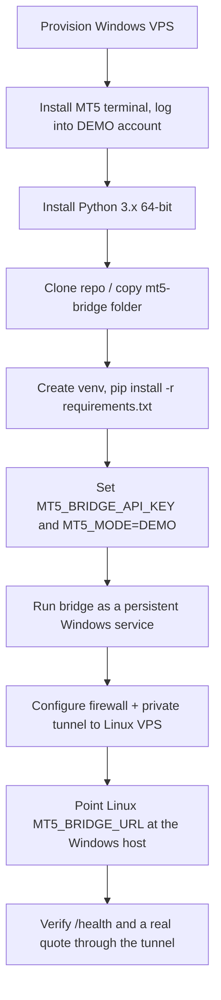

# Deploying the MT5 Bridge to a Windows VPS

> **Code update (21 September 2026):** Native bridge processes now bind to `MT5_ACCOUNT_ID`, use `MT5_TERMINAL_PATH`, and require an explicit Rust `MT5_BRIDGE_ROUTES` entry and verification call. Use the current [Windows MT5 bridge setup](windows-mt5-bridge-setup.md) for configuration. The older single-account examples below describe the original deployment concept and are superseded by that setup guide.

## 1. Purpose and Scope

This guide covers the **Windows half** of the hybrid deployment topology already introduced in [Can this run on a Linux VPS instead of Windows? — Option B](linux-vps-deployment.md#42-option-b--hybrid-linux-vps--a-separate-windows-host-recommended-for-real-mt5): a real MT5 terminal and this project's Python MT5 Bridge running on a Windows host, reachable only by the Rust backend running elsewhere (typically a Linux VPS).

Only two things move to Windows:

| Stays on Linux (unchanged) | Moves to Windows |
|---|---|
| Rust backend, PostgreSQL, admin dashboard, risk engine, audit logging, credential encryption | `mt5-bridge/` (Python/FastAPI) + the MT5 terminal it talks to |

If you only need mock data, you do not need this guide — `MT5_MODE=MOCK` already runs everywhere via `docker compose up`. This guide is for connecting a **real** MT5 demo or live account.

## 2. Prerequisites

- A Windows Server VPS (or a broker-provided MT5 VPS) with:
  - 64-bit Windows, administrator access via RDP
  - At least 2 vCPU / 4 GB RAM as a practical minimum per terminal instance
  - Outbound internet access to your broker's trading servers
- A verified MT5 **demo** account and its broker, login, password, and exact server name (see [how-to-use-the-application.md §3](how-to-use-the-application.md#3-information-needed-to-connect-an-mt5-account)) — never start this process with a live account
- A way to reach the Windows host privately from your Linux VPS (WireGuard, Tailscale, or an equivalent private network/VPN — see [§4.6](#46-lock-down-the-network))
- Git access to this repository (`https://github.com/kukuhtw/aifrx.git`) or another way to copy the `mt5-bridge/` folder onto the Windows host
- The same `MT5_BRIDGE_API_KEY` value you will also set in the Linux backend's `.env`

## 3. Deployment Flow



## 4. Step-by-Step Deployment

### 4.1 Provision the Windows VPS

Use either a generic cloud Windows Server VPS or a broker-provided MT5 VPS (many MT5 brokers offer these specifically for hosting a terminal near their trading infrastructure). Either works the same way for this guide — you still deploy this project's own bridge code onto it. Harden RDP access immediately (strong password, restrict the allowed source IP range if your provider supports it) before doing anything else.

### 4.2 Install and configure the MT5 terminal

1. Download the MT5 terminal from your broker's official site (not a third-party mirror) and install it.
2. Log in with your **demo** account's login, password, and exact server name.
3. Leave the terminal open and logged in — the Python `MetaTrader5` package in this repo's bridge attaches to an **already-running, already-logged-in terminal** on the same machine. The current bridge code does not call `mt5.login()` itself (see [§5](#5-current-code-limitation-one-terminal--one-account) for why this matters).
4. If your broker/terminal build gates automated calls behind an "Algo/Auto Trading" toggle, enable it in the terminal's options — the exact setting name varies by terminal build, so check your broker's documentation if quotes or orders are unexpectedly rejected later.
5. Disable automatic terminal updates during active use if your provider allows it, so a mid-session update doesn't drop the connection unexpectedly.

### 4.3 Install Python and the bridge's dependencies

Install a 64-bit Python matching the `MetaTrader5==5.0.5120` package pinned in `mt5-bridge/requirements.txt` — check that release's supported-version metadata on PyPI before choosing a version; Python 3.12 (matching the Linux bridge's own container image) is a reasonable first choice.

```powershell
winget install Python.Python.3.12
```

Get the bridge code onto the host:

```powershell
git clone https://github.com/kukuhtw/aifrx.git C:\aifrx
cd C:\aifrx\mt5-bridge
python -m venv venv
.\venv\Scripts\Activate.ps1
pip install -r requirements.txt
```

Because this now runs on Windows, `platform_system == "Windows"` in `requirements.txt` is satisfied and `pip` actually installs the `MetaTrader5` package this time — unlike on Linux, where it is silently skipped (see [linux-vps-deployment.md §3](linux-vps-deployment.md#3-evidence-from-this-codebase)).

### 4.4 Configure environment variables

The bridge only needs two variables in this environment:

```powershell
[System.Environment]::SetEnvironmentVariable("MT5_BRIDGE_API_KEY", "<a-long-random-secret>", "Machine")
[System.Environment]::SetEnvironmentVariable("MT5_MODE", "DEMO", "Machine")
```

Use the same `MT5_BRIDGE_API_KEY` value on the Linux backend's `.env`. Never set `MT5_MODE=LIVE` at this stage — keep it on `DEMO` until you have completed the full demo-before-live checklist in [risk-controls.md](risk-controls.md) and [user-journey-and-data-flow.md §9](user-journey-and-data-flow.md#9-demo-to-live-journey).

### 4.5 Run the bridge as a persistent Windows service

Running `uvicorn` directly in an RDP session stops the moment you disconnect. Use a service manager so it survives reboots and disconnects. The most common lightweight option is [NSSM](https://nssm.cc/) ("the Non-Sucking Service Manager"):

```powershell
nssm install AIFXMT5Bridge "C:\aifrx\mt5-bridge\venv\Scripts\uvicorn.exe" "app.main:app --host 0.0.0.0 --port 8000"
nssm set AIFXMT5Bridge AppDirectory C:\aifrx\mt5-bridge
nssm set AIFXMT5Bridge AppEnvironmentExtra MT5_BRIDGE_API_KEY=<same-secret> MT5_MODE=DEMO
nssm set AIFXMT5Bridge Start SERVICE_AUTO_START
nssm start AIFXMT5Bridge
```

(Flag names may differ slightly by NSSM version — check `nssm --help` for your installed build.) If you would rather avoid installing a third-party tool, a Task Scheduler task set to "run at startup" with "restart on failure" achieves the same result with slightly more manual setup.

The MT5 terminal itself (from §4.2) must also stay running and logged in on this machine — the bridge process depends on it, not the other way around.

### 4.6 Lock down the network

Do not expose port 8000 to the public internet. Two practical options:

**Option 1 — Mesh VPN (simplest to operate):** Install a mesh VPN client such as WireGuard or Tailscale on both the Windows host and the Linux VPS. Each machine gets a private IP reachable only from the other nodes in your mesh, regardless of NAT or cloud provider. Point `MT5_BRIDGE_URL` at that private address.

**Option 2 — Point-to-point WireGuard tunnel:** Configure a WireGuard interface directly between the two hosts if you prefer not to depend on a third-party coordination service.

In either case, also restrict Windows Firewall to only accept port 8000 on the private tunnel interface:

```powershell
New-NetFirewallRule -DisplayName "MT5 Bridge - private only" -Direction Inbound -LocalPort 8000 -Protocol TCP -RemoteAddress <linux-vps-private-ip> -Action Allow
```

Leave the public network adapter without an inbound rule for port 8000 at all. For production, terminate TLS in front of the bridge (a local reverse proxy such as Caddy or nginx on the Windows host, or mTLS at the tunnel layer) rather than serving plain HTTP, even over the private link — see [security.md](security.md).

### 4.7 Point the Linux-hosted Rust backend at the Windows bridge

On the Linux VPS, update `.env` — no Rust code changes are needed:

```dotenv
MT5_BRIDGE_URL=https://<windows-host-private-address>:8000
MT5_BRIDGE_API_KEY=<same-secret-set-in-4.4>
MT5_MODE=DEMO
```

Restart the Rust backend so it picks up the new bridge address.

### 4.8 Verify end-to-end

From the Linux VPS, over the private tunnel:

```bash
curl https://<windows-host-private-address>:8000/health

curl -H "X-Internal-API-Key: <same-secret>" \
  https://<windows-host-private-address>:8000/accounts/test/quote/EURUSD
```

A successful quote response confirms the terminal is logged in and the bridge can reach it. A `503 market data unavailable` means the terminal is not running/logged in; a `401 unauthorized` means the API key does not match on both sides. Then exercise the full flow through the Rust backend: `POST /api/v1/analyses` for the connected account should now return analysis built from a real broker quote instead of mock data.

## 5. Current Code Limitation: One Terminal = One Account

Read this before planning a multi-user production rollout. Looking at the bridge's own source:

- `mt5-bridge/app/mt5_client.py`'s `quote()` and `order()` functions call the `MetaTrader5` package's module-level functions (`mt5.symbol_info_tick`, `mt5.order_send`) without ever calling `mt5.login()` — and without using the `account_id` from the request URL to select which account to act on.
- `mt5-bridge/app/sessions.py`'s `SessionRegistry` only hands out an `asyncio.Lock` per `account_id`; it does not spawn or route to a separate terminal process per account.

In practice, this means **one bridge process talks to whichever single account is logged into the one MT5 terminal running on that machine**, regardless of which `account_id` a request names. This is fine — and exactly what this guide sets up — for a single-account or personal deployment.

It is **not** yet sufficient for a multi-user SaaS deployment where different users' orders must go to different broker accounts in isolation. That requires, per [MT5 and the dual tech stack §8](mt5-and-dual-tech-stack.md#8-multi-user-session-isolation):

1. One MT5 terminal installation per active account (each using the terminal's `/portable` flag with its own data directory, so multiple terminals can run side by side on one host).
2. One bridge process per terminal, each bound to its own port and each started with its own `MT5_BRIDGE_API_KEY`.
3. A mapping on the Rust side from `account_id` to the correct bridge URL/port — which does not exist in the current single-`MT5_BRIDGE_URL` configuration (`backend-rust/src/config.rs`) and would need to be added before this pattern is usable in production.

Treat §4 of this guide as the correct procedure to repeat per account/terminal pair, and treat the account-routing layer in Rust as outstanding engineering work — consistent with the "current implementation boundary" already called out in [user-journey-and-data-flow.md §10](user-journey-and-data-flow.md#10-current-implementation-boundary).

## 6. Security Hardening Checklist

- [ ] RDP restricted to a known admin source IP, or accessed only through the same private VPN used for the bridge traffic
- [ ] Port 8000 has no public inbound firewall rule; only the private tunnel interface is allowed
- [ ] TLS (or mTLS) terminates in front of the bridge rather than serving plain HTTP, even privately
- [ ] `MT5_BRIDGE_API_KEY` is a long random value, different from any other secret in the system, and stored the same way on both hosts
- [ ] The Windows account running the bridge service is not an unnecessary local administrator
- [ ] OS and MT5 terminal are kept patched
- [ ] No MT5 password, API key, or credential ever appears in bridge logs (the current code does not log request bodies — keep it that way if you add logging)
- [ ] Outbound traffic from the Windows host is limited to your broker's servers and the Linux VPS's private address where your provider supports egress filtering

## 7. Operational Checklist

- [ ] Bridge service is set to auto-start on reboot and auto-restart on failure
- [ ] MT5 terminal is set to auto-login on startup so a host reboot doesn't leave it logged out
- [ ] `GET /health` is polled from your monitoring of choice; treat a failure as "terminal or bridge down," not "broker down"
- [ ] A process exists for rotating `MT5_BRIDGE_API_KEY` on both hosts together
- [ ] Reconciliation plan exists for the timeout/uncertain-outcome case described in [MT5 and the dual tech stack §13](mt5-and-dual-tech-stack.md#13-failure-ownership) — a network blip after an order is submitted does not prove the broker didn't receive it

## 8. Demo Before Live

Everything in this guide should be completed and exercised against a **demo** account first. Do not set `MT5_MODE=LIVE` or a live `TRADING_MODE` until:

- The full demo workflow (analysis → intent → confirmation → execution → ticket verification) has been tested end-to-end through this Windows bridge.
- The security hardening and operational checklists above are complete.
- Every live-trading gate in [risk-controls.md](risk-controls.md) and [user-journey-and-data-flow.md §9](user-journey-and-data-flow.md#9-demo-to-live-journey) is understood and deliberately satisfied — payment or infrastructure readiness alone never enables live trading.

## 9. Troubleshooting

| Symptom | Likely cause |
|---|---|
| `pip install` doesn't install `MetaTrader5` | Wrong platform (not actually Windows) or a Python version not covered by the pinned package version's wheels |
| `ModuleNotFoundError: MetaTrader5` at runtime | `MT5_MODE` is not set to a non-mock value, or the package failed to install silently — re-check `pip list` |
| `503 market data unavailable` | MT5 terminal is not running, not logged in, or lost its broker connection |
| `401 unauthorized` from the bridge | `X-Internal-API-Key` sent by the caller doesn't match `MT5_BRIDGE_API_KEY` on the Windows host |
| `400 account mismatch` | The `account_id` in the URL path doesn't match `account_id` in the request body — a Rust-side bug, not a Windows config issue |
| Bridge unreachable from the Linux VPS | Private tunnel is down, or the Windows Firewall rule doesn't match the tunnel's actual source address |
| Quotes stop after a while | Terminal auto-update, disconnection, or Windows Update reboot interrupted the logged-in session — pair with the operational checklist above |

## 10. Related Documentation

- [Can this run on a Linux VPS instead of Windows?](linux-vps-deployment.md) — the topology this guide implements the Windows half of
- [MT5 and the Rust–Python architecture](mt5-and-dual-tech-stack.md) — why the split exists and multi-account isolation requirements
- [MT5 deployment](mt5-deployment.md) — condensed production worker/terminal isolation guidance
- [Security](security.md) — bridge authentication and network boundary requirements
- [Risk controls](risk-controls.md) — the gates that must pass before enabling real trading
